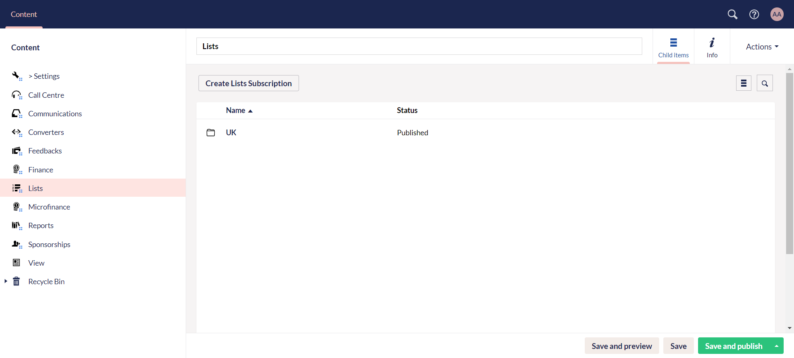
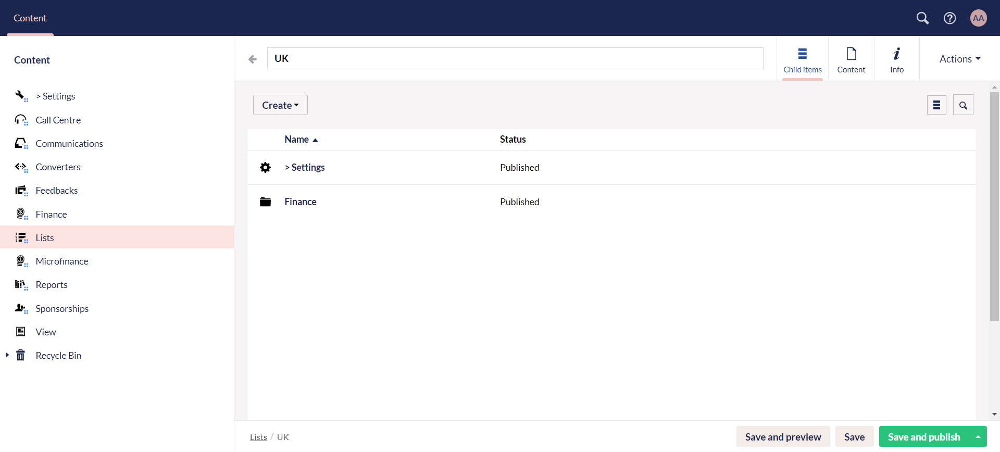
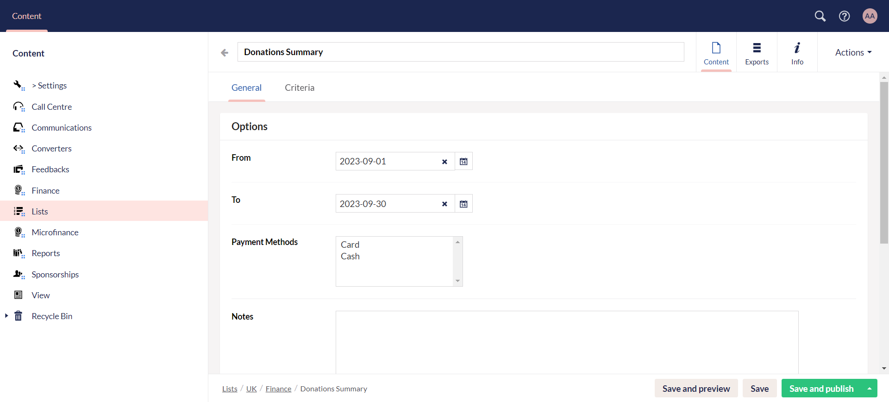
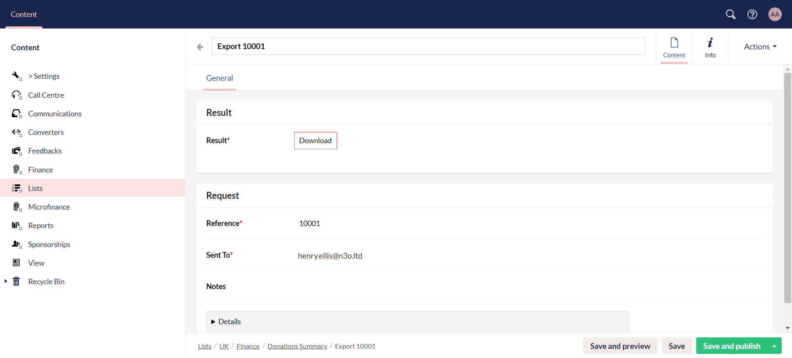
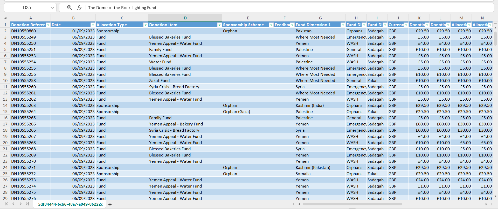

One more feature to grasp under **Content** in the section menu is **Lists**. The lists functionality plays an important role in organizing and managing data related to donors, beneficiaries, and various other entities within a CRM. 

Just like the lists feature in Engage, **Engage Forms** also contributes towards this functionality by offering:

1. Creation of multiple lists for donors over a specific **date range**.
2. **Downloadable Excel sheet** for any list in the **Exports** section.
3. **Less wait time** for downloading of any newly created list. 
4. **Notification via email** about the completion of any newly created list.

## Create a List Using Engage Forms

Multiple lists, whether a donations summary or a beneficiary list, can be created via Engage Forms by providing only a **date range**, **payment methods**, **email address** and **password**. These lists right after creation, whether having large or small amount of data, have the ability to be downloaded without too much wait time. The **Criteria** tab for each list makes it easier for the donor to find any *list field*, set up its *filter* and update it accordingly without the need to navigate to Engage itself.

To create a list:

**1.** Click Engage on the main dashboard and navigate to **Engage Forms**. 

**2.** Click **Create Lists Subscription** and create a folder you will keep your list in.

**3.** Open up the folder, and create lists folder via **Create**.

:::tip
**Lists settings** under the *Create* button includes all those payment methods to be added which automatically appear when creating a list e.g. *Cash*, *Card* and *Direct debit*, etc. 
:::

**4.** Click the lists folder and click **Create** to create a **Date Range list** or a **Date Range Payment Methods list**, with *payment methods* to be the only difference between them. 

**5.** In the **General** tab, **name** the list, specify the date and time in the **From** and **To** section, specify the **payments methods**, input the **email** to update the donor as soon as the export is complete and the **password** to protect the file. Click **Save and Publish**. The **Criteria** tab includes the `json` code for all the fields included in a list, predefined by N3O.

:::tip
To only save your work for further changes, click **Save** and to save your work and view an unpublished version of the website, click **Save and Preview**. An Umbraco preview of the website will appear.
:::

**5.** As soon as the list for the specified time period is obtained from Engage, you will see an export in the **Exports** tab. Click it and download the Excel sheet from the **Download** option.

**6.** An example can be a donations summary list that includes data about all the donations performed by donors with fields **donation reference**, **donation date**, **donation type**, **fund dimensions**, etc.

