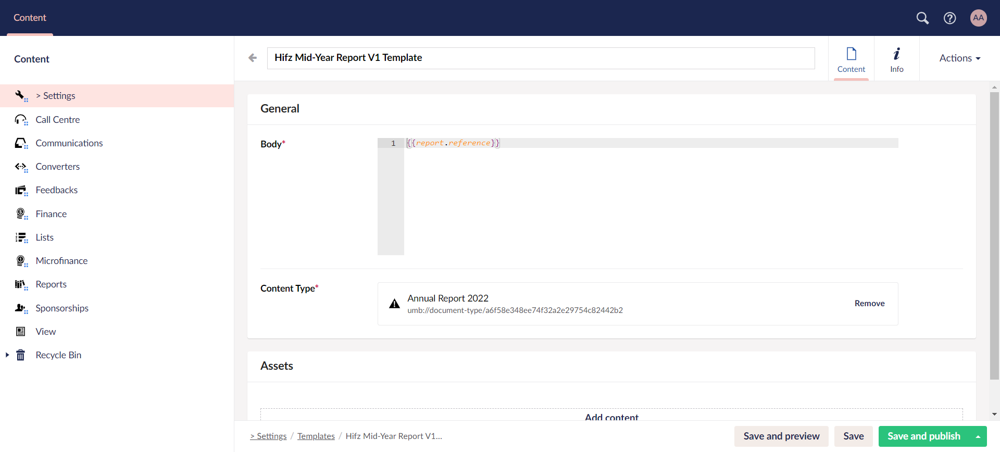
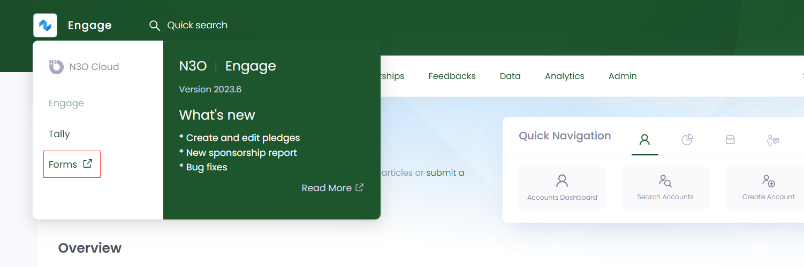
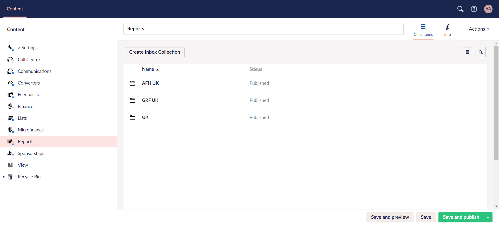
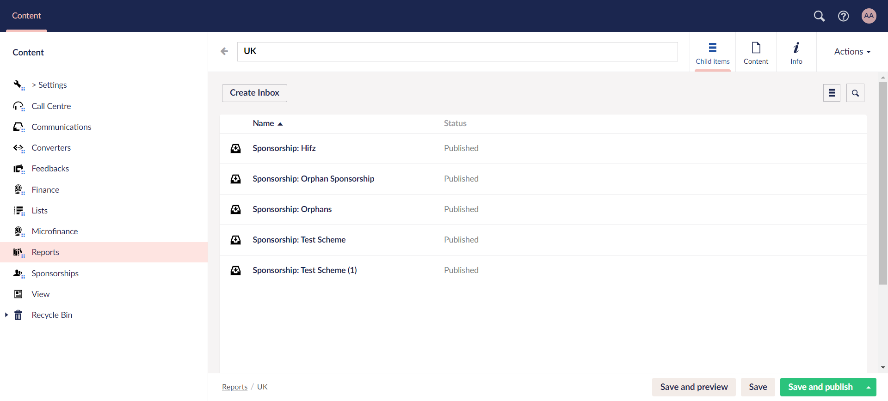
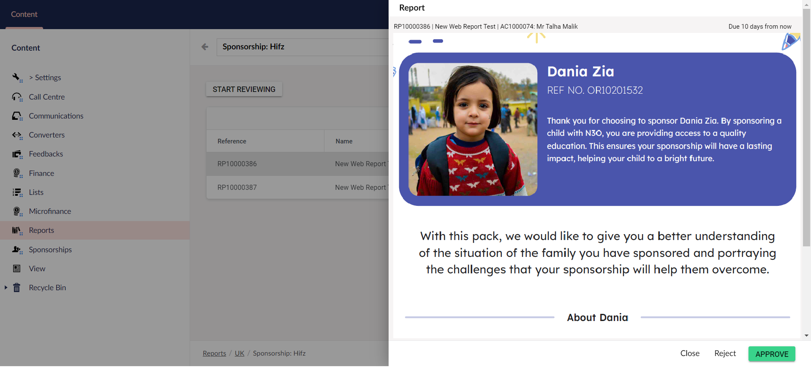

One of the most important part of **Engage Forms** under **Content** in the section menu is **Reports**. Generally, reports are structured documents that compile data and information to convey about a certain feature or buisness aspect. In Engage, reports are run, whether manually or automated, to update the charities after a certain period of time.

Some key features that Engage CRM reporting provides are:

1. **Customizable Reports:** Create reports tailored to the charities specific needs.

2. **Real-Time Dashboards:** Interactive dashboards to provide real-time visualization of key metrics and performance indicators for various reports.

3. **Automated Reporting:** Schedule reports to be generated and delivered automatically at specified intervals (daily, weekly, monthly).

## Reports in Engage

Two prominent features provide the reporting process in Engage; **sponsorships** and **feedbacks**. 

- Sponsorship reports include **sponsorship annual reports** for each individual sponsorship and **beneficiary reports** for each beneficiary stating their latest education status (grades, subject, class, marks).

- Feedback reports include **feedback project reports** for all the projects that have been instructed for completion or still pending.

## Create a Report in Engage Forms

In **Engage Forms**, the reports process is similar to that in Engage. To create a report, you first need to add a template in the *Templates* section under **Settings**. A template requires:

1. **HTML body** of the report 
2. **Document type** of whom the report belongs to
3. Any extra **assets** to be added in the report

Templates can be created manually but in most cases, they are predefined by N3O according to the charity's needs as reports are system-generated. Each report template is created empty at first for the charity to fill it up. As soon as the information is completed and saved, the report gets saved at the backend in Engage.

## Send a Report to the Donor

A report must be sent to the donor once it is created. But before sending, there are two options: **review** the report or send it **immediately**. Reports whose data has been submitted and ready to be reviewed, appear automatically in the **Inbox** section under **Reports**, in Engage Forms. 

To view the inbox section:

**1.** Click Engage on the main dashboard and navigate to **Engage Forms**. 

**2.** Click on **Reports** and you can view different inboxes related to different time zones.

**3.** Open up an inbox folder, and you can view separate folders related to **Sponsorships** and **Feedbacks**. These folders are automatically generated and synced with the existing schemes in Engage. You do not need to create them yourself.

**4.** Each folder includes all those reports that are ready to be reviewed. Click the **Review** button to analyse the report thoroughly, add any information, and choose to *approve* or *reject* the report. If a report is **approved**, it is immediately sent to the donor and if **rejected**, then update the data and send it for review again.

