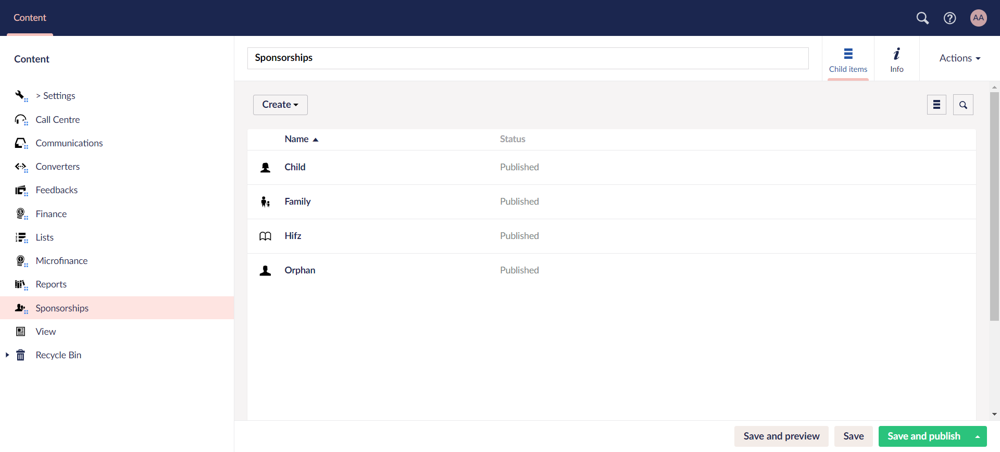
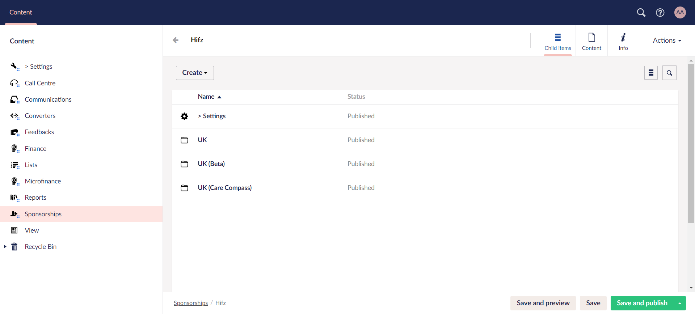
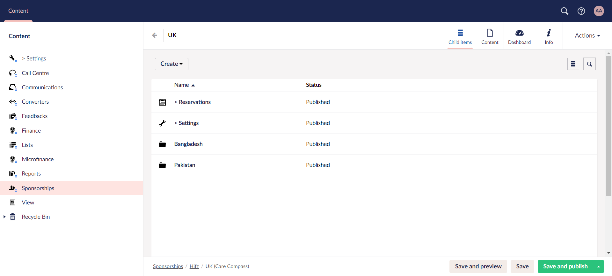
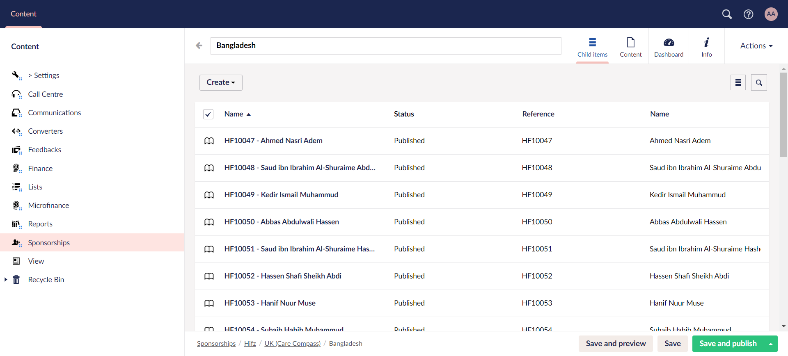
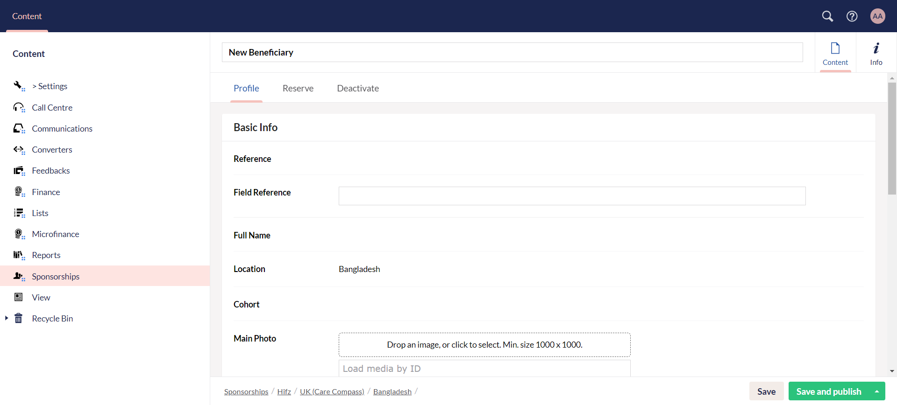
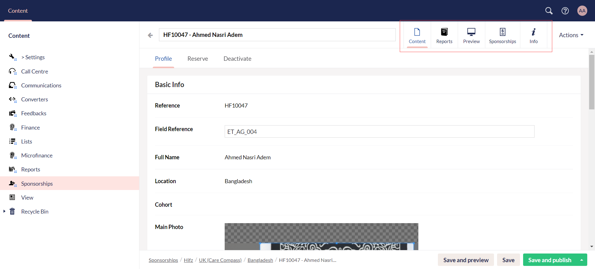

Another major part of **Engage Forms** under **Content** in the section menu is **Sponsorships**. The sponsorships module is custom-built to manage hundreds of thousands of donor-to-beneficiary relationships. It has two main parts; **Engage** and **Engage Forms**. Engage stores the relationship between the donor and beneficiary along with other functionalities such as payments and donations whereas Engage forms stores the actual data of the beneficiaries.

## Collect and Add Beneficiary Information in Engage Forms

Engage forms allow you to customize the data you want to collect about your beneficiaries (whether it’s about their family, health, education, or hobby) and manage what it looks like. Each beneficiary when added in Engage forms, is automatically synced with Engage allowing the donor to view the relationship and conduct any actions necessary.

To add a new beneficiary:

**1.** Click Engage on the main dashboard and navigate to **Engage Forms**. 

**2.** Click on **Sponsorships** and you will see a number of folders depicting the different sponsorship schemes added in Engage.

**3.** Choose any folder, and you can view further scheme folders created within. You can also create a new one via **Create**. 

**4.** Click on any scheme folder and create different locations via **Create** based on the **fund dimension "location"** for that scheme in Engage.

**5.** Choose any location folder, and you will see a list of all added beneficiaries for a particular scheme. 

**6.** To add a new beneficiary, click **Create** to populate the **New Beneficiary** screen. Under the **Profile** tab, in the **Basic Info** section, enter **field reference** and click **Drop an image** to upload a photo of the beneficiary. Input the **first name**, **last name**, **date of birth** and select the **gender**.

:::tip
1. Make sure the size of the image is minimum **"1000x1000"** dimensions. If the dimensions are less than the required, a warning message will be shown.
2. By default, **priority** and **location** will be prepopulated, and you can change it as per necessary.
3. Fields such as **ID**, **Cohort ID**, **Photo URL**, etc. are prepopulated by the Umbraco system.
:::

**7.** For each beneficiary, you can:

- Preview **HTML reports** under the **Preview** tab.
- View the donor account that is sponsoring the beneficiary under the **Sponsorships** tab with details including sponsorship **begin on** and **end date**. 
- Click **View in Engage** to view the sponsorship in Engage under the **Sponsorships** tab.

**8.** You can also choose to **reserve** or **deactivate** a beneficiary as required. Visit the <K2Link route="docs/engage/sponsorships/reserving-sponsorships/" text="Reserving" isInternal/> or <K2Link route="docs/engage/sponsorships/deactivating-sponsorship/" text="Deactivating Beneficiary documentations" isInternal/> respectively.