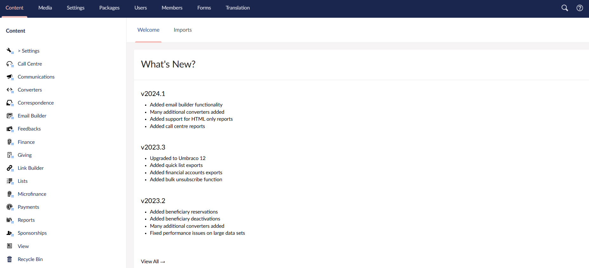
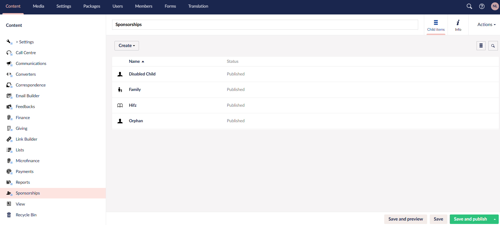
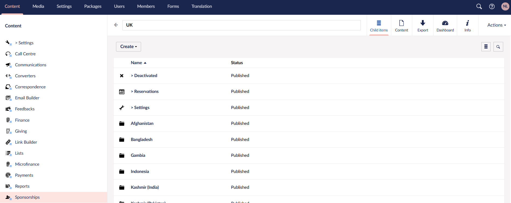
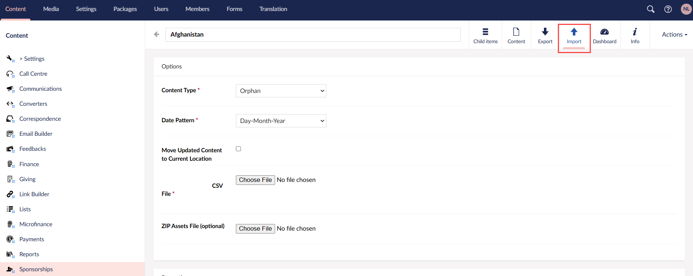
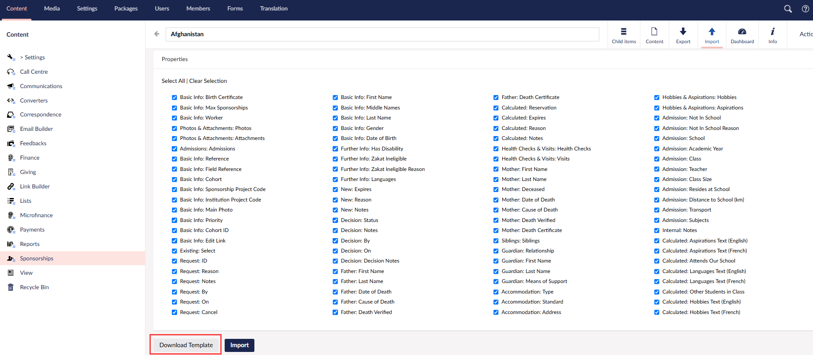
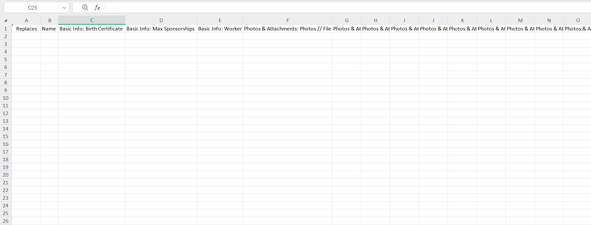
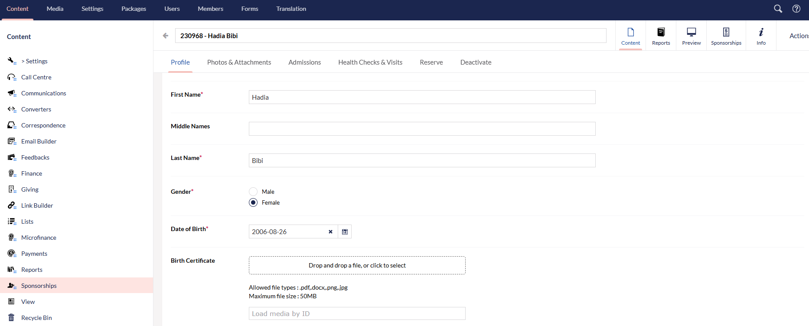
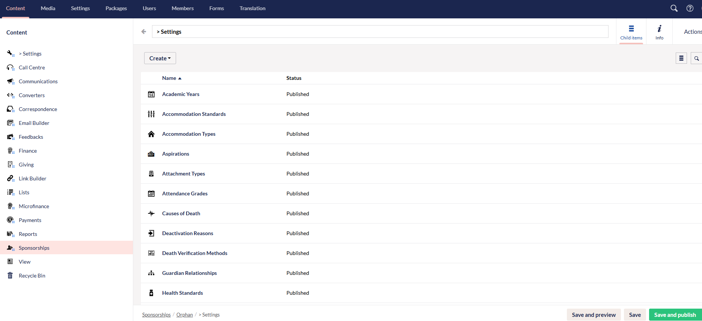
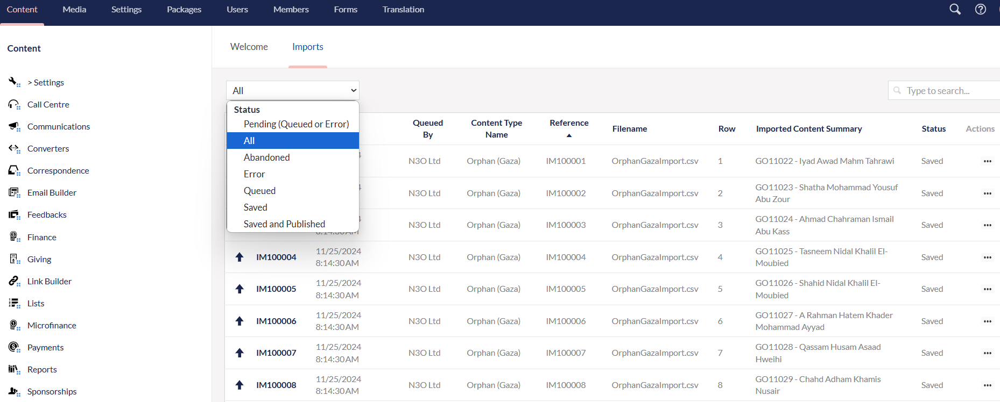

Generally, bulk import refers to the process of uploading large volume of data such as donor records into the CRM in one go, rather than adding individually. This speeds up the data entry process and reduces the chance of manual input errors. 

## How to Upload Beneficiary Data Using Engage's Bulk Import?

Engage allows you to import beneficiary data in bulk via **Engage Forms (Umbraco)**. Have a look at the detailed steps below.

**1.** Login into Engage CRM, click **Engage** on the top left-hand side, and choose **Forms** to navigate to the main **Umbraco dashboard**. 

**2.** Choose **Sponsorships** from the side menu, and select the **sponsorship scheme** you want to import beneficiaries for. As an example, let's use the "Orphan scheme". 

**3.** As orphans might be scattered across multiple locations, we categorise them into different location-based folders. Choose a single **location folder**.

**4.** Click **Import** on the top left, select the **Content Type** (defined as the sponsorship scheme), **Date Pattern** is prepopulated and scroll down to the **Properties** section.

**5.** Click **Select All** to select all the properties an imported beneficiary might require, and then **Download Template** to download the **template (Excel sheet)**. 

**6.** In the downloaded Excel sheet, there are both **mandatory** and **optional** fields available. Input all the mandatory fields and any optional fields, if required, to make sure a beneficiary is imported correctly.

:::tip
- Mandatory fields are those with an aesterisk on an actual beneficiaries profile in Umbraco.

- The **"Replaces"** field in the **Excel sheet** is only to be filled with the beneficiary reference, if you want to update any existing beneficiary's data. 
- Regarding fields having more than one option to input e.g. father's cause of death, means of support, guardian relationship, etc., choose from the ones available by visiting the **Settings** section under the related **sponsorship scheme**.

:::

Some of the mandatory fields within the Excel sheet are:

- Beneficiary's **first & last Name**
- Beneficiary's **gender** 
- Beneficiary's **date of birth**
- Beneficiary's **language**
- Fathers: **first & last name**, **date & cause of death**, **death verified**
- Mothers: **first & last name**
- Siblings: **first & last name**, **relationship** with the beneficiary & **status**
- Guardian: **first & last name**, **relationship** with the beneficiary & **means of support**
- Beneficiary's Accomodation: **type**, **standard** and **address**

Some of the optional fields within the Excel sheet are:

- Beneficiary's **birth certificate**
- Beneficiary's **zakat ineligibility** as yes or no and the **ineligibility reason**
- Admission Information: **school**, **academic year**, **class**, **teacher**, **transport** and **subjects** taken

**7.** To upload the Excel sheet, navigate back to the **Import** tab, click **Choose File** and select the **Excel CSV file**. Lastly, click **Import**. 

**8.** To view the status of your import, click the **Imports** tab on the main **Umbraco dashboard** screen. Now, select the status (**Pending(Queued or Error)**, **All**, **Abandoned**, **Error**, **Queued**, **Saved**, **Saved or Published**) of the import from the dropdown. **For convenience, select "All" as status, to view all imports.** Imports appear in the form of a list with the **name**, **time and date** it was queued at, **content type name**, uploaded **filenames**, and **status**. If the status shows **"saved and published"**, that means the import is successfully complete. You can also select the name of the import and look at the details downloaded for it. 

