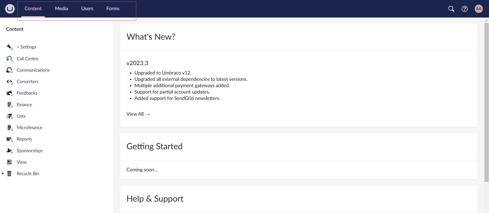
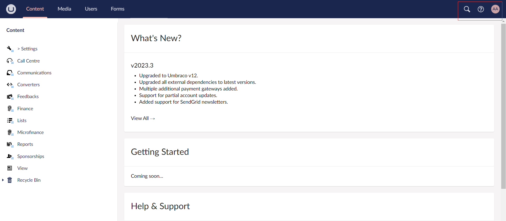
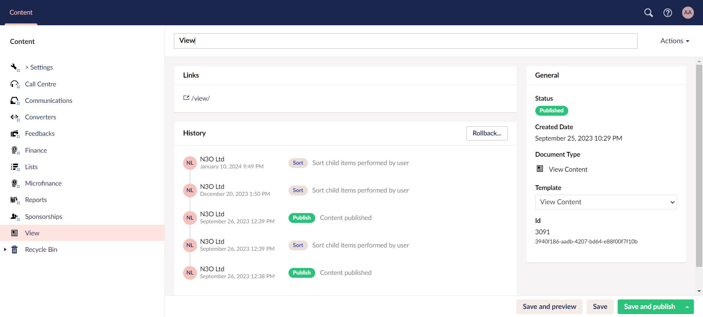
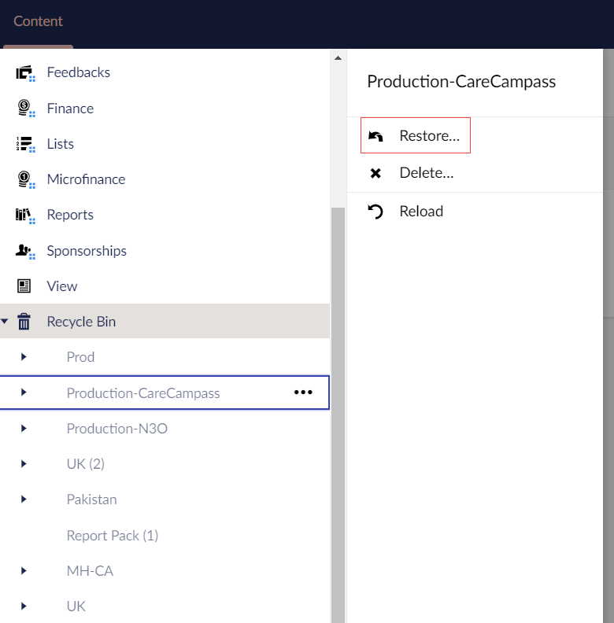
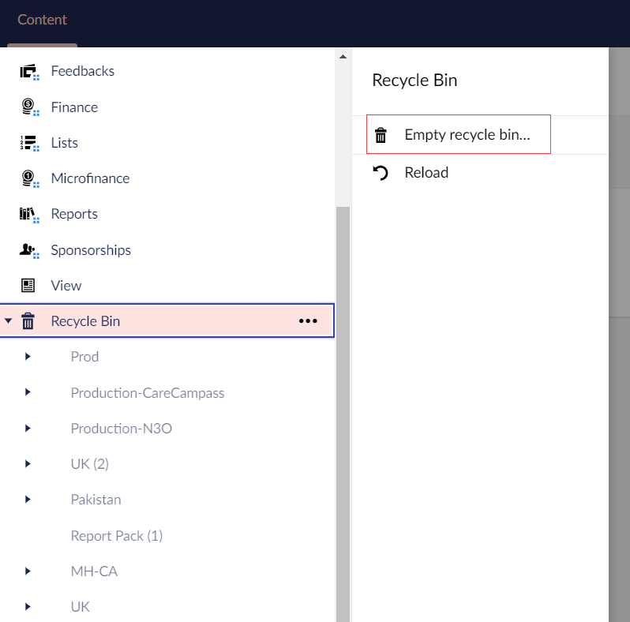
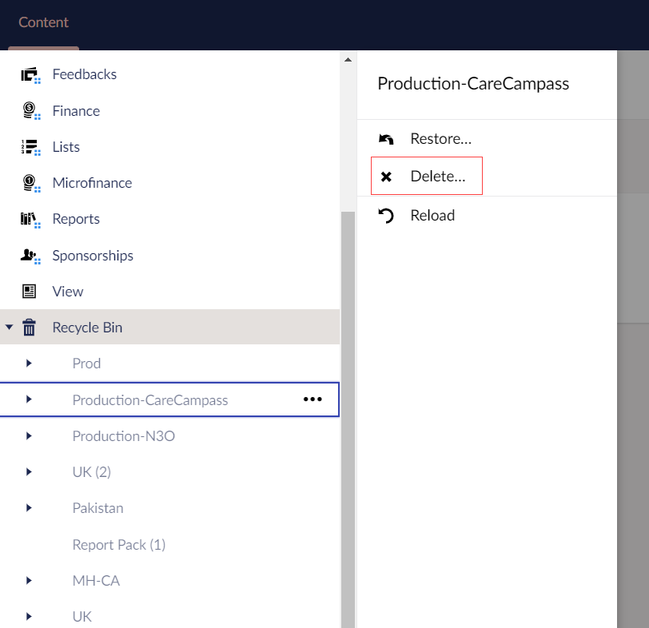

In this article, you will learn about the different sections present within the **Engage forms**.

## Section Menu

The Section menu is the horizontal menu located at the top of the Umbraco Backoffice (Engage Forms). A section in Umbraco is where you perform specific tasks related to a particular area of Umbraco. For example *Content*, *Settings* and *Users* are all sections. You can navigate between the different sections by clicking the corresponding tab.

## Help Section

The help section includes different options that you can try while using Engage forms.

1. In the top-right corner, you will find a **search tool**, which is also accessible by hitting `CTRL + Space` on your keyboard. You can search for anything within Umbraco.

2. Next to the search tool, there is a **help section**. In the help section you can find Engage forms Backoffice tours and links to Umbraco resources such as documentation and UmbracoTV.

3. There is also a small **user section** with shortcuts to edit the currently logged-in user, and view their most recent activities.

## View Section

The View section is predefined by N3O to look upon the history of actions performed for each feature in Engage forms. 

1. The **Links** section includes link to the view page.

2. The **History** section talks about **previous** or **recent actions** performed within Engage forms along with the **date** and **time**. You can also rollback to the previous version of any action using the **Rollback** button.

3. The **General** section inlcudes information of the **View** section like **Created Date**, **Document Type**, etc. 

## Recycle Bin

The Recycle Bin is a separate tree list which can be found at the bottom of the section tree view in the **Content** and **Media** tab only. Clicking the arrow to the left of the Recycle Bin icon will reveal any pages that have been deleted from the website.

### Restore Deleted Pages

To restore deleted pages from the Recycle Bin:

1. **Right-click** the page you wish to restore from the Recycle Bin and select **Restore**. Alternatively, click **...** next to the page in the Recycle Bin and select **Restore**.

### Empty Recycle Bin 

If you are confident you no longer require any pages in the Recycle Bin, you can permanently delete it. To empty the Recycle Bin:

1. **Right-click** the Recycle Bin and select **Empty recycle bin**. Alternatively, click **...** next to the Recycle Bin and select **Empty recycle bin**.

### Delete Individual Pages

To delete individual pages from the Recycle Bin:

1. **Right-click** the page you wish to delete from the Recycle Bin and select **Delete**. Alternatively, click **...** next to the page from the Recycle Bin and select **Delete**.

