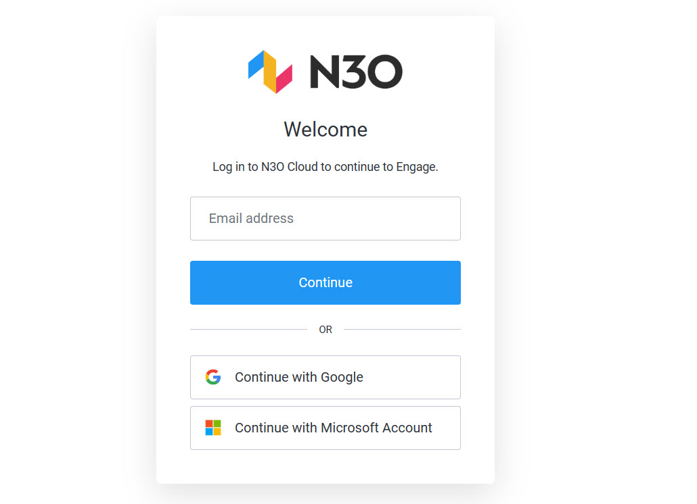
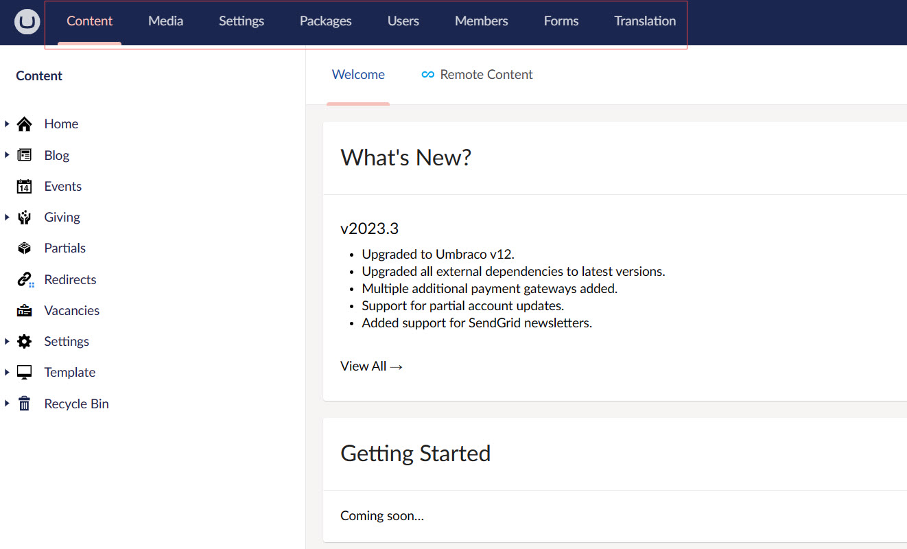
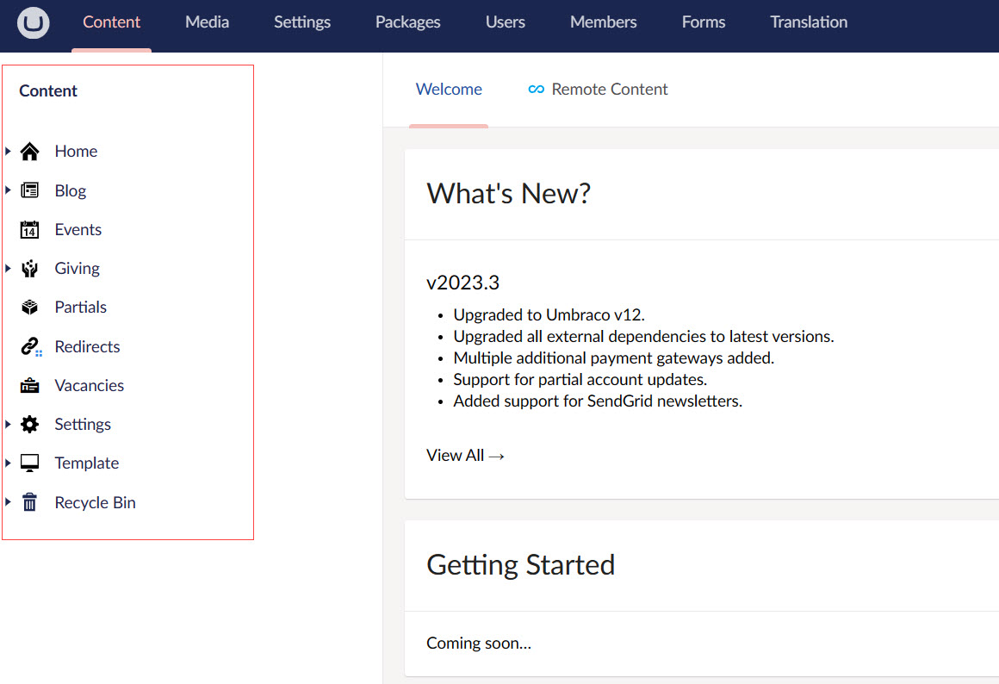
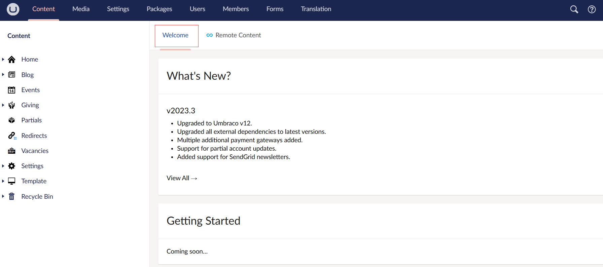

Umbraco is an open-source content management system (CMS) built on the Microsoft .NET framework. It provides a flexible, customizable, and editor friendly platform for creating and managing websites. Here's a brief introduction to Umbraco:

1. **Open Source:** Umbraco is open-source, which means its source code is freely available for developers to modify and extend according to their needs.

2. **Content Management:** Umbraco provides a user-friendly interface for content management, allowing editors to create and organize content with ease. Content can be structured using a variety of data types, including text, images, videos, and documents.

3. **Customization:** Umbraco's architecture allows for extensive customization through the use of templates, macros, and custom data types.

## Use Umbraco to Build Websites

Umbraco CMS can be used to create a fully functional website tailored to your specific needs, but this guide will walk you through the example of an **Umbraco website** customized by N3O's team. 

A basic guide to get started with a new website includes:

1. Installation and Setup
2. Content Structure + Temlplates
3. Styling and theming
4. Rendering content and adding any new functionality
5. Testing and deployment

All the above initial steps required for a customized website are already done by N3O. To get started, N3O will provide you an **Umbraco backoffice login URL** which will redirect you to the **N3O login screen**. It is important to note that in order to access the Umbraco infrastructure, you must be added as a normal *Engage CRM User* beforehand. If you are not added as a user, then contact N3O at `support@n3o.ltd`. 

## Getting Started with the Umbraco Backoffice  

:::note Important
Engage CRM is integrated and interconnected with the Umbraco backoffice while building a website. Hence, it is important to remember that any change made in the CRM will automatically be reflected within Umbraco.
:::

On the *N3O login screen*, login with your **email** and **password** given by N3O, and you will be redirected to the Umbraco backoffice screen (mainly known as backend). This is actually the staging site where you can make any changes and publish them.

:::tip
To view the actual website built using Umbraco, copy the staging URL before `/umbraco` and paste it in a new browser tab. Each and every content added in the backoffice will appear on the production site.
:::

In the Umbraco backoffice, you can view different sections related to different functionalities, but, each of you may have different access capabilities to those sections. **Normal users** can only edit, add and publish content, however, users with **admin priviledges** can perform more than that. 

Let's have a look at the main concepts that will be used throughout the Umbraco backoffice.

### Section Menu

The Section menu is the horizontal menu located on the top of the backoffice. A section is where you perform specific tasks related to that section. For example, **Content**, **Settings** and **Users**. You can navigate between the different sections of the backoffice by clicking the corresponding icon in the section menu. 

:::note Important
Normal users will have access to *Content*, *Media* and *Packages* only, but admin users can access all including *Settings*, *Users* and *Members*.
:::

### Tree

A tree is a hierarchical list of items related to a specific section, for example *Content* or *Settings*. You can expand trees by clicking the down arrow to the left of each node or by double-clicking the node. 

For example, the *Content* section contains all the main building blocks **(Home, Giving, Settings and Template)** that you need in order to build a website and *Users* section includes information for all the users and members in Umbraco.

:::note
A node is an item in a tree. Pages and content are displayed in the Content tree, while media section items appear as nodes in the Media tree, and so on.
:::

### Dashboard

A dashboard is the main view you are presented with when entering a section within the backoffice. It can be used to show valuable information to the users of the system. Normal users will see a *Welcome dashboard*, but admin users will see a *Welcome* and an additional *Remote Content* dashboard.

