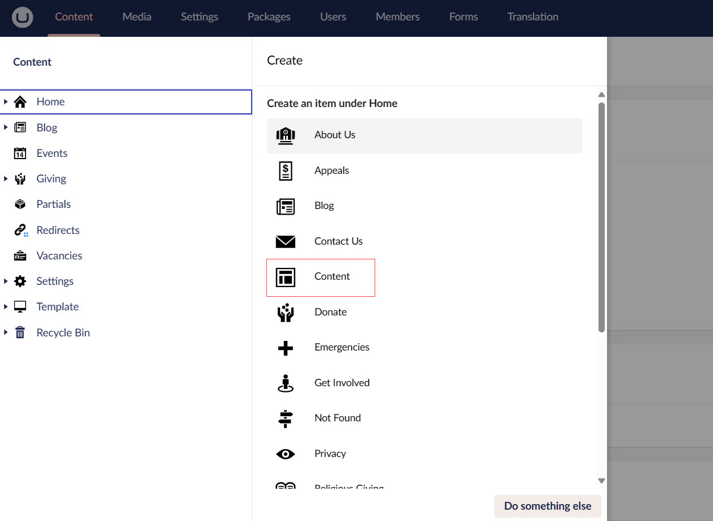
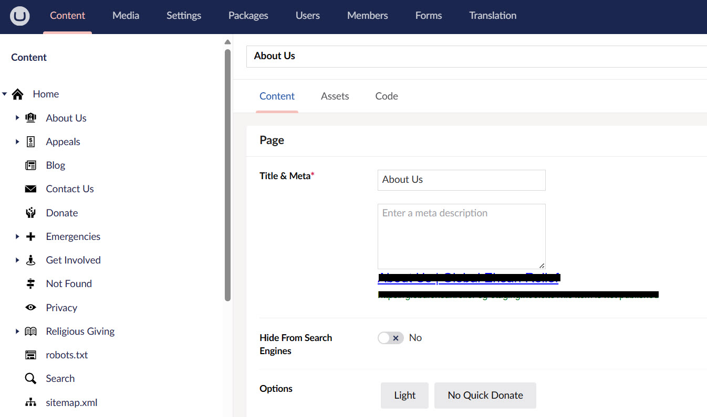
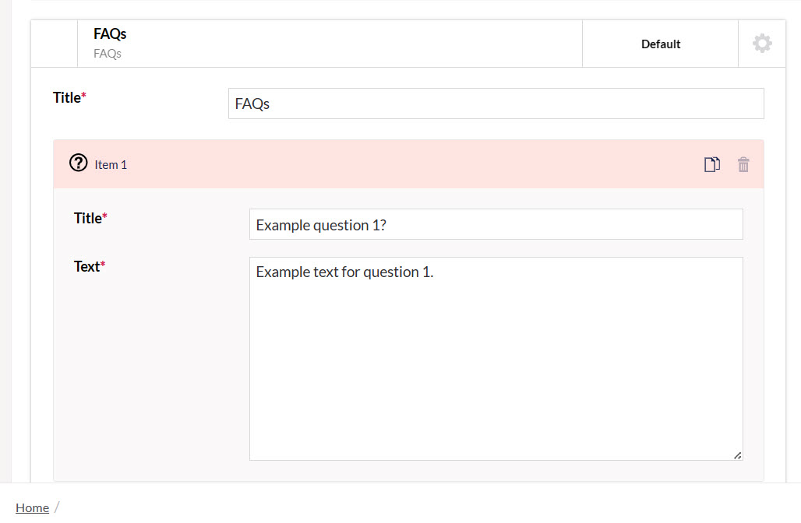
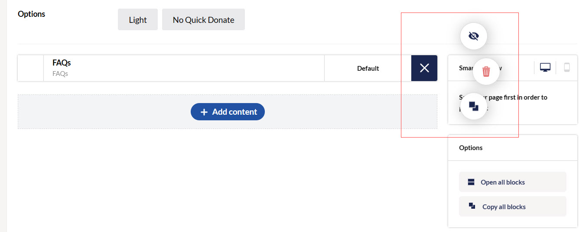
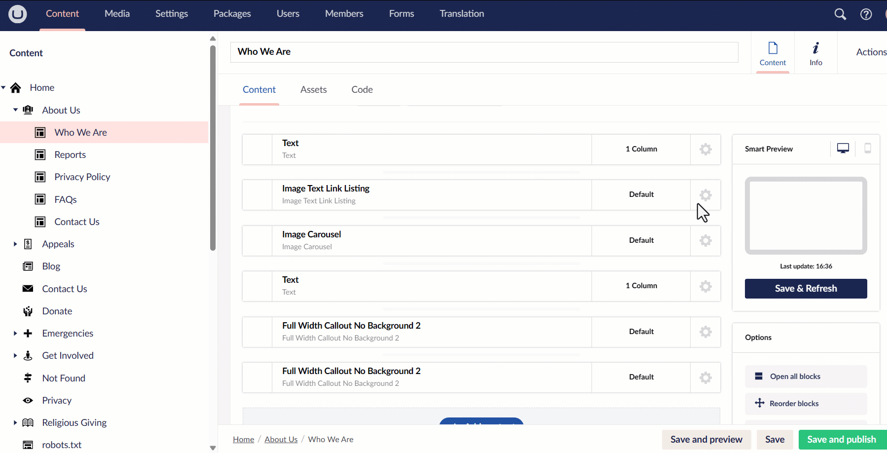

The first important building block under **Content** in the section menu is **Home**. Everything added onto the website as text, images or any other information is present under Home. It is basically the root node of all the child nodes present in a website. For example, *Home* may include *About Us* or *Get Involved* as separate sections in the header menu. 

:::info
Remember that before any content can be created in the Umbraco backoffice, it needs to be defined first as a *Document Type*. Read more about document types in the <K2Link route="https://docs.umbraco.com/umbraco-cms/tutorials/creating-a-basic-website/document-types" text="Umbraco documentation"/>. However, document types are already predefined by N3O team for you.
:::

## Adding Multiple Pages Under Home

Multiple pages with subsections can be created under Home. These pages would again differ based on the website you create. However, this guide will walk you through the pages of the website built by N3O. 

:::tip
It is important to note that **Home page** needs to be created before creating any other subpages.
:::

For a website, each item in the header menu will be created as a page along with its subsections. For example:

1. **About Us** may include **Who We Are**, **Reports** or **Privacy Policy**. 
2. **Get Involved** may contain **Newsletter**, **Donation**, or **Volunteer**.
3. **Projects** may include all projects that a charity is working for.

To add a new page under Home, follow these steps:

**1.** Hover over Home and click the **... dots**.

**2.** Click **Content** under the *Create* screen. A new page opens up on the dashboard.

**3.** Enter the **name** in the top textbox and **Title & Meta** as a short but descriptive title and description. You can also make the name and title similar to avoid confusion. 

**4.** As soon as the above is added, a URL linking to the page will appear below the *meta* description.

**5.** If you want to hide the page from Google search, then toggle **Hide From Search Engines** as yes, otherwise no. 

**6.** To add content blocks in a page, click **+ Add content** to view different content blocks already predefined as a part of the design process by N3O developers. Some of them are under the **General** category and other under **Advanced**. The name of each block is also preconfigured and will vary from client to client.

:::info
- Each block is basically a separate section that can be viewed on the production website.
- Any change done on the block will automatically reflect on the production website.
:::

**7.** Pick any content block, for example, **FAQs** or **Hero Donation Form** and click **Insert selected**. It will appear as an expandable block on the page.

:::tip
You can also view the layout of the block by clicking **Pick layout**.
:::

**8.** Expand the block and add the required details within. Each block has different textboxes related to different information and may include multiple versions. For example, the **FAQs** block has a **Title** textbox and **FAQ questions** in the form **Item 1** and **Item 2**, that can be added or removed according to your requirement.

**9.** Individual blocks may include following information to be added:

- **Title** of the block.
- **Images** with their preferred dimensions already mentioned within the block.
- **Buttons** that may link towards other pages.
- **HTML** generated texts that can be changed according to need.
- **YouTube** or other `.mp4` extension videos with text defined for them.
- **External URLs** to add any external links other than the website pages.

**10.** Multiple content blocks can be added on a single page. Each of the block can be **copied**, **removed** or **hid** within the page. Click the **gear icon** on the right side of any block and perfom the action you want.  

**11.** You can also see a mini preview of the block added to the website as soon as you save it in the **Smart Preview** section.

**12.** Furthermore, you can copy all blocks added, expand all if required and reorder them as necessary. As soon as all blocks are added or even if one of them is added, click **Save and Publish**.

:::tip
To only save your work for further changes, click **Save** and to save your work and view an unpublished version of the website, click **Save and Preview**. An Umbraco preview of the website will appear.
:::

## Editing Pages or Blocks

Similar to creating pages and adding blocks, you can also edit any added page or block preset by the N3O team. Simply open up the relevant page, change any information you want in the block or page section and click **Save and Publish**.

