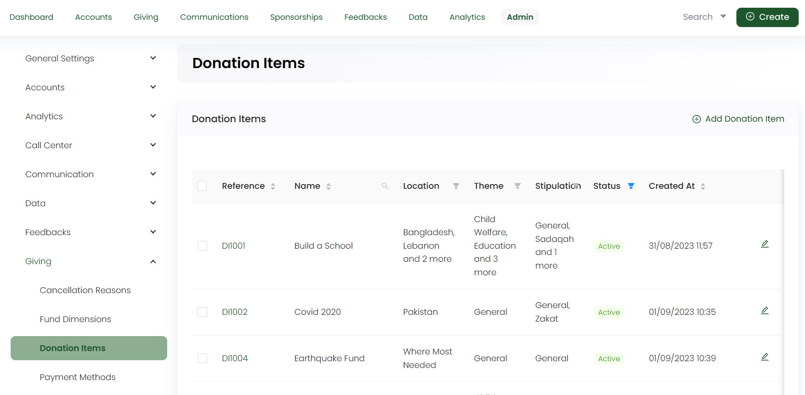
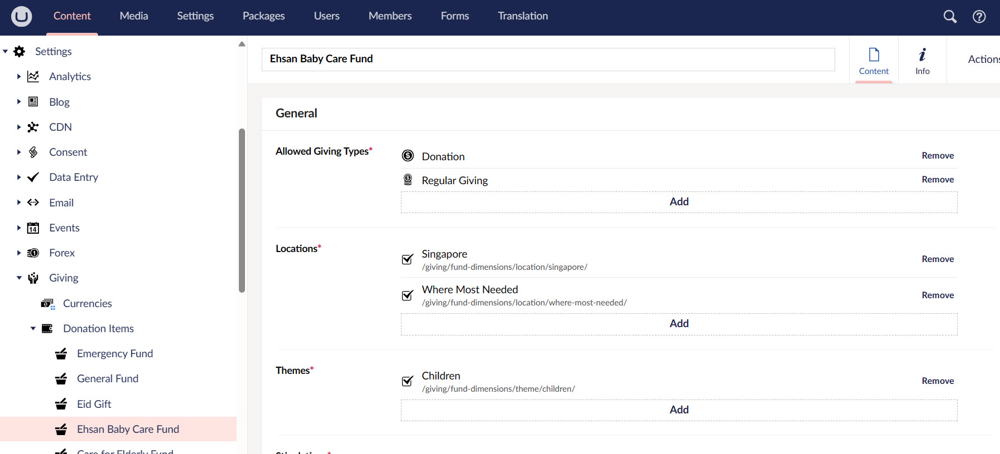
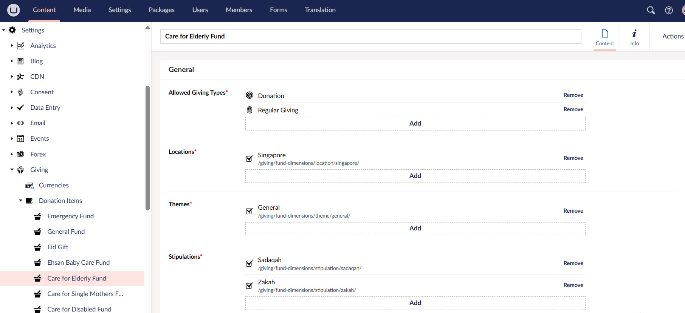

The next main building block under **Content** in the section menu is **Settings**. This module is related to all the donation items and projects that you are raising money for. It is important to note that this effective integration between Umbraco and Engage CRM ensures that charities having a higher number of donation items get rid of the struggle to know what's coming into the website or the CRM.

This guide will show you how the donation items are first added in Engage and then linked to the Umbraco backoffice. 

## Adding Donation Items in Engage

Each donation item added in the Umbraco backoffice must first be created in the Engage CRM. You can ask your system administrator to add all the donation items for your charity organisation via the admin section. To read more on how to add them, visit the <K2Link route="docs/administrators/giving/adding-donation-items/" text="Adding Donation Items Administrator docs" isInternal/>.

As soon as a donation item is added, it is automatically linked within Umbraco and you can choose those items for the projects you want to market for a specific audience.

:::caution
Any change or addition made towards a donation item, whether **fund dimensions** (location, theme or stipulation) or **name** is automatically reflected upon refreshing the Umbraco backoffice. 
:::

## Viewing or Editing Donation Items in Umbraco Backoffice

To view or edit a donation item in the Umbraco backoffice:

**1.** Go to **Settings** and select **Giving**.

**2.** A folder containing all existing donation items predefined by N3O will be shown.

**3.** Refresh the page to view the donation item added before in the Engage CRM. Choose that one or any existing e.g. "Care for Elderly Fund".

**4.** The donation item page displays the **type of giving**, **fund dimensions** (location, theme, and stipulation) and **price**. Fud dimensions can vary from client to client. This information exactly matches with the one in Engage CRM.

