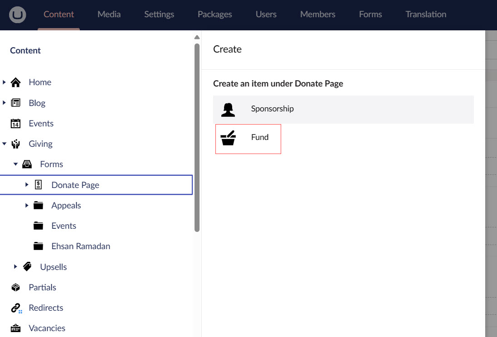
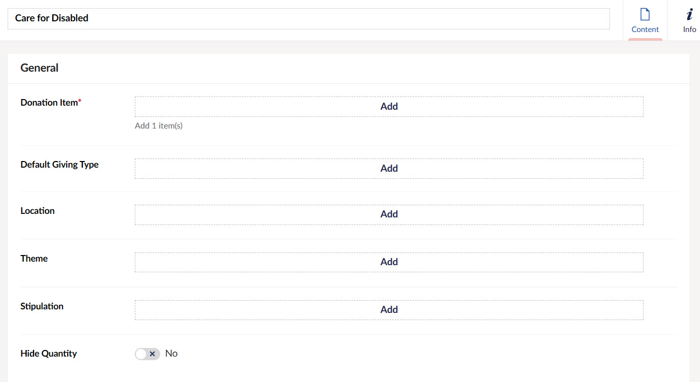
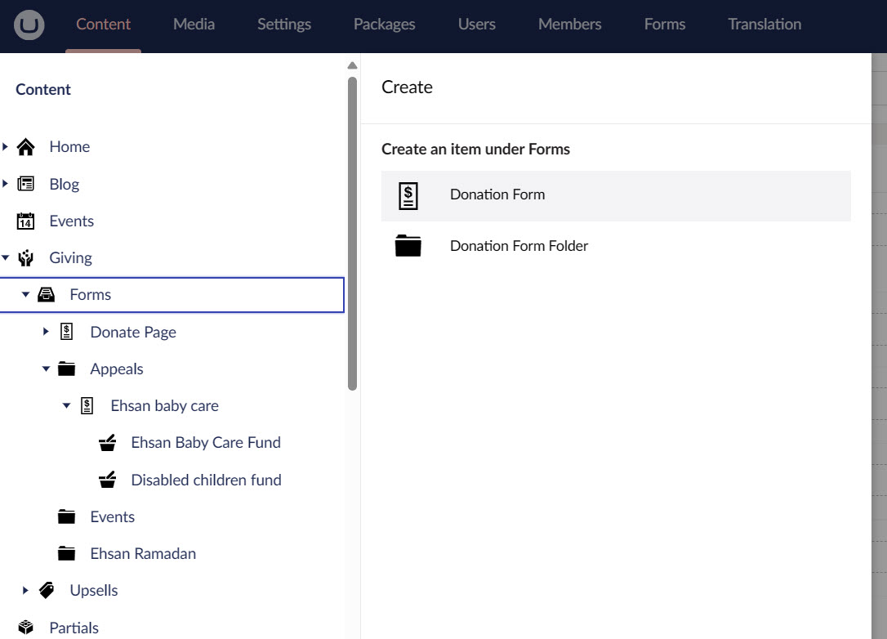
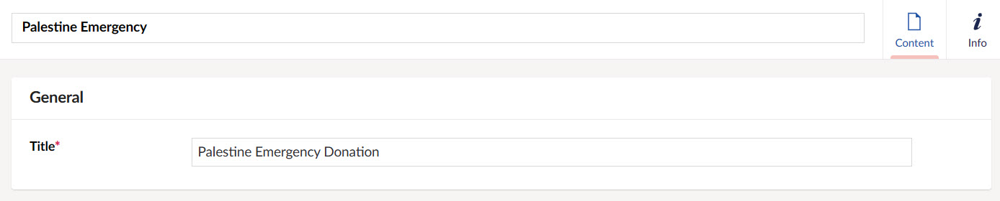
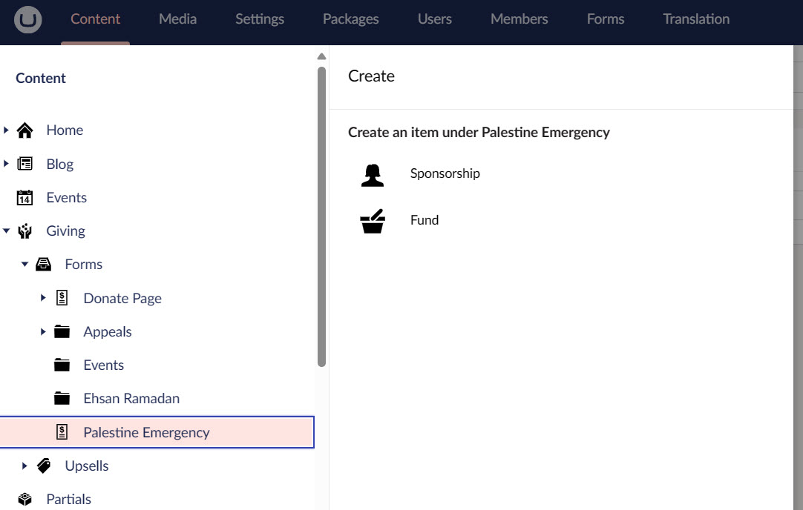
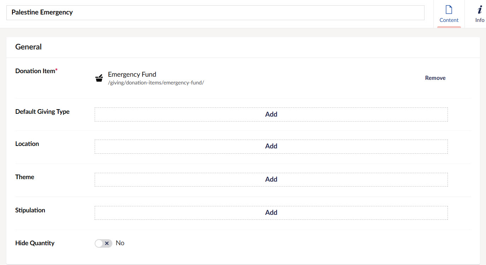

As soon as all the donation items are added and configured in the Umbraco backoffice with the Engage CRM, the next step is use them to raise money for a dedicated cause. This is done via adding donation forms on the website.

A charity organisation may have separate donation forms to raise donation via the website as a whole or separate pages. Let's look at each of those forms in detail.

## Viewing the Donate Page for General Donations and Adding Funds

:::note
Every change made to the **Donate Page form** would automatically reflect on the production site.
:::

The donate page is the actual checkout to donate generally via the website. Click the **Donate Now** button on the top right of the production site to view the page. 

To add a new fund to the existing donate page form, preconfigured by N3O:

**1.** Go to **Giving** and select **Forms**. A **Donate Page** item will appear.

**2.** Hover over Donate Page and click the **... dots**. 

**3.** Click **Fund** on the **Create** screen.

**4.** Input the **name** of the fund, add the donation item for which the fund would raise money, default **giving type**, each **fund dimension** (*location*, *theme* and *stipulation*) and **price handles** related to the giving type.

**5.** The fund added in the donation form can be viewed in the dropdown and price handles if added would show as defaults on the production site. *For example, a fund with donation item "Care for Disabled", and any price handles as providing "$50 to 1 child" or "$100 to 2 children" when added, will automatically reflect under the dropdown in the main donate page.*

## Viewing Donate Forms for a Single Page and Adding Funds

:::note
Every change done in the single page donate forms would automatically reflect on the production site.
:::

You can also create separate donate forms for each page on the website. For example, the *Palestine Emergency page* can have a donation form to raise money for Palestine emergency only. To view and add funds to a form for a single page:

**1.** Go to **Giving** and select **Forms**. 

**2.** Hover over **Forms** and click the **... dots**. Select **Donation Form**.

:::tip
You can also create a **Donation Form Folder** and then add a donation form within it.
:::

**3.** **Name** the page and give the form a **Title**.

**4.** Now, hover over the donation form created and click the **... dots**.

**5.** Click **Fund** on the **Create** screen.

**6.** Input the **name** of the fund, add the donation item for which the fund would raise money, default **giving type**, each **fund dimension** (*location*, *theme* and *stipulation*) and **price handles** related to the giving type.

**7.** The fund added in the donation form can be viewed in the dropdown and price handles if added would show as defaults on the production site. *For example, a fund with donation item "Palestine Emergency", and any price handles when added, will automatically reflect under the dropdown in the main donate page.*