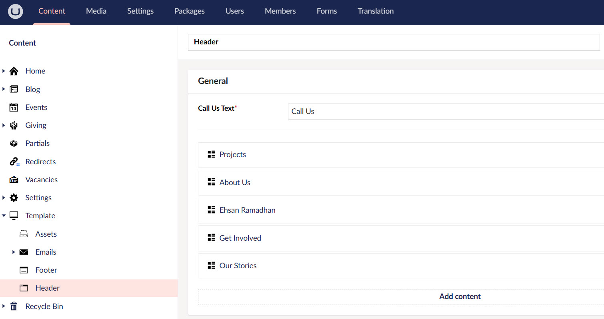
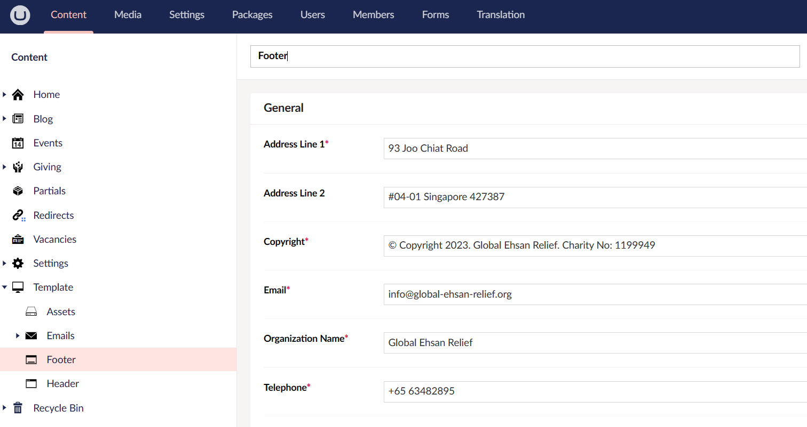
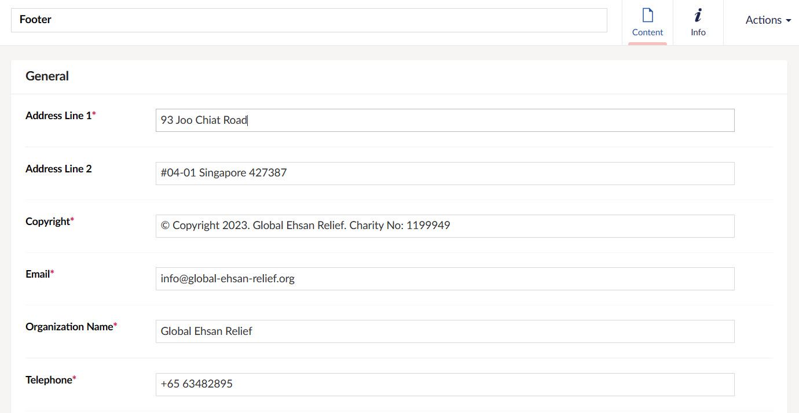
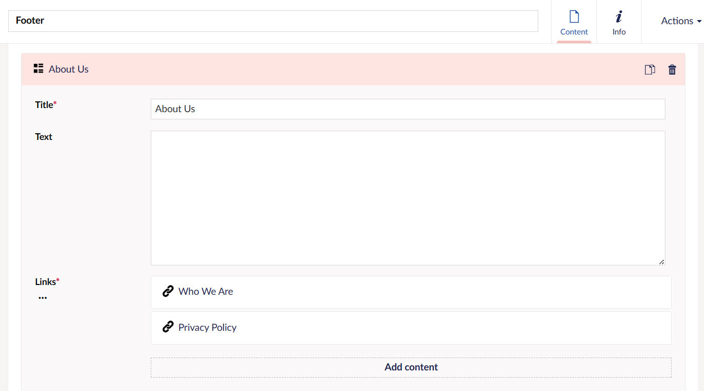

The last building block under **Content** in the section menu is **Template**. Template defines all the header and footer options to be added onto the website. 

## Header

Header is the main navigation menu on the top of each page in a production website. For example, the sample website explained in the guide has *Projects*, *About Us*, and *Get Involved*, etc. in the header menu.

The header in a website may include:

1. Website's logo or name (branding)
2. Navigation menu to navigate to different pages and sections
3. Search bar to search different content
4. Utility links such as login, sign up options
5. Donation button to donate 

### Adding Header Menu Options

To add different header options in the Umbraco backoffice, click on **Template** and then **Header** to view the Header page.

:::note
- The *Header Document Type* has already been pre-defined by the N3O team, therefore you can add the menu options directly.
- All menu options and their related information to be added will be based on your website and Engage CRM subscription.
:::

**1.** On the *Header* page, you will notice two tabs namely, **Content** and **Info**. Content includes the *General* section where navigation menu options can be added and *Info* contains the links, history of the header page, etc. 

:::tip
Each header option added and published, will automatically appear on the production website URL.
:::

**2.** To add a new menu option, click **Add Content** and a box will appear with the name *Item x*, where x represents the number of the box. Input the following:
    
- **Title** of the menu option.
- Some **text** about the option if required, but prefer to leave it blank.
- **Links** as the sub menu options under the main header menu. 

**3.** To add links, click **Add Content** and a box will appear with the name *Item x*, where x represents the number of the box. Now add the following:

- Drag and drop an *icon file* or select from your local drive with the extension `.svg` as pre-defined by N3O, under **Icon**.
- Add the link to where the sub menu option would navigate to, in **Link Content**.
- If the page navigates to an external URL then add it in the **Link External URL** textbox.
- Name the sub menu option in the **Link Text** textbox.

**4.** Click **Save and Publish** to save and view all the changes made on the published version of the website. As soon as all the boxes added are saved, their respective names appear instead of *Item x*.

:::tip
To only save your work for further changes, click **Save** and to save your work and view an unpublished version of the website, click **Save and Preview**. An Umbraco preview of the website will appear.
:::

**5.** You can perform other actions on the menu boxes as defined below.

- Change the order of the menu options as required. Simply double-click the box and move it up or down and then save and publish.
- Copy a box via the *copy icon* and paste it as a duplicate.
- Delete a box via the *delete icon* to remove it from the menu. 

## Footer

The footer of a website appears at the bottom of each page. Some common components found in the footer are:

1. Navigation links of the main header menu 
2. Contact information for the charity
3. Copyright information
4. Social media links or icons

### Adding Footer Information 

To add the footer information in the Umbraco backoffice, click on **Template** and then **Footer** to view the Footer page.

:::note
- The *Footer Document Type* has already been pre-defined by the N3O team, therefore you can add the information directly.
- All the footer related information to be added will be based on your website and CRM Engage subscription.
:::

**1.** On the *Footer* page, you will notice two tabs namely, **Content** and **Info**. Content includes the *General* section where all information would be added and *Info* contains the links, history of the footer page, etc. 

:::tip
All footer information added and published, will automatically appear on the production website URL.
:::

**2.** Add the following information as footer for a website.

| Textbox | Description |
| ------- | ----------- |
| **Address Line 1 and 2** | Address of the charity organization. |
| **Copyright** | Description of copyright details. |
| **Email** | Email address to contact the charity. |
| **Organization Name** | Name of the charity organization. | 
| **Telephone** | Telephone number to contact the charity. | 

**3.** You can also add or edit any previous navigation links added for the main header menu. Click **Add Content**, input the **title** and **text** and add links to the sub items if needed, with the same procedure as defined above for the header in *step 3*.

