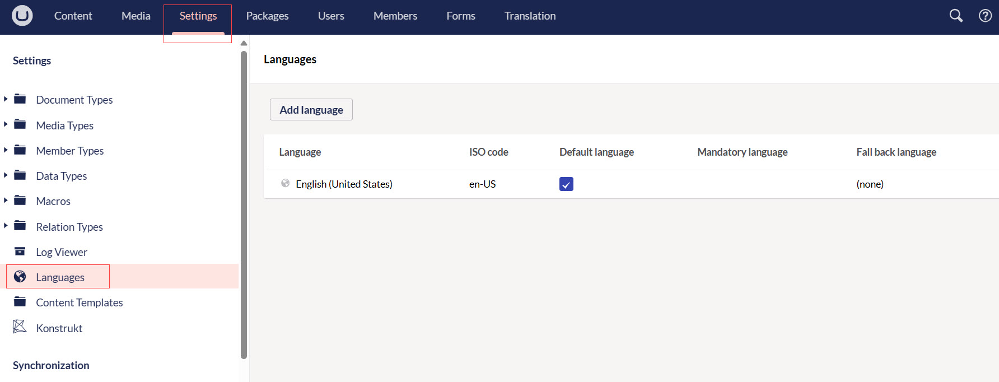
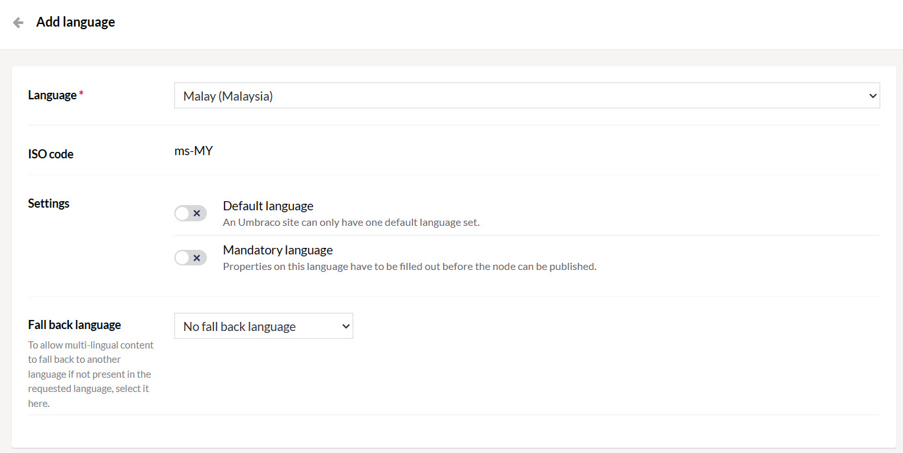
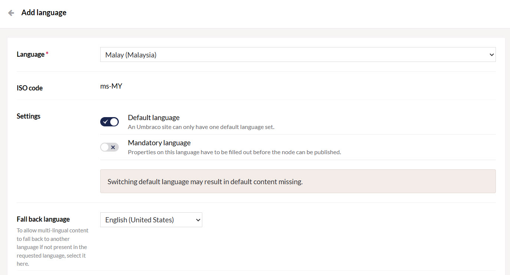
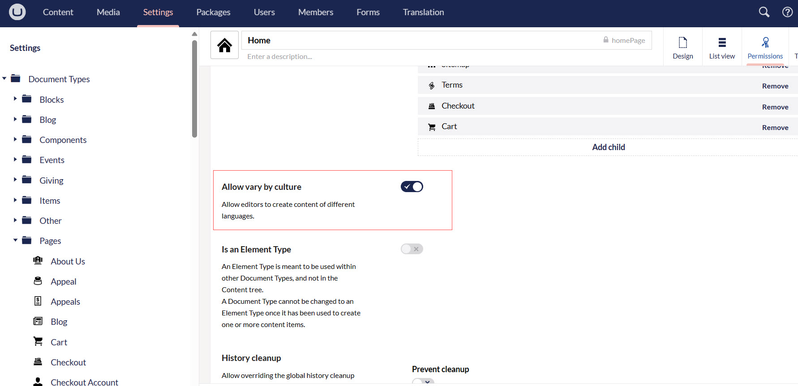
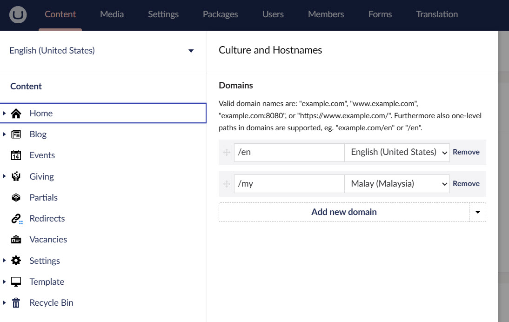
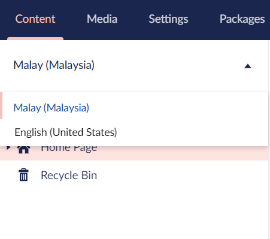
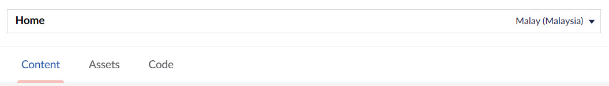
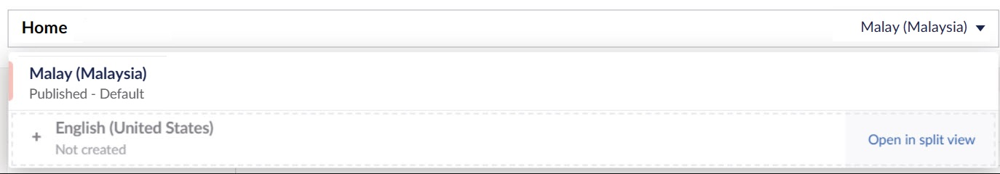
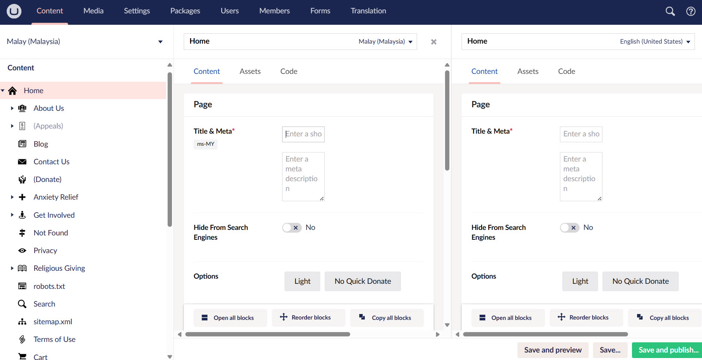
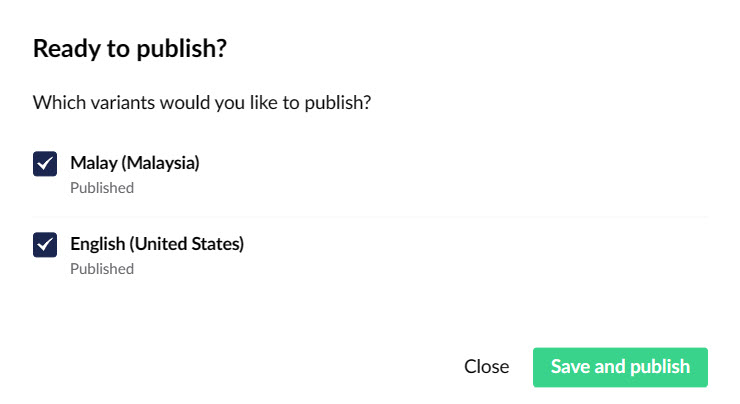

Now that we have a basic website set up, let's make the site multilingual by making variations of our content in one more language. For this tutorial, we will make a *Malaysian* version of all the pages.

## Adding a new language

To add a new language, follow these steps:

**1.** Go to the **Settings** tab in the main menu.

**2.** Select **Languages** in the Settings tree. The **Languages** window opens in the editor. The default language **English** is already displayed where all the content was added.

**3.** Click **Add Language**. The **Add Language** window opens in the editor.

**4.** Select a Language from the dropdown list. In this tutorial, we will pick **Malay**. An **ISO code** generates automatically.

**5.** In **Settings**, to set the new language as the:

- Default language for your site, toggle **Default Language**.
- Mandatory language for your site, toggle **Mandatory Language**.

**6.** Select a **Fallback Language** from the drop-down list and click **Save**.

## Enabling Language Variants on Document Types and Properties

:::info
Document Types define what kind of content can be created in the Content section and what an end-user sees and can interact with.
:::

To enable language variants on Document Types, follow these steps:

**1.** Go to the **Settings** tab in the main menu.

**2.** Select **Pages** from the Document Types folder and any specific page. For now, we choose **Home**.

**3.** Go to the **Permissions** tab on the top right and toggle **Allow vary by culture** and click **Save**.

**4.** Now, move to the Design tab.

**5.** Click on the **gear icon** of the **Page Title** and toggle **Allow vary by culture** and click **Submit**.

## Adding Culture and Hostnames to the root node of the website

:::info
This section can be predefined and completed by the user with admin rights only.
:::

To add culture and hostnames so that the website can appear under different URL for a separate language, follow these steps:

**1.** Go to the **Content** tab in the main menu.

**2.** Right-click on the **... dots** next to the **Home** content node and select **Culture and Hostnames**.

**3.** Add a **domain** for each hostname and click **Save**.

## Adding Language Variants to the Content

For multilingual websites, you will find a language dropdown above your content tree. If it's not there, you might need to refresh the page:

In the language dropdown, you will find all the languages that you have installed for your site. You can switch between them to update the content variations for each language.

To add language variants to the content, follow these steps:

**1.** Go to the **Home** node. You will find a language dropdown next to the title at the top:

**2.** Click the dropdown and hover over the new language. You will see an **Open in Splitview** option will appear.

**3.** Click Open in Splitview. In this splitview, we can see the content node with each language side by side.

**4.** Enter the **Name** for your content node and the **Title & Meta** in the new language.

**5.** Click **Save and Publish**. The **Ready to Publish** window opens providing the option to publish in one or more languages. You can select either one or multiple languages and click **Save and Publish**.   

