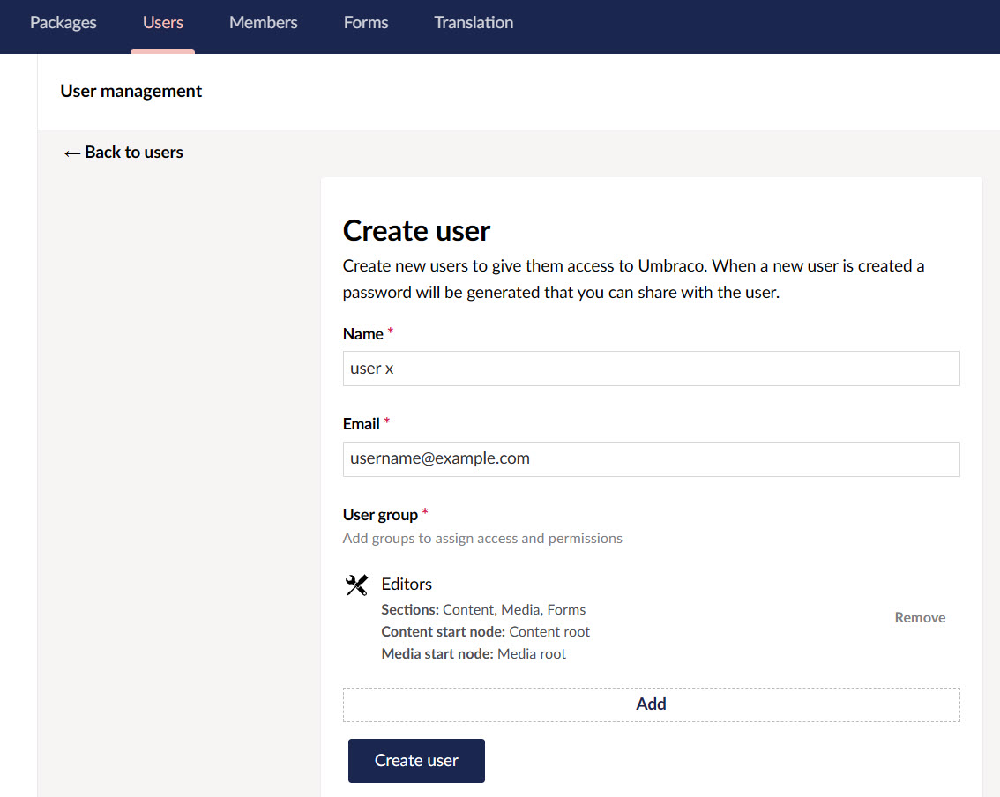
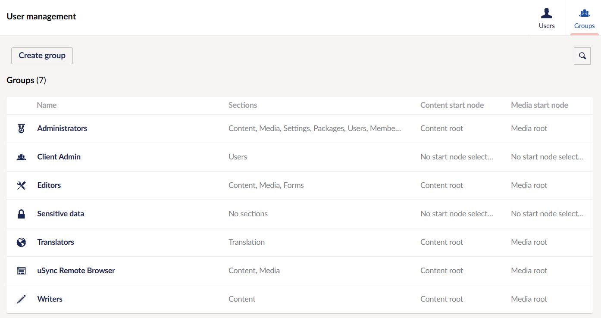

Users are people who have access to the Umbraco backoffice. These include Content Editors, Translators, Web Designers, and Developers. This guide will explain how to define, create, and manage users in the backoffice.

:::note Important
- **Users** tab in the section menu only appears for users having administration rights.
- To add a user, first navigate to the **Engage CRM** and ask your **system administrator** to add a new user for you in the <K2Link route="docs/administrators/manage-users-and-roles/" text="Manage Users and Roles" isInternal/> section.
:::

To add a user, navigate to the **Users** tab, click the **down arrow** next to **Invite User** button and select **Create user**. You will be prompted to enter the **Name** and **Email** for the new user. You will also need to select which **User group** the new user should be added to such as *Administrators*, *Client Admin* or *Editors*, etc.

:::info
It is advised to not invite the user, as sometimes emails might not be recieved by the user due to some reasons.
:::

Once you have created the user, an autogenerated password will be provided. This password needs to be used to access the account. 

:::tip
In the case while using Engage, the generated password is not needed since the same login and password can be used to login into the Umbraco backoffice.
:::

## User Profiles

Every user added appears under the **Users** tab and has some default properties as defined:

1. Change/Remove photo.
2. Change Password (provides option to set a new password).
3. Disable (allows one to disable service access).
4. Update the email for the user.
5. Language (sets the backoffice language of the user account).
6. User Group (determines scope of access in the backoffice)
7. Start nodes for both Content and Media sections to limit the access

## User Groups

By default, the *User Groups* available to new users under the **Groups** tab are **Administrators**, **Writers**, **Editors**, **Translators** and **Sensitive Data**, but, you can create your own custom user groups and add properties and tabs as you prefer. N3O has already defined some user groups for you to use. 

1. **Administrator:** Can do anything when editing nodes in the content or other sections (has all permissions). In this case, will be the N3O staff.
2. **Client Admin:** Allowed to create and publish content items but given to 2 or 3 members from the charity organization. 
3. **Editor:** Allowed to create and publish content items or nodes on the website without approval from others or restrictions (has permissions to **Public Access**, **Rollback**, **Browse Node**, **Create Content Template**, **Delete**, **Create**, **Publish**, **Unpublish**, **Update**, **Copy**, **Move** and **Sort**).

