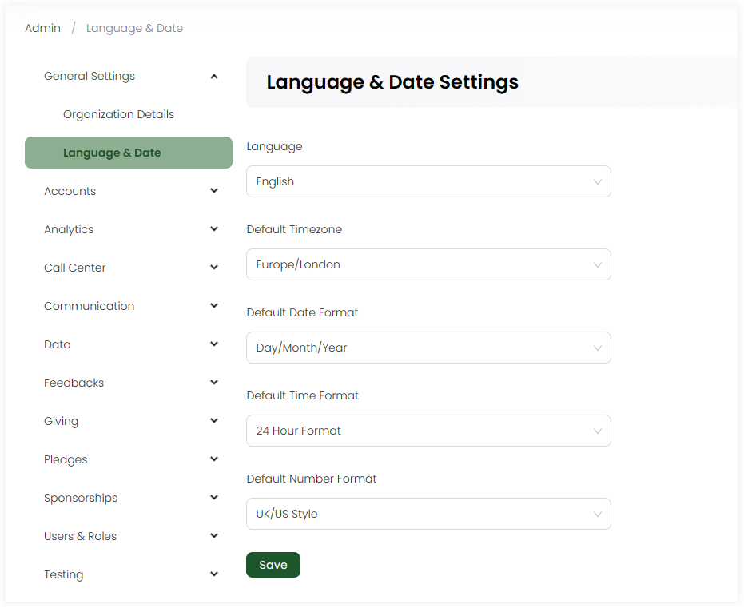

:::tip Who can use this feature?
The main **Product Owners** along with the members having **Admin Roles** access granted.  
:::

Language and date settings include customizing the CRM's language and date according to the region and user preferences. You can define each setting by selecting any value from the dropdown. 

| Setting | Description |
| ------- | ----------- |
| **Language** | Select the language e.g. *English*, *French*, etc. |
| **Default Timezone** | Select the default timezone according to what the CRM time would work e.g. *Europe/Samara*. |
| **Default Date Format** | Select the default date format e.g. *day/month/year*. |
| **Default Time Format** | Select the default time format e.g. 12 or 24-hour format. |
| **Default Number Format** | Select the default number format e.g. *US/UK sytle*. |

