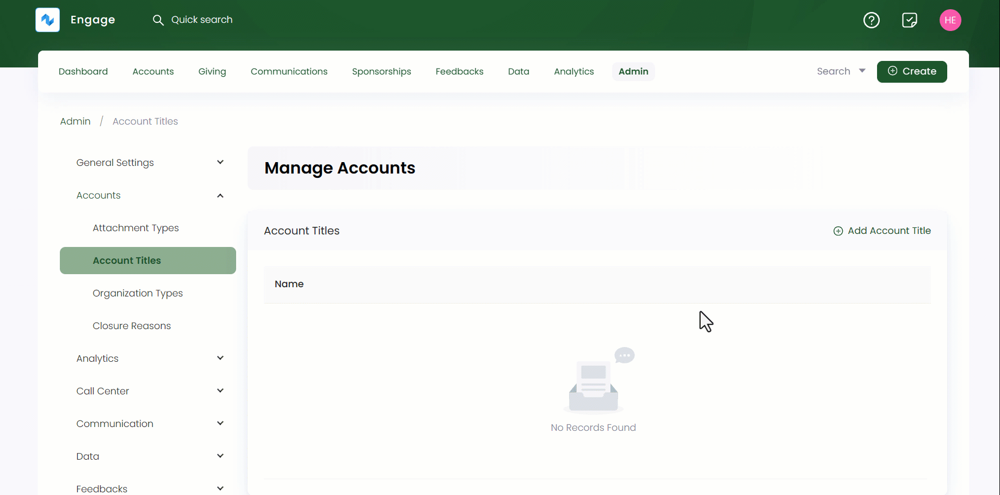

:::tip Who can use this feature?
The main **Product Owners** along with the members having **Admin Roles** access granted.  
:::

Account titles talk about the labels added before writing a specific full name. Admin users can add various account titles that can be later added via the dropdown in the **Name** section while creating an individual account in Engage.

You can add and also edit any previously added account titles via the **pen icon**. To add, click the **+ Add Account Title** option, **name** the title and select **OK**. All account titles appear in the form of a list along with their names.

