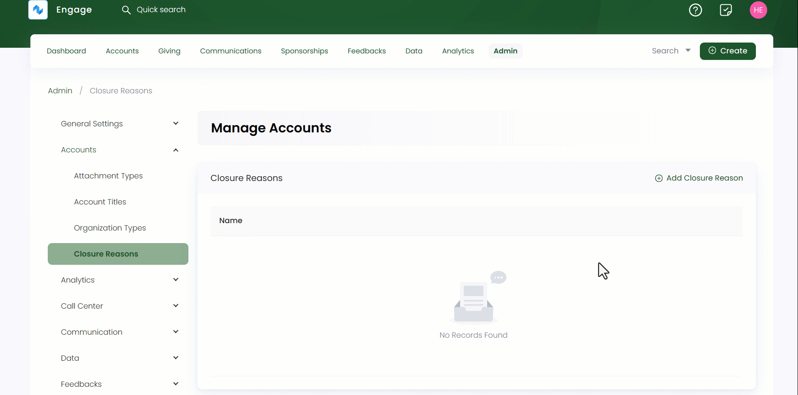

:::tip Who can use this feature?
The main **Product Owners** along with the members having **Admin Roles** access granted.  
:::

Closure reasons typically refer to the specific explanations for closing an account, or any other entity within an organization. These reasons are often documented to provide clarity, transparency, and a record of the circumstances that led to the closure. 

Admin users can add various closure reasons that can be later chosen via the dropdown in the **Reason** section while closing any individual or organizational account in Engage. 

You can add and also edit any previously added closure reasons via the **pen icon**. Click the **+ Add Closure Reason** option, **name** the reason and select **OK**. All closure reasons appear in the form of a list along with their names.

