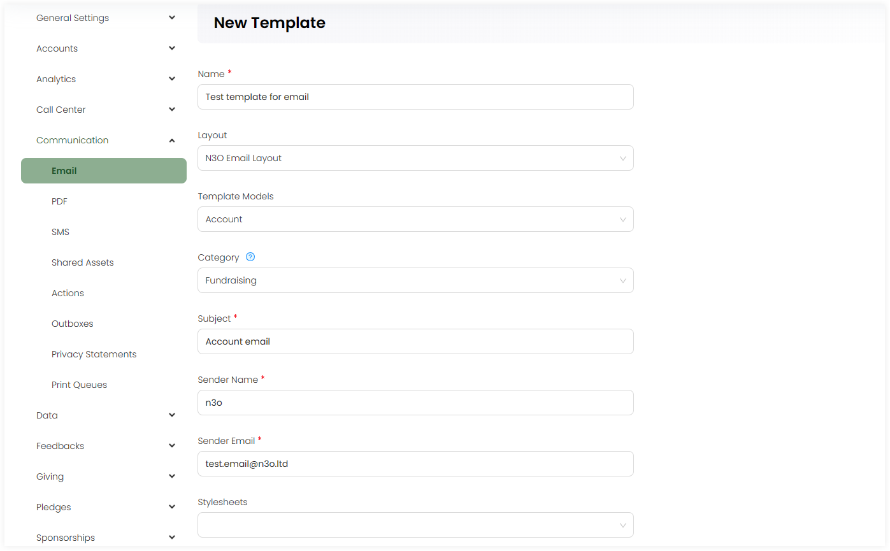
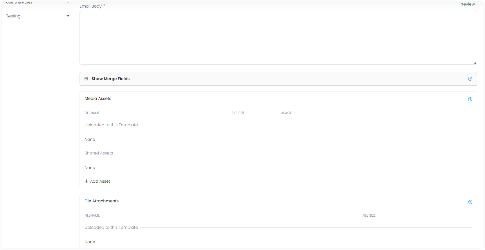

Templates are ready to use and available content structure or framework for sending emails to customers.  

To create an email template, click the **+ Create New Template** option under *Email Templates*. On the **Create Template** screen, in the upper section:

1. Input the **Name** of the template.
2. Select the **layout** which you desgined before. 
3. Choose the **Template Models**, model type for which the email would be sent e.g. accounts or sponsorships. 
4. Select the **category** of communication preferences so that Engage can use that throughout.
5. Write the **Subject**, **Sender Name** and **Senders Email**.
6. Choose the **Stylesheets**, *CSS* files used to define the visual presentation and layout of elements within a document.

In the lower section:

1. Write down the email body of the template. You can also preview the content via the **Preview** option.
2. Click the **+** icon and search for the available merge fields for the selected template model. By default, merge fields related to the template model selected appear automatically and are populated once the email is generated.
3. Include any media assets for the template e.g. images or fonts by uploading any new via **+ Add Asset** or select from existing ones.
4. Add any email attachments in the **File attachments** section.
5. Add any extra notes and click **Save**.

## List of Templates

All templates added appear in the form of a list under the **Email Templates** tab with the following parameters. 

| Parameters | Description |
| ---------- | ----------- |
| **Reference** | Unique reference of the template. |
| **Name** | Name of the template. |
| **Created By** | Name of the admin user who created the template. |
| **Updated At** | Date and time the template was updated at. |
| **Notes** | Any notes added within the template. |