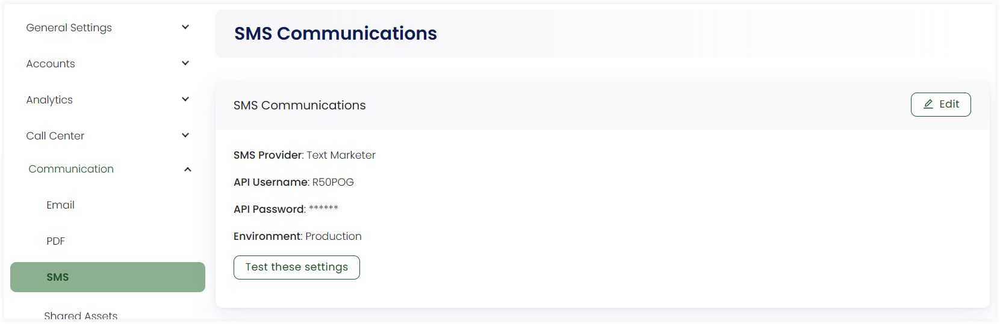

:::tip Who can use this feature?
The main **Product Owners** along with the members having **Admin Roles** access granted.  
:::

In Engage, before sending an SMS to donors, admin users need to set up the whole SMS layout and configure the SMS settings. 

## Configure SMS Communication Settings

You, as an admin user, need to set up and configure SMS settings in the **SMS Communications** section. You can add or edit any previous SMS setting via the **Edit** button. 

- Provide the **SMS Provider** name.
- Input the **API Username** and **API Password**.
- Choose the **Environment** as Production or Sandbox. 

You can also test these settings to verify whether the SMS provider and other information are correct or not. Click **Test these settings**, input the **Sender** and **Recipient** phone numbers and select **Send**. 

## Compose SMS Layouts

In Engage, composing SMS via the admin section requires you to create 3 different parts with each part explained in their respective sections.

1. **Partials**
2. **Layouts**
3. **SMS Templates**