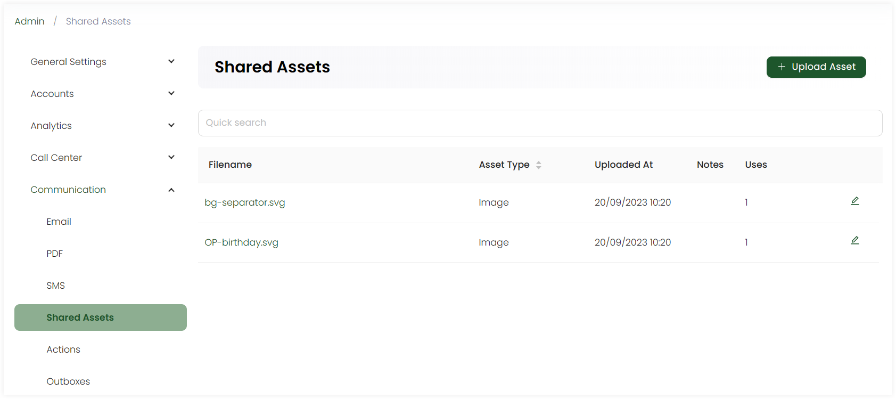

:::tip Who can use this feature?
The main **Product Owners** along with the members having **Admin Roles** access granted.  
:::

Shared assets are the resources or data that are accessible and usable by multiple members or teams within an organization. Admin users can add assets in the form of images, or documents that can be used while creating email, SMS or PDF partials, layouts or templates in Engage. 

Click on **Admin** in the header menu, **Communication** and then **Shared Assets** from the side menu. On the **Shared Assets** screen, click the **+ Upload Asset** option, add any notes, upload any asset file and click **OK**. You can also edit any previous asset added and replace it with a new one. 

All assets appear in the form of a list.

| Parameters | Description |
| ---------- | ----------- |
| **Filename** | Name of asset file. |
| **Asset Type** | Type of asset uploaded. |
| **Uploaded At** | Date and time the asset was updated. |
| **Notes** | Any notes added. |
| **Uses** | Number of times an asset was used. |

