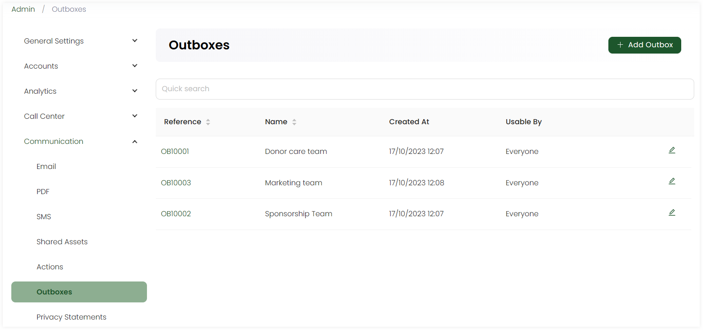

:::tip Who can use this feature?
The main **Product Owners** along with the members having **Admin Roles** access granted.  
:::

Outbox is a feature that typically stores the outgoing messages, documents or emails before being sent. Admin users in Engage, can add, edit and maintain mutliple outboxes related to different entities like sponsorships, accounts etc.

Click the **+ Add Outbox** option, **name** it, select the users who can create templates, dispatch documents and view the contents of the outbox as **Managed By** and **Usable By**, add any extra notes and click **Save**.  

:::tip
You can also search for any outbox in the list via the search bar on top.
:::

All actions appear in the form of a list.

| Parameters | Description |
| ---------- | ----------- |
| **Reference** | Unique reference number of the outbox. |
| **Name** | Name of the outbox. |
| **Created At** | Date and time the outbox was created. |
| **Usable By** | Users who can dispatch documents and view the contents of the outbox. |

