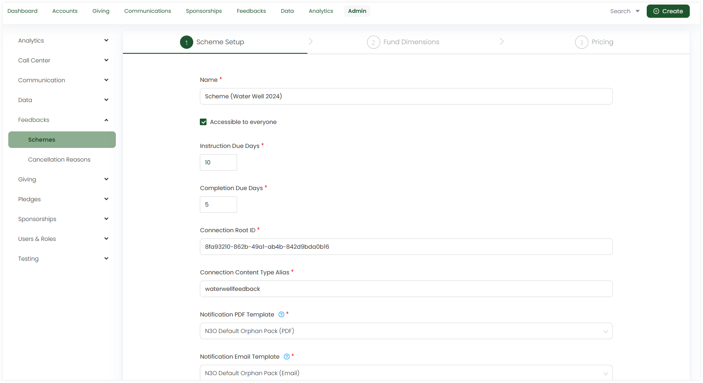
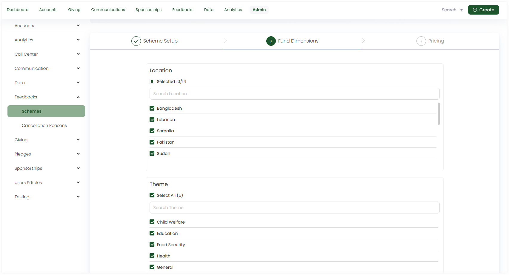
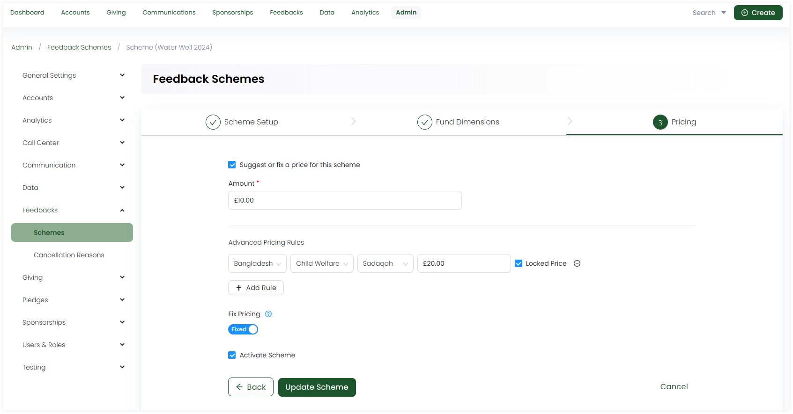

:::tip Who can use this feature?
The main **Product Owners** along with the members having **Admin Roles** access granted.  
:::

In Engage, feedbacks refer to special projects that require feedback being given back to the donor after its completion. Before creating a feedback and donating towards it, admin users must first create feedback schemes and activate them.

To add a scheme, click **Add New Scheme**. Under **step 1: Scheme Setup**, input the following information.

1. **Name:** The name of the feedback scheme.
2. **Restrict to Roles:** The users who will be able to access the scheme, either all or some part of it. If you want the scheme to be accessible by all, tickmark **Accessible to everyone**.
3. **Instruction Due Days:** The number of days by which the feedback can be instructed. 
4. **Completion Due Days:** The number of days by which the feedback must be completed.
5. **Connection Root ID:** The connection ID for the feedback scheme.
6. **Connection Content Type Alias:** The alias name for the feedback's content type.
7. **Notification PDF Template:** A PDF composition that is configured to be used as the notification template. This template must be added before adding the scheme. See the PDF Template Administration Docs.
8. **Notification Email Template:** An email composition that is configured to be used as the notification template. This template must be added before adding the scheme. See the Email Template Administration Docs.

Next, select the number of fund dimensions for each under **step 2: Fund Dimensions**.

:::tip
- These fund dimensions are the ones that the admin has already added under the *Giving - Fund dimensions* section.
- You can select **all** or **some** of the fund dimensions from the list. 
:::

1. Location
2. Theme
3. Stipulation

Lastly, input the pricing for the feedback scheme under **step 3: Pricing**. 

1. You can leave the pricing scheme as it is without suggesting any price or tickmark the **Suggest or fix a price for this scheme** to input the amount. 

2. You can add **advanced pricing rules** by selecting fund dimensions and locking a price for them. Multiple rules can be added for multiple fund dimensions.

3. You can use the toggle to add **fixed pricing** as well. When fixed, users entering a donation are unable to enter an amount that is different from the price specified for a particular donation item. 

4. Tickmark **Activate Scheme** to activate the scheme as soon as it is created.

