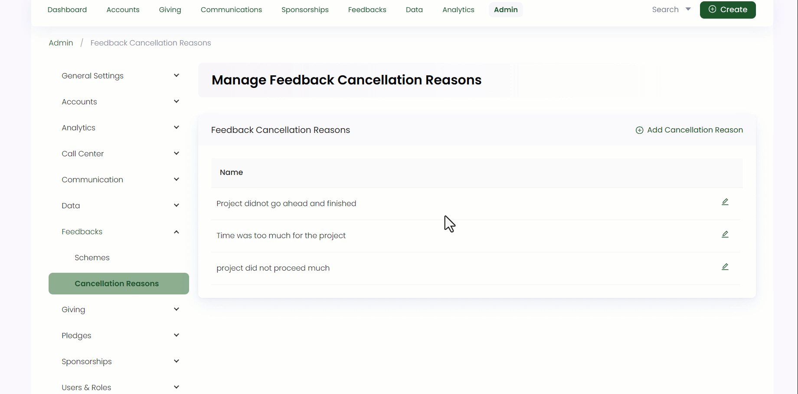

:::tip Who can use this feature?
The main **Product Owners** along with the members having **Admin Roles** access granted.  
:::

Cancellation reasons in general explain about the justifications provided for terminating or discontinuing a certain function. In Engage, admin users can add different cancellation reasons for multiple feedbacks.

To add a reason, click on **Admin** in the header menu, **Feedbacks** and then **Cancellation Reasons** from the side menu. On the **Manage Feedback Cancellation Reasons** screen, click **Add Cancellation Reason**, input the name and select **OK**. You can also edit and delete any existing cancellation reason.

