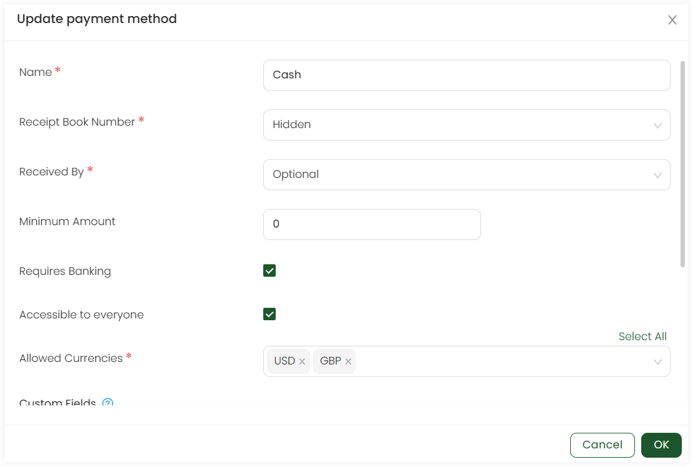
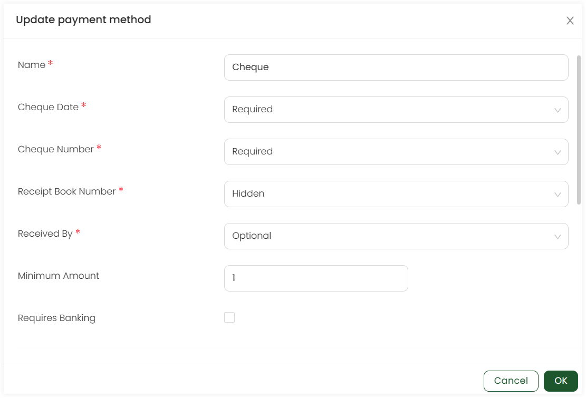

Cash and cheque are digital forms of payment methods that are accepted in financial transactions. Click on **Admin** in the header menu, **Giving** and then **Payment Methods** from the side menu. To add cash and cheque as a payment method, click **Add payment method** and select **Cash & Cheque**. Choose the **country**, that is set to *United Kingdom* as default, the **payment provider** from the dropdown as cash or cheque, and click **OK**.

## Cash

If you select cash, then add information for the following fields.

| Field | Description |
| ----- | ----------- |
| **Name** | Name of the payment provider i.e. *Worldline*. | 
| **Receipt book number** | Book number as *hidden*, *optional* or *required*. |
| **Received by** | Name of receiver as *hidden*, *optional* or *required*. |
| **Minimum amount** | Minimum amount to be paid via the payment provider i.e. *pound 1*. |
| **Requires Banking** | Tickmark if the payment method requires banking or not. |
| **Accessible to/restrict roles** | Users that can access the payment provider i.e. *Admin* or *Finance manager*. |
| **Allowed currencies** | The currency used in the payment provider e.g. *GBP* or *USD*.  |
| **Custom Fields** | Any additional field for the payment provider as *hidden*, *optional* or *required*.  |

## Cheque

If you select cheque, then add information for the following fields.

| Field | Description |
| ----- | ----------- |
| **Name** | Name of the payment provider i.e. *Worldline*. | 
| **Cheque Date** | Date of the cheque as *hidden*, *optional* or *required*. | 
| **Cheque Number** | Cheque number as *hidden*, *optional* or *required*. | 
| **Receipt book number** | Book number as *hidden*, *optional* or *required*. |
| **Received by** | Name of receiver as *hidden*, *optional* or *required*. |
| **Minimum amount** | Minimum amount to be paid via the payment provider i.e. *pound 1*. |
| **Requires Banking** | Tickmark if the payment method requires banking or not. |
| **Accessible to/restrict roles** | Users that can access the payment provider i.e. *Admin* or *Finance manager*. |
| **Allowed currencies** | The currency used in the payment provider e.g. *GBP* or *USD*.  |
| **Custom Fields** | Any additional field for the payment provider as *hidden*, *optional* or *required*.  |

