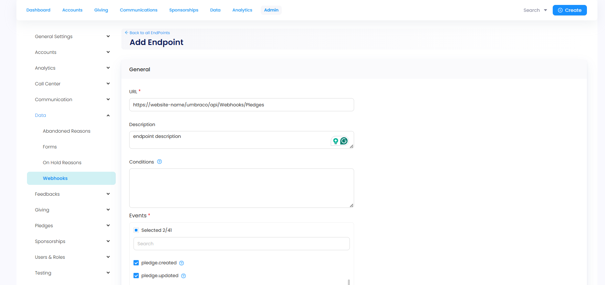
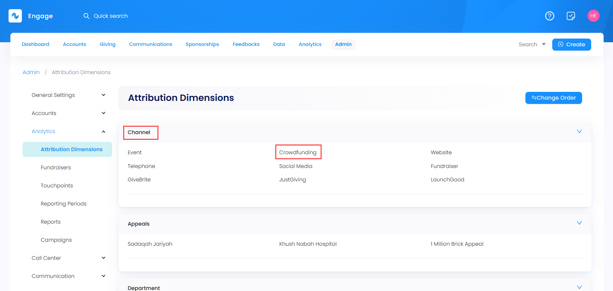
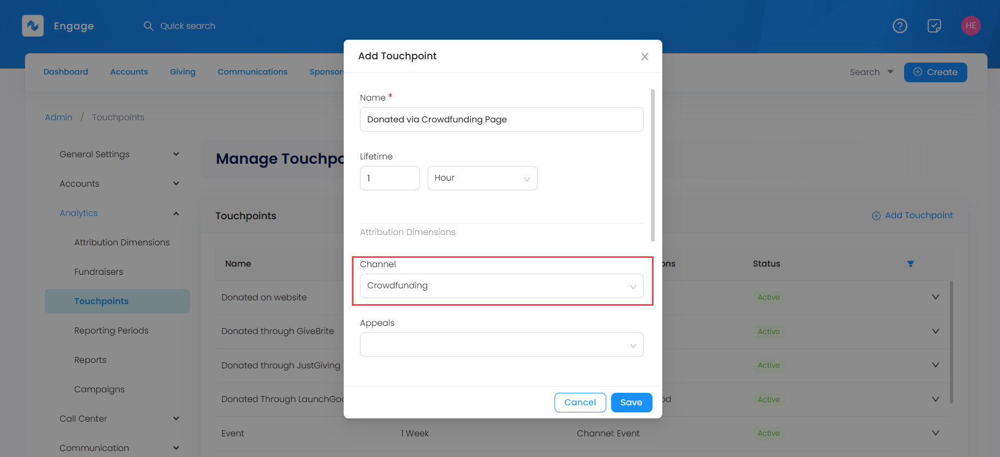
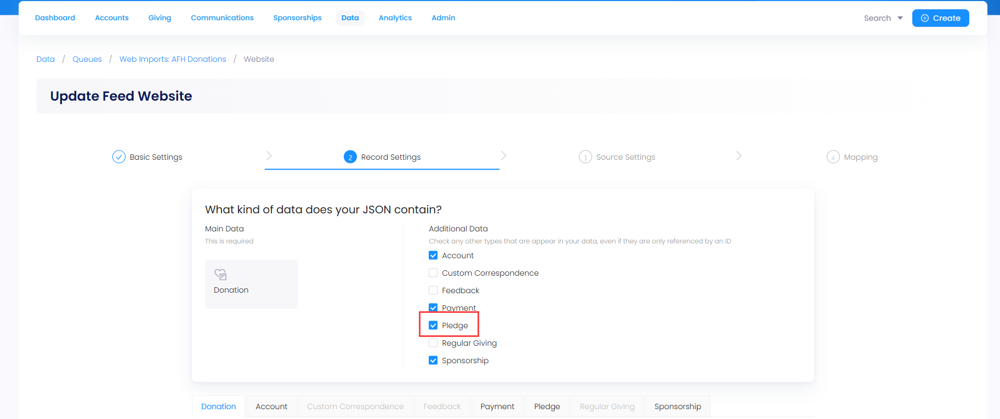
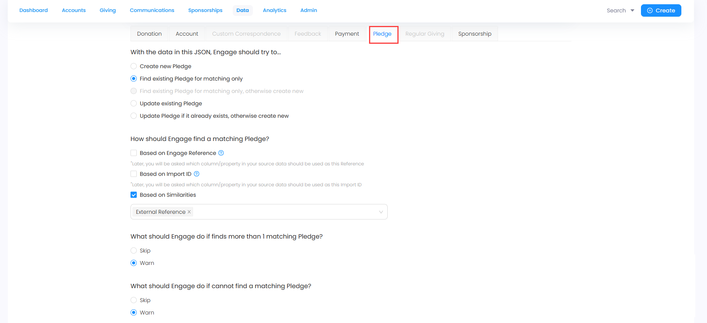
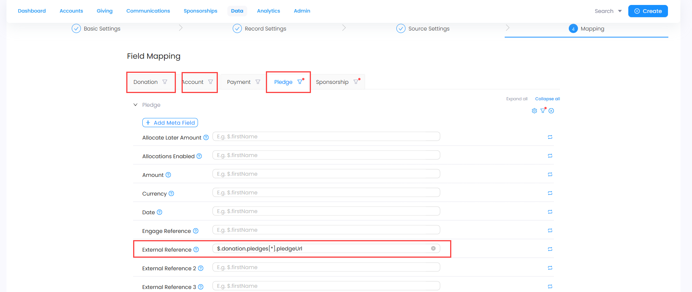

In Engage, crowdfunding refers to creating fundraising pages for different campaigns where donors or supporters donate a certain amount within a website. Each fundraiser page is linked to a pledge within Engage. Whenever a donor donates on the page, a webhook is sent to Engage indicating that a donation has been made for a particular campaign and a pledge is created with all its required details. 

:::tip
- Pledges are formal commitments made by certain individuals (donors) to raise money in support of a cause. You can search for the created pledge after a crowdfunding donation via any search function in Engage. Each pledge shows:
    - **Account name** and **reference**
    - **Name** of the fundraising page from where the donation has come
    - **Amount** donated
    - **Source** of the crowdfunding page
    - **Status** of the pledge

- Webhook is a way to send real-time data from one application to another whenever a given event occurs. 
:::

But before moving further, there are certain import and administration settings that need to be completed by the internal team.

## Administration Settings

### 1. Create a Webhook

Creating a webhook for certain events taking place on the website is the first step to construct a proper crowdfunding platform. For this purpose, let us look at how to create a webhook linked to crowdfunding in Engage. 

:::tip
This webhook is created by the N3O team internally, having access to the **administrator** section.
:::

**1.** Login to the Engage CRM and navigate to the **Admin** section from the main menu. Expand **Data** and select **Webhooks** from the side menu.

**2.** Click **+ Add Endpoint**, input all the details required for the webhook as described below and select **Save**. 

- **URL:** Input the URL on which the webhook information would be sent to. The first part of the URL refers to the **website** and the next part is **standard** and does not change. For example, *first part: "/charity-organisation-domain/"* and *second part: "/umbraco/api/Webhooks/Pledges"*.
- **Description:** Description of what the webhook means and what it does.
- **Events:** These are the actions for which the webhook would be sent. For crowdfunding, two events need to selected; **"pledge.created"** and **"pledge.updated"**, because Engage needs to show the statistics of all the donations recorded via the fundraising pages on the website. This also means that donors who want to fundraise manually can easily navigate to the **pledge linked to the fundraising page in Engage** and donate there. As a result, the webhook would be sent to the crowdfunder/fundraiser that a donation has occurred and received respectively.

### 2. Add Attribution Dimension and Touchpoint

The second step is to add an attribution dimension and touchpoint related to crowdfunding in Engage so that donations coming in can be tracked properly. 

**1.** Navigate to **Admin** section in the main menu. Expand **Analytics** and click **Attribution Dimensions**.

**2.** Under the category **Channel**, add a new one named *"Crowdfunding"*.

**3.** Next, click **Touchpoints** and add a new touchpoint named *"Donation via Crowdfunding Page"* by selecting the channel as the one added previously.

## Import Settings

The last step is to configure the web import donation feed for the created webhooks and pledges. 

**1.** Navigate to **Data** in the main menu and then **Imports**. Select the Web Import **"Donations"** type queue which is created previously by the N3O team.

**2.** Select the created **json webhook feed** and update it accordingly.

- Tickmark and enable **Pledge** under "additional data" in **step 2: Record Settings**. 

- Under the **Pledge** tab, select the first option as "Find existing Pledge for matching only" and leave the rest as default.

- In **step 4: Field Mapping**:
    - Under **Pledge**, add **external reference** as `$.donation.pledges[*].pledgeUrl`.
    - Under **Account**, add **Account Interaction** and select the **Filter icon** to add `$.donation.pledges[0].pledgeUrl` as *simple JSON path*. Then click the **Settings icon**, choose the **Engage field: Touchpoint** and its default value as the previously added touchpoint.
    - Under **Donation**, expand **Allocation** and add **Linked to Pledge** as `$.donation.allocations[*].linkedToPledge`. 

