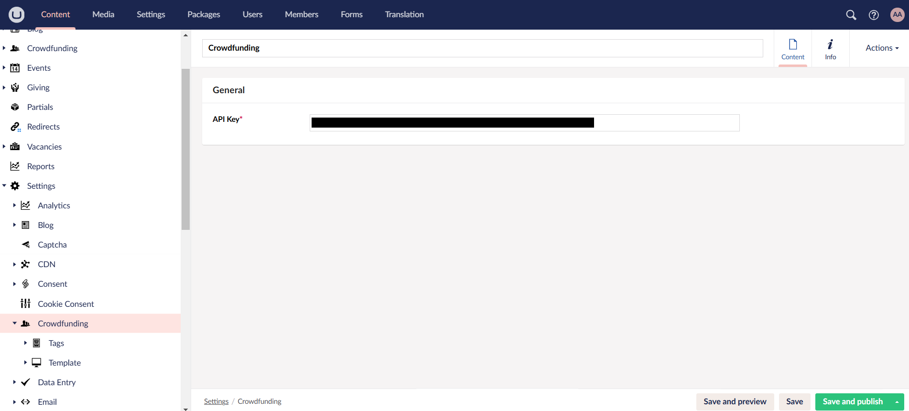
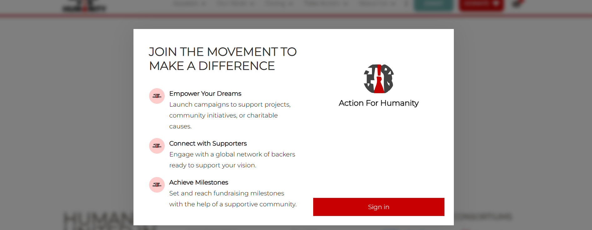
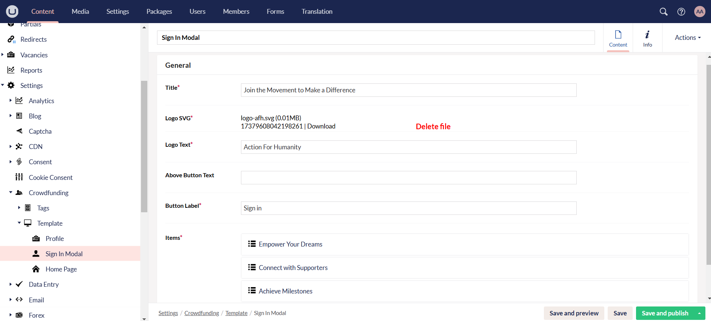
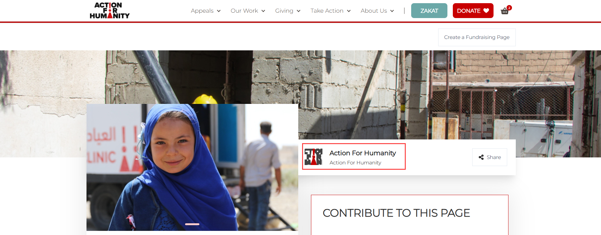
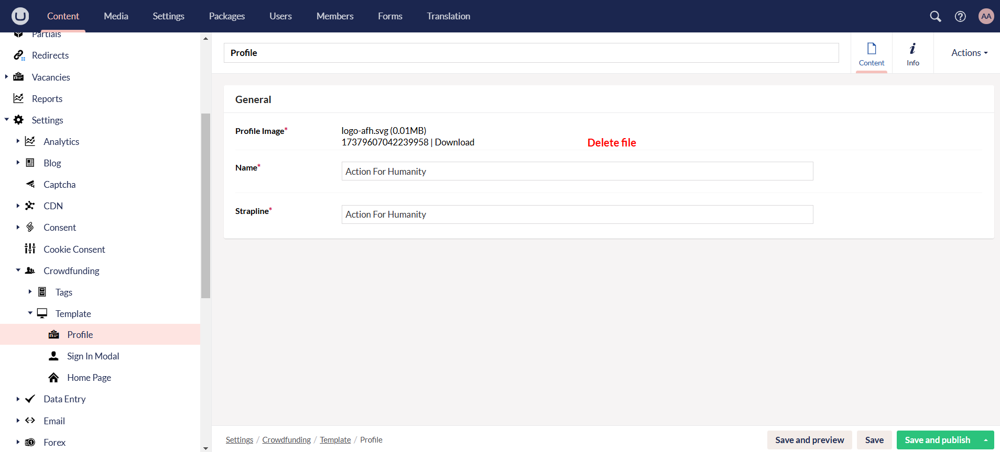
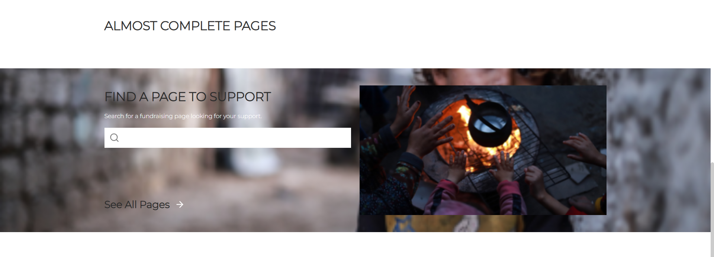
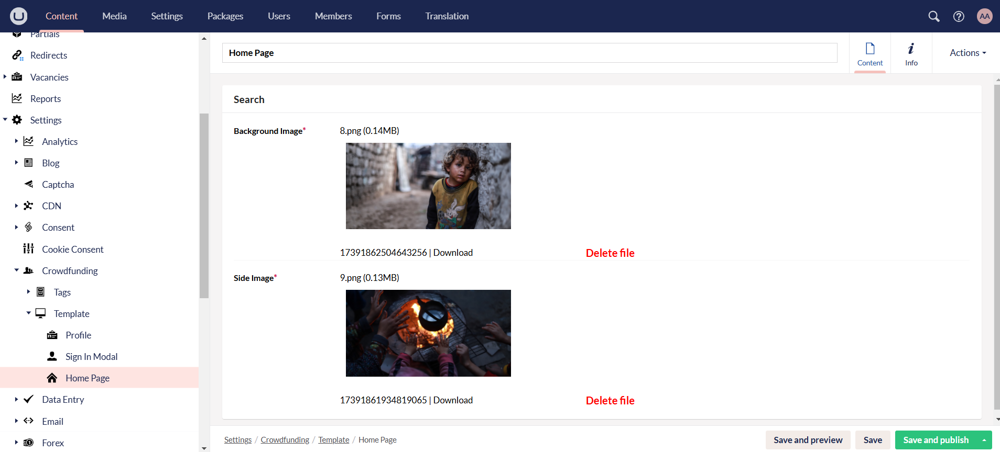
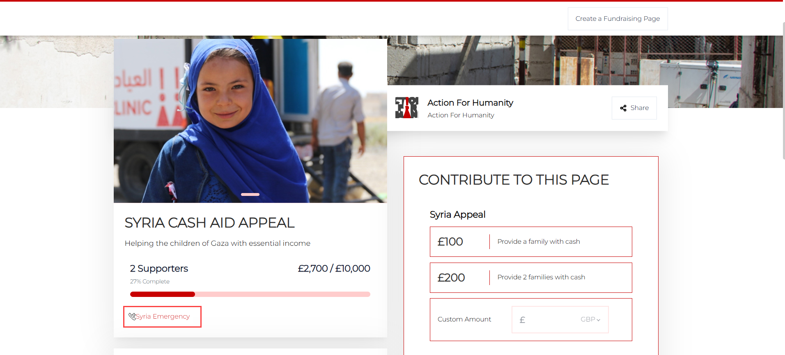
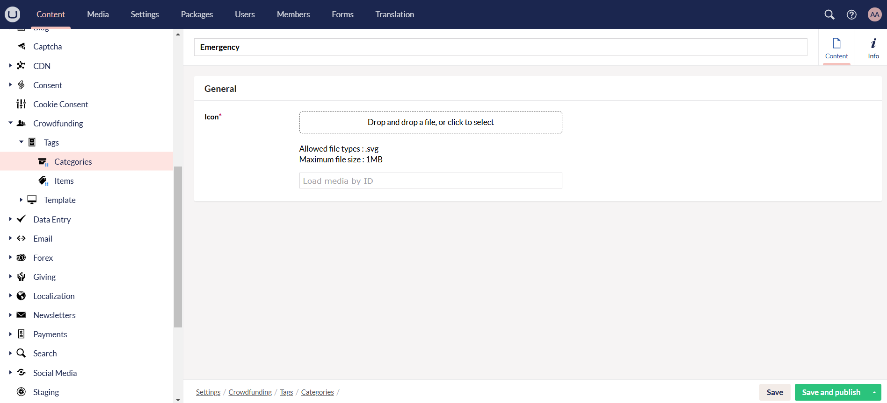
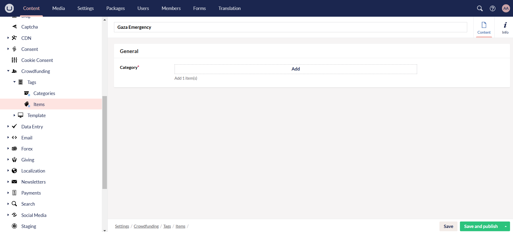

:::tip Important
**Crowdfunding settings** are set up and completed by the **internal N3O team only** for both website staging and production environments.
:::

As soon as a webhook is set up in Engage, the next step is to configure the **settings** for the crowdfunding platform. These settings are mandatory and must be set up before creating any campaign or fundraiser page. They include two main elements:

- **Template**
- **Tags**

**1.** Login to the **Umbraco staging backoffice** using your login credentials. Navigate to **Settings** and then **Crowdfunding** under the **Content** tab. 

**2.** On the *crowdfunding page*, an **API key** must be added by a *developer from N3O* for both the staging and production environments. This key is used for communicating between the staging and production sites and same for both. 

### Templates

**3.** Expand **Template** and complete its components as described below. These are necessary to fill in otherwise the crowdfunding pages might break later on.

**3.1** First, click **Sign In Modal**. This is a sign in pop-up modal (asking the donor to sign in first) that appears when a donor wants to create a fundraiser page via the *create fundraising page* option on a campaign.

- On the *sign in modal content page*, under the **General** section, input all the mandatory information with *asterisks*, as detailed below, and click **Save and Publish**. Each piece of information unfolds on the actual pop-up modal and must be asked from the charity itself, but some defaults should be included for clarity.

    - **Title:** Headline of the pop-up modal that showcases the charity.
    - **Logo SVG:** Logo of the charity in `svg` format.
    - **Logo Text:** Name of the charity under the logo.
    - **Button Label:** Button name from where the donor would sign in and continue to create a fundraiser page. 
    - **Items:** Items include an **icon**, **title** and **text** to show what the chairty works for which can be goals or any other. Click on **Add Content** and fill in the relevant information.

**3.2** Next, click **Profile**, which typically appears on the campaign page that the charity creates next to the introduction section. 

- On the *profile content page*, under the **General** section, input all the mandatory information with *asterisks*, as detailed below, and click **Save and Publish**. Each piece of information is displayed as the charity name, strapline and logo on the actual campaign page.

    - **Profile Image:** Image showing the logo of the charity in `svg` format. Upload it according to the required dimensions.
    - **Name:** Name of the charity representing the campaign.
    - **Strapline:** Short and impactful phrase that supports the charities campaign and name.

**3.3** Lastly, click **Home Page**, that includes images appearing on the actual fundraising home page containing all the campaigns created. 

- On the *home page content page*, under the **Search** section, upload the **background** and **side image** with the correct image dimensions specified.   

 

### Tags

**4.** Expand **Tags** under Crowdfunding. This is an optional field and one may or may not use it for their crowdfunding pages. Under Tags, there are two options:

- **Tag Category:** A tag category groups similar tags together based on common themes or purposes for e.g. emergency, food etc. 
- **Items:** Items are tags themselves and appear on the campaign page under the introduction section.

**4.1** To create a tag category, click **Categories** and then **Create Tag Category**. Write a **name** and upload an icon for the category in `svg` format. All categories appear in a list on the *Categories* page.

**4.2** To create a tag, click **Items** and then **Create Tag**. Write a **name** and select a category for the tag via **Add**. All tags appear in a list on the *Items* page.

