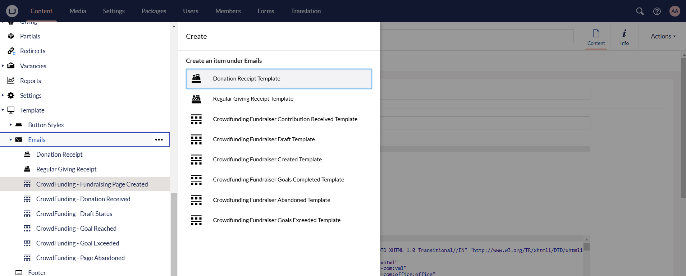
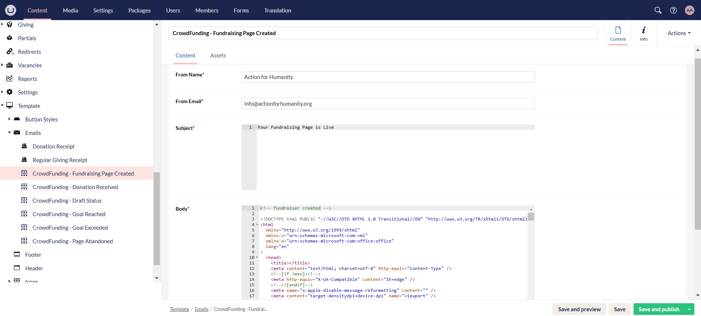

:::tip Important
**Crowdfunding Email Templates** are set up and completed by the **internal N3O team only** for both website staging and production environments.
:::

Email templates are essential for a fundraising campaign because they ensure consistent, professional, and effective communication with potential donors and supporters. When **fundraising with N3O**, a donor receives an email whenever a donation is made, a fundraiser page is created or the goal/target to complete a campaign is reached. 

Different crowdfunding email templates can be set up for a campaign but we have 6 default templates.

1. **Fundraiser Created:** An email is sent to the donor when a fundraising page has been created and activated for donations.
2. **Fundraiser Contribution Received:** An email is sent to the donor that a donation is received via a fundraiser page.
3. **Fundraiser Abandoned:** A reminder email is sent to the donor for a fundraising page that is created and activated but no donation is received on it after a certain time period i.e. 30 days.
4. **Fundraiser Draft:** An email is sent to the donor that a fundraising page was created and has not been activated for quite a while.
5. **Fundraiser Goals Completed:** An email is sent to the donor that you have reached your goal of fundraising for a certain fund via the fundraiser page. 
6. **Fundraiser Goals Exceeded:** Goal exceeded is a case when a donor has exceeded the amount to be raised for the fundraising page. A reminder email is sent to the donor that your goal amount limit is exceeded, hence, please tell us where to allocate your additional donations. In this case, we have extra funds that can be added for allocations.

:::tip
Each email template should only exist **once** in the Umbraco backend.
:::

Now, let us look at how to create an email template.

### Create an Email Template

**1.** Login to the **Umbraco staging backoffice** using your login credentials. Navigate to **Template** and then **Emails** under the **Content** tab. 

**2.** Default templates created are available, but to create one, hover over **Emails**, click the **three dots (...)** and choose a template. 

**3.** Under **Content** tab, input the following details below.

- **From Name:** Name of the charity who will be sending the emails.
- **From Email:** Email address of the charity who will be sending the emails. 
- **Subject:** Subject line of the email.
- **Body:** Body of the email that includes an **HTML code** designed by the N3O designer. 

