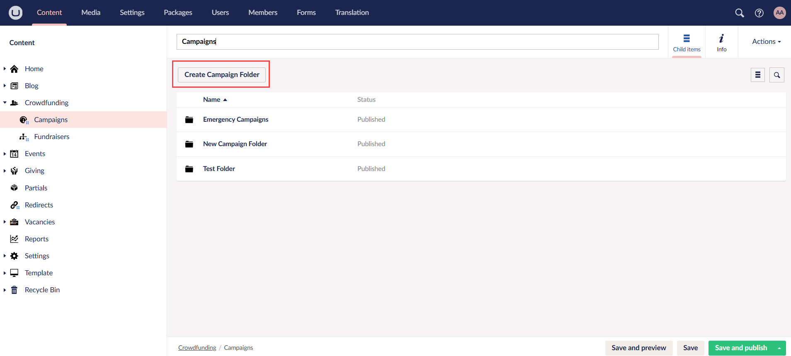
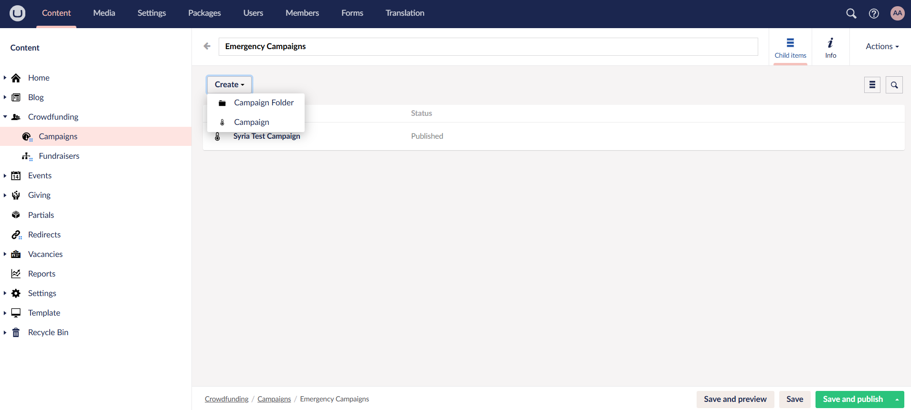
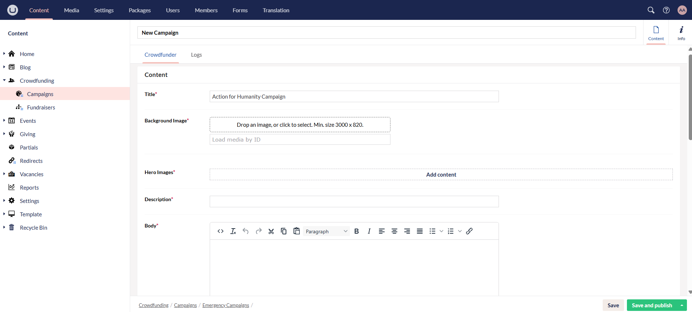
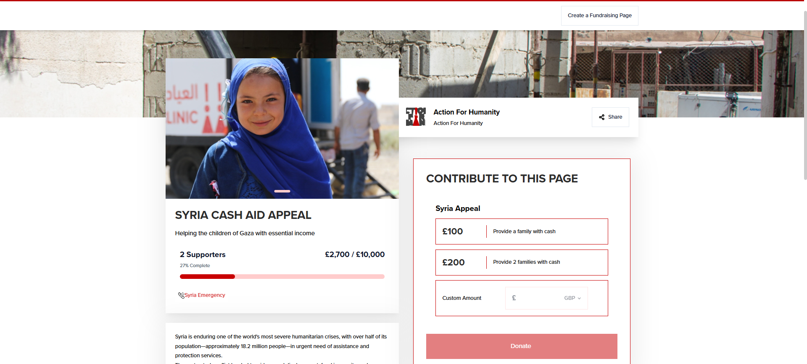
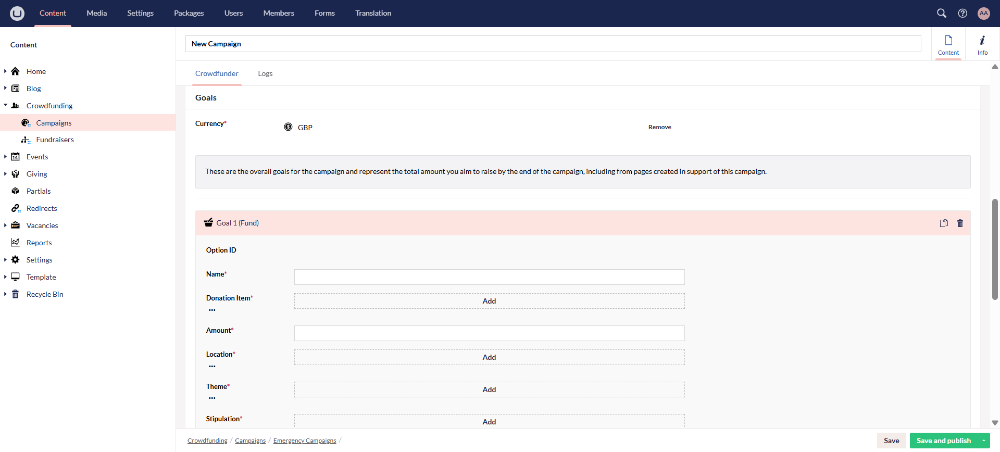
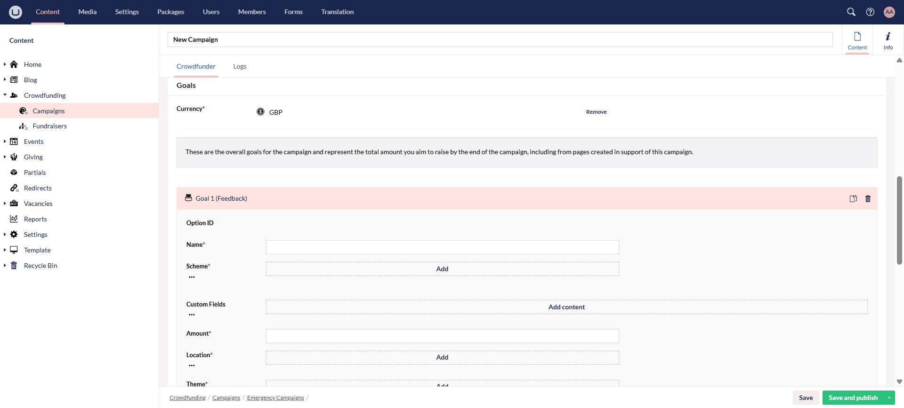
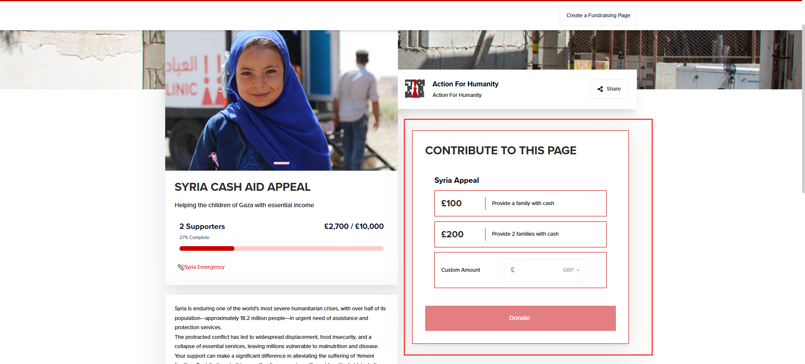
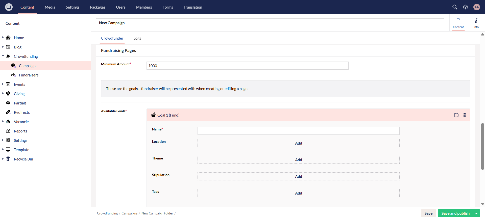
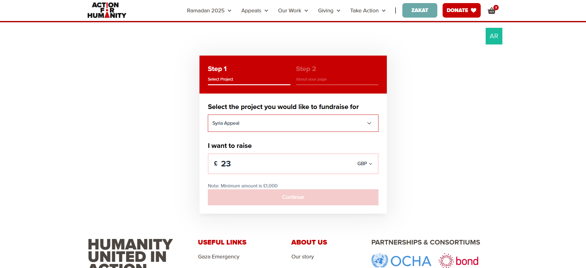
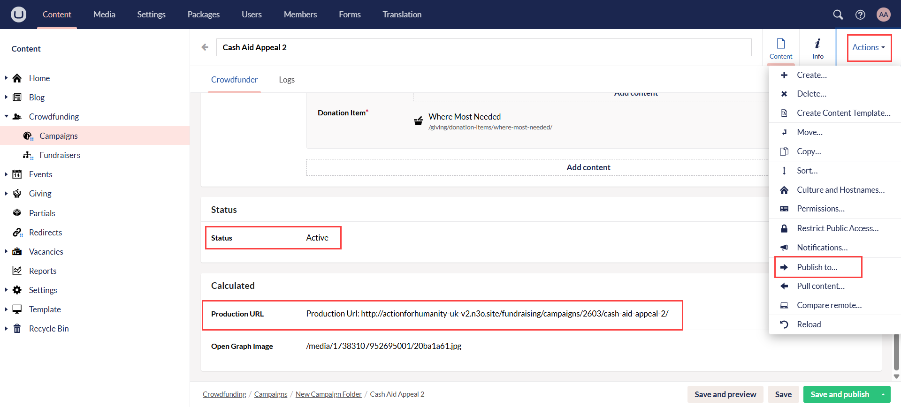

As soon as crowdfunding settings are completed by the N3O team, the first important step is to **create a campaign**. A campaign refers to a structured effort to raise funds for a specific cause, project, or goal through small donations from a large number of people online.

## Purpose of Campaigns

1. **Raise Funds for a Cause:** The primary goal is to generate financial support for a project, emergency relief, research, or general operations.

2. **Build & Strengthen Community:** Encourages people to come together and support a shared mission, fostering long-term donor relationships.

3. **Encourage Recurring Giving:** A well-executed campaign can convert one-time donors into long-term supporters.

Regarding crowdfunding with N3O, campaigns are primarily source pages of the charity/organization from where we create a fundraising page and contains a list of all other fundraiser pages. 

**To create a campaign:**

**1.** Login to the **Umbraco staging backoffice** using your login credentials. Navigate to **Crowdfunding** and then **Campaigns** under the **Content** tab. 

**2.** On the *Campaigns* page, you can directly add a campaign or create folders to categorize campaigns respectively. To start, first create an opening campaign folder via **Create Campaign Folder** and name it. 

**3.** Within the campaign folder, click **Create** and then **Campaign**.

**4.** Now, **name** the campaign and input the following information. All options with asterisk are mandatory to fill in.

:::tip
Regarding images, please upload the ones with the correct dimensions as mentioned in Umbraco. You can also use an image resizer to crop & resize them if necessary. 
:::

### Under Content:

- **Title:** Title of the campaign to raise funds for e.g. *Gaza Relief Aid Appeal*.
- **Background Image:** Upload background image which will show behind the title. Make sure to upload a quality image with the correct dimensions.
- **Hero Images:** Upload hero image or multiple images which will show above the main title and description part. Make sure to upload quality images with the correct dimensions.
- **Description:** Description or tagline which defines the title in a small sentence.
- **Body:** A paragraph describing the purpose of the specific campaign being created.
- **Tags:** Add tags via the **Add** option. These are the tags that were added previously when setting up crowdfunding settings.

This is how all content information will appear on the actual campaign.

### Under Goals:

:::tip
- These are the overall goals for the campaign and represent the total amount (visible on the campaign page) you aim to raise by the end of the campaign, including from pages created in support of this campaign.
-  Multiple goals can be added for a single campaign.
:::

- **Currency:** Choose the currency in which you raise the funds. 
- **Goals:** Click **Add Content** and choose to add whether a **fund** or **feedback** goal. Both have their own set of parameters to add respectively. 

#### Fund Goal:

- **Name:** Name of the fund goal.
- **Donation Item:** Click **Add** and choose the donation item. **All donation items added must be synced with Engage.**
- **Amount:** Input the amount of the fund goal. This is the total amount for all the goals.
- **Fund Dimensions:** Click **Add** and for each fund dimension: **location, theme and stipulation**, choose the one which is already added for the donation item selected previously. These dimensions must match with the item to avoid any errors.
- **Price Handles:** Click **Add Content** and add in the different price handles, as **amount and description**. These prices and their descriptions will appear as a complete donation form on the campaign page. You can choose any and donate towards it.
- **Tags:** Add tags via the **Add** option. These tags are relevant to the fund goal but appear with all the tags under the title and description.

#### Feedback Goal:

:::tip
Feedback goals can be added for charity organizations availing the feedback functionality.
:::

- **Name:** Name of the feedback goal.
- **Scheme:** Choose the feedback scheme. 
- **Custom Fields:** Add the custom fields as items. Choose the **type**, **alias** as alias name, **text** describing the field and **date**.  
- **Donation Item:** Click **Add** and choose the donation item. **All donation items added must be synced with Engage.**
- **Amount:** Input the amount of the feedback goal. This is the total amount for all the goals.
- **Fund Dimensions:** Click **Add** and for each fund dimension: **location, theme and stipulation**, choose the one which is already added for the donation item selected previously. These dimensions must match with the item to avoid any errors.
- **Price Handles:** Click **Add Content** and add in the different price handles, as **amount and description**. These prices and their descriptions will appear as a complete donation form on the campaign page. You can choose any and donate towards it.
- **Tags:** Add tags via the **Add** option. These tags are relevant to the feedback goal but appear with all the tags under the title and description.

This is how all goals will appear on the actual campaign in the donation form.

### Under Fundraising Pages:

:::tip
- Fundraising page goals are the ones when a donor creates a fundraising page and is then given options to raise money for a specified one.
- Multiple goals can be added for a single fundraising page.
:::

- **Minimum Amount:** This is the minimum raise required to achieve the donation target.
- **Available Goals:** Choose a **campaign fund** or **campaign feedback** goal and input its details respectively. Both goals are described above in detail.
    - **Name:** Name of the goal.
    - **Fund Dimensions:** Click **Add** and for each fund dimension: **location, theme and stipulation**, choose the one which is already added for the donation item selected previously. These dimensions must match with the item to avoid any errors. But, **fund dimensions are non-mandatory here so that donors can select their own preference**.
    - **Tags:** Add tags via the **Add** option. These tags are relevant to the fund goal but appear with all the tags under the title and description.
    - **Price Handles:** Click **Add Content** and add in the different price handles, as **amount and description**. These prices and their descriptions will appear as a donation form on the fundraiser page.
    - **Donation Item:** Click **Add** and choose the donation item. **All donation items added must be synced with Engage.**

This is how the fundraising goal options appear while creating a fundraising page.

**5.** Click **Save and Publish** and it will take two to three minutes to populate the campaign. The **status** of the campaign would change from **draft** to **active**. 

- **Draft** status means that a webhook is sent to Engage and a pledge is created to save the donations within Engage. 
- **Active** status means that the page is ready to become live for donations.

You can also view the active campaign page created. Click the **info** tab and then the **campaign link** which opens the campaign on a new tab.

:::tip
- You can also deactivate a campaign page via the **Deactivate toggle** under **Status**.   
- You can also view any error while creating a campaign under the **Logs** tab. 
:::

**6.** Now, publish the campaign page to **live (production environment)**. Click **Actions**, **Publish to**, select the **live server** and press **Publish to server**. After a few minutes, refresh the campaign page and a **production URL** will be generated under the **Calculated** section. You can use that URL on any page or block within the website.

