   
When a campaign page is completed in Umbraco, the next step is to **create a fundraiser page**. A fundraiser page is an individual or organization’s dedicated online page used to collect donations for a specific cause with a certain campaign.

To create a fundraiser page:

**1.** Login to the **Umbraco staging backoffice** using your login credentials. Navigate to **Crowdfunding** and then **Campaigns** under the **Content** tab.

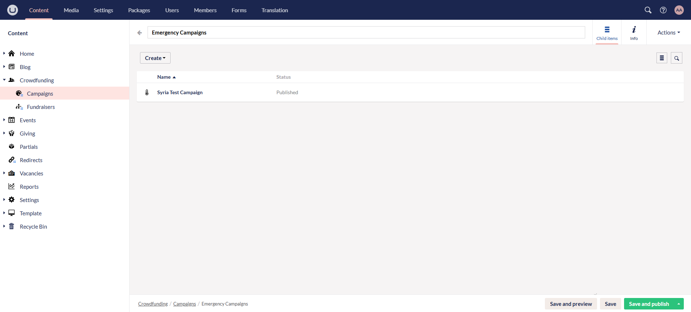

**2.** Open up any campaign and click **Create a Fundraising Page**.

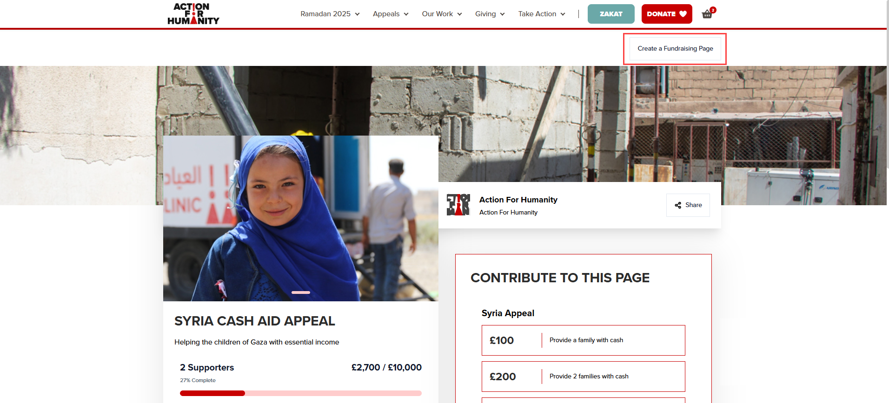

**3.** Click **Sign In** on the charity's main sign-in modal. Donors creating a page for the first time are redirected to a login module. 

- If you do not have an account, click **Sign up**, enter your **email** and **password** and press **Continue**. Next, input all your **account** details **(title, first & last name, telephone, email)**, **address** details **(country, city, postcode, line number)** and click **Continue**.

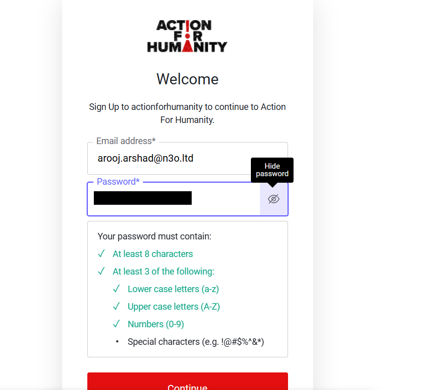

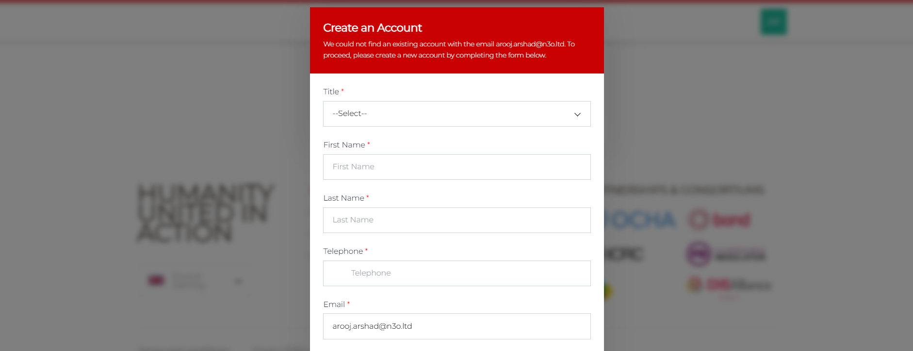

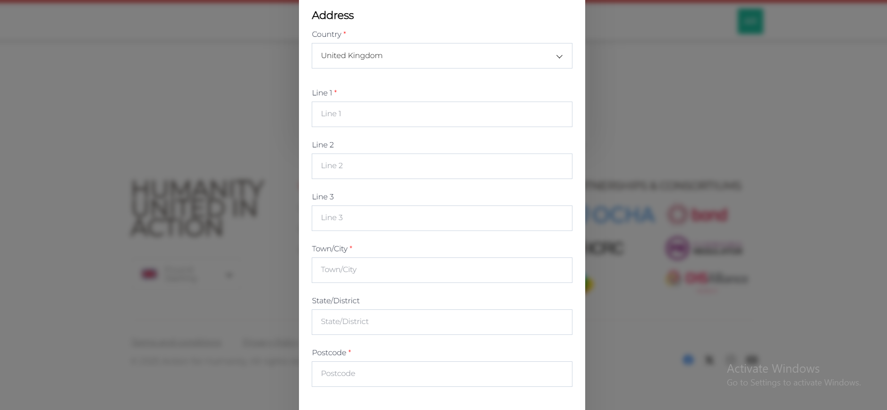

- If you have an account, then enter your **email** and **password** on the login module and the system searches for one or more matching accounts. Select the existing matched account, confirm your **address** and other details and click **Continue**.

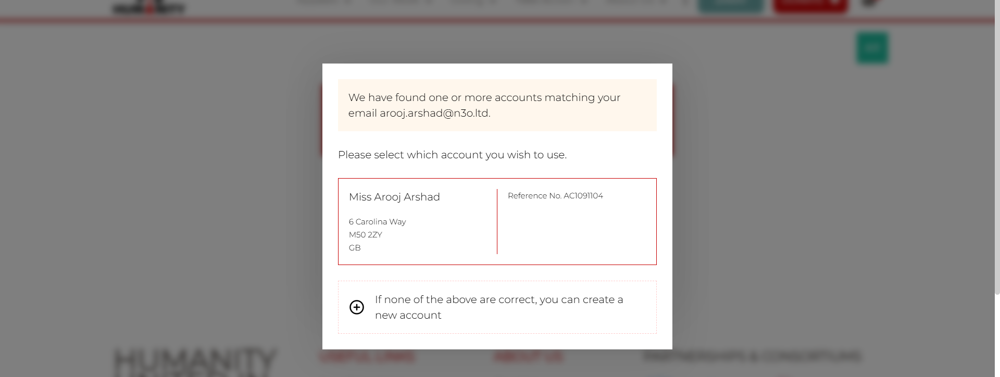

**4.** Moving forward, select the **project** which you would like to fundraise for, input the amount to raise and click **Continue**. These projects are the fundraiser goals added in the fundraising pages section while creating a campaign.

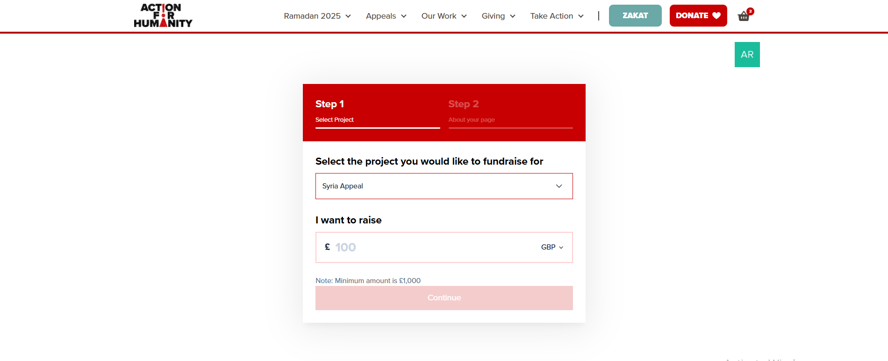

**5.** Input the fundraiser page **name** and a customized **URL** will be generated. You can also modify or customize the URL as per your preference. Click **Continue**.

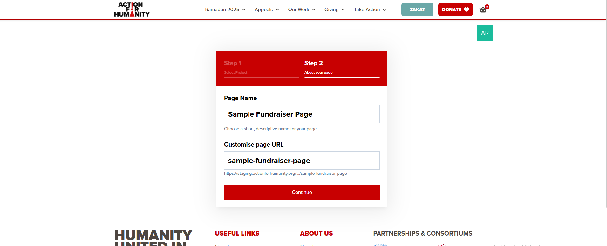

**6.** The system starts creating the fundraising page and a message is shown to **please wait**.

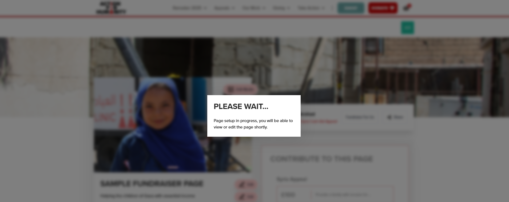

**7.** When the page gets created, it appears in an edit mode with a tagline: *"You are in edit mode"*. You can edit different parts of the page including **images**, **title**, **description**, **goal information** and **body description**, that show an **Edit** option. 

- To edit an image, click **Edit Media** and **"+"** on the top right. Next, click **Browse files**, choose a new image from the system, edit and crop the uploaded picture, press **Save**, and then **"Upload"** to change the image.

- To edit other parts, click **Edit**, change the existing and click **Save**.

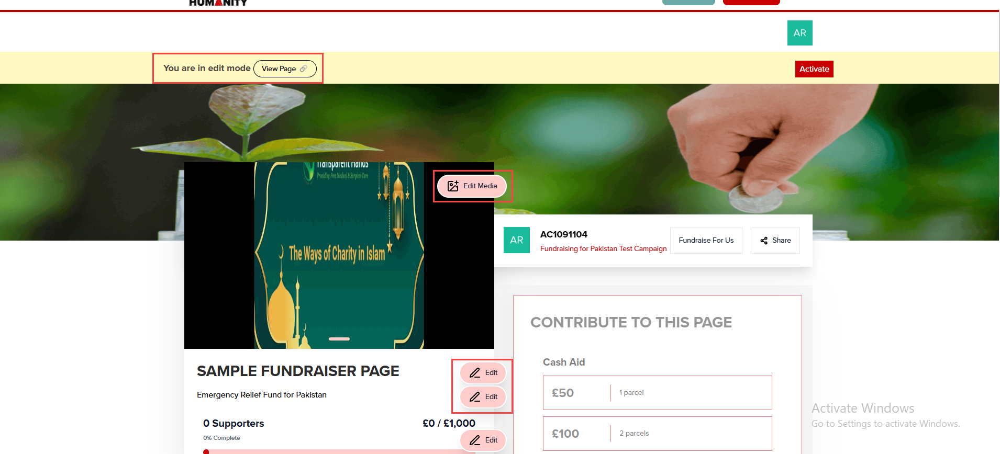

:::tip
- You can also preview the page to see how it actually looks like via the **View Page** option. 
- On the right-hand side, you will also see your **account logo**. Click the logo and you can change your **password** or **sign out** respectively. 

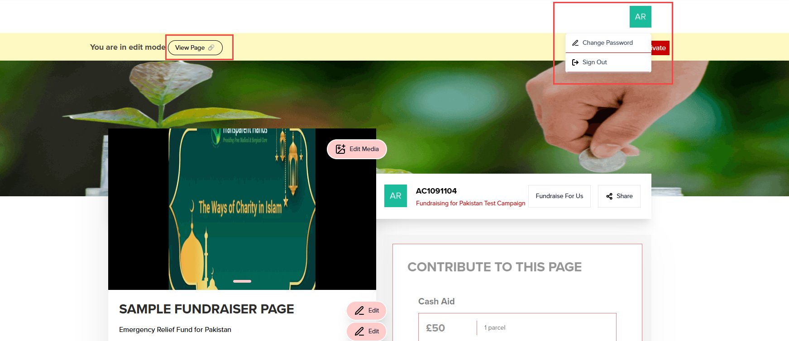
:::

**8.** For the fundraiser page to be accessible to everyone, click **Activate**. It takes a few seconds to activate the page and make it live. 

- You can also share the page with other people via the **Share** option. Click the button and copy the link.  
- You can also create a new fundraiser page via the **Fundraise For Us** option which will link it to the main campaign page.

:::tip
The fundraiser page will always be in **edit mode** for the creator and **live mode** for everyone else.
:::

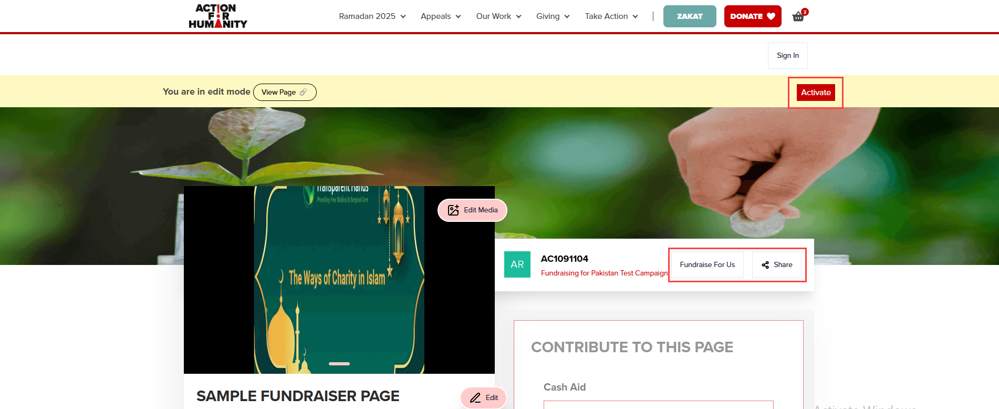

:::tip
Step 9 is for the internal N3O team only but can looked upon for more information.
:::

**9.** Each created fundraiser page is added and saved under the **Fundraisers** section in Umbraco. Expand **Crowdfunding** and click **Fundraisers**. 

- Live fundraiser pages are saved under the **Live** tab with its **page name**, page creator **account's name** and **status**. You can view or edit a page via the drop down under **Actions**.   
- Local fundraiser pages that are only saved and published in Umbraco are saved under the **Local Pages** tab with its **page name** and **status**.

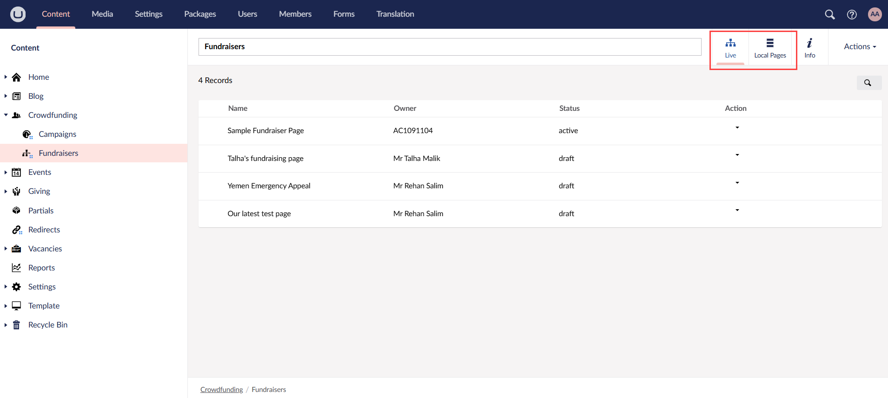
