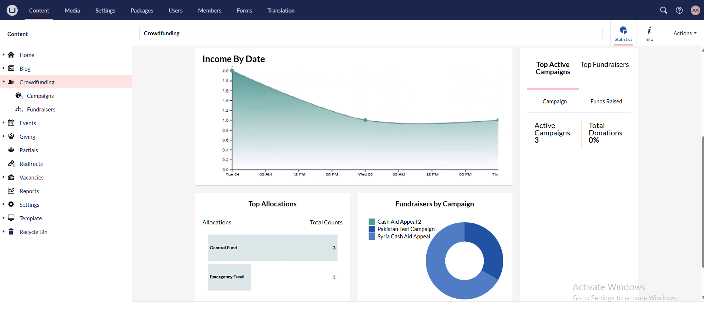

Once campaigns and fundraiser pages are complete, a charity can study an overview of all the crowdfunding features using different statistics. Login to the **Umbraco staging backoffice** using your login credentials and click **Crowdfunding**. By default, the page is set to **production**.

Let us have a look at the different statistics the crowdfunding page displays.

- A **date range** featuring a set time period can be chosen and each stat will be shown accordingly.

- The first box shows **total amount donated** via crowdfunding campaigns, **average** and **total donation**. 

- The second box tells about the **total number of donors/supporters** that contributed towards the campaign and fundraiser pages and the **number of type of donations (single/one-off and regular)**.

- Next to the second box, you can see total number of **active**, **new** and **fully complete fundraiser pages**. 

- Below the first and second boxes, a graph displays the **donation/income** according to the date it was made on.

- Beside the graph, a table describes:
    - The **number of top active campaigns** and the **percentage** of total number of donations raised from them.
    - The **number of top active fundraiser pages** and the **percentage** of total number of donations raised from them.

- Below the graph, you can see a horizontal bar chart showing the **top allocations** that give a **maximum count** for different donations and a pie chart explaining the **number of fundraiser pages** created for multiple campaigns.

