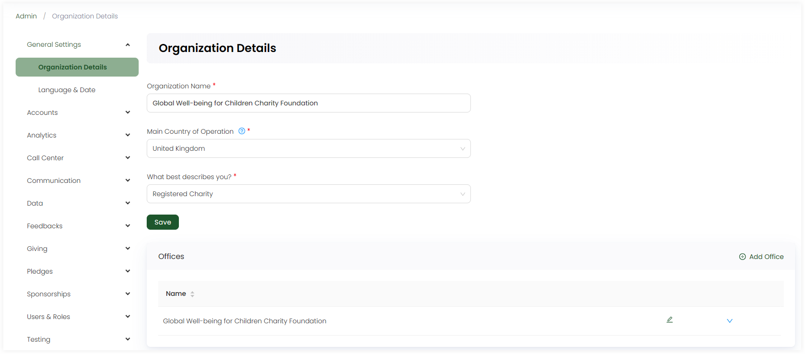

:::tip Who can use this feature?
The main **Product Owners** along with the members having **Admin Roles** access granted.  
:::

In the organization details section, you can find information about the type of organization for which the CRM, i.e. Engage, works. You can also edit and update an input field under any heading.

Have a look at each field and its description in the table below.

| Field | Description |
| ----- | ----------- |
| **Organization Name** | Name of the organization for which the CRM works. |
| **Main Country of Operation** | Select name of the country where the organization resides. This also helps the CRM to select a format for names, addresses, etc. most suitable for you. |
| **What best describes you?** | Select what best classifies you as an organization. |
| **Offices** | Add an office located for your organization as name of the city or the office itself. Use the **+ Add Office** option, write the *name* and click **Add**. You can also come back later and add more or edit the previous ones via the *pen icon* as required.  |

