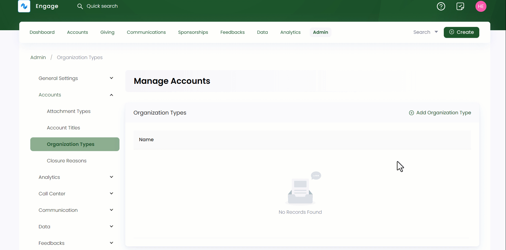

:::tip Who can use this feature?
The main **Product Owners** along with the members having **Admin Roles** access granted.  
:::

The term organization type classifies as the different categories an organization falls under based on their missions, goals and scope of activities. Admin users can add various organization types that can be later added via the dropdown in the **Name** section while creating an organizational account in Engage.

You can add and also edit any previously added organization types via the **pen icon**. Click on **Admin** in the header menu, **Accounts** and then **Organization Types** from the side menu. On the **Manage Accounts** screen, click the **+ Add Organization Type** option, **name** the type and select **OK**. All organization types appear in the form of a list along with their names.

