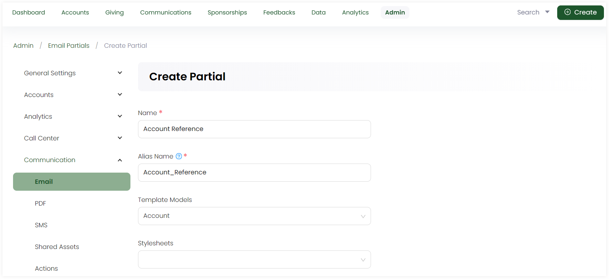

Partials refer to the individual, reusable and modular components included within the email for e.g. email headers, greetings, signatures, etc. The modular approach makes it more efficient to manage and update email templates, as changes made to a partial are reflected across all instances where it is used.

To create a new email partial, click the **+ Create New Partial** option under the *Partials* tab. On the **Create Partial** screen, in the upper section:

1. Input the **Name** of the partial.
2. Write the **Alias Name** that can be further used in layouts and templates. 
3. Choose the **Template Models**, model type for which the email would be sent e.g. accounts or sponsorships. 
4. Choose the **Stylesheets**, *CSS* files used to define the visual presentation and layout of elements within a document.

In the lower section:

1. Write down the content of the partial as *plain text* or *HTML*. You can also preview the content via the **Preview** option.
2. Click the **+** icon and search for the available merge fields for the selected template model. By default, merge fields related to the template model selected appear automatically and are populated once the email is generated.
3. Include any media assets for the partial e.g. images or fonts by uploading any new via **+ Add Asset** or select from existing ones.
4. Add any extra notes and click **Save**.

## List of Partials

All partials added appear in the form of a list under the **Partials** tab with the following parameters. 

| Parameters | Description |
| ---------- | ----------- |
| **Reference** | Unique reference of the partial. |
| **Name** | Name of the partial. |
| **Alias** | Alias name of the partial. |
| **Created By** | Name of the admin user who created the partial. |
| **Updated At** | Date and time the partial was updated at. |
| **Notes** | Any notes added within the partial. |