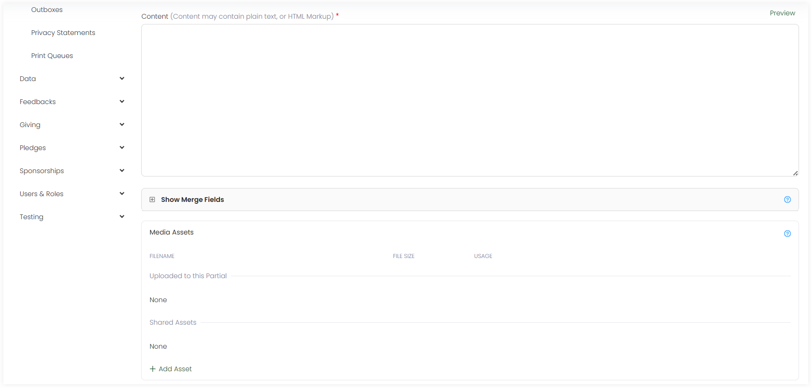

Layouts determine the arrangement and structure of partials created within the email content. They play a role in capturing the recipient's attention and delivering the right email information.

To create an email layout, click the **+ Create New Layout** option under the *Layouts* tab. On the **Create Layout** screen, in the upper section:

1. Input the **Name** of the layout.
2. Choose the **Template Models**, model type for which the email would be sent e.g. accounts or sponsorships. 
3. Choose the **Stylesheets**, *CSS* files used to define the visual presentation and layout of elements within a document.

In the lower section:

1. Write down the content of the layout as *plain text* or *HTML*. You can also preview the content via the **Preview** option.
2. Click the **+** icon and search for the available merge fields for the selected template model. By default, merge fields related to the template model selected appear automatically and are populated once the email is generated.
3. Include any media assets for the layout e.g. images or fonts by uploading any new via **+ Add Asset** or select from existing ones.
4. Add any extra notes and click **Save**.

## List of Layouts

All layouts added appear in the form of a list under the **Layouts** tab with the following parameters. 

| Parameters | Description |
| ---------- | ----------- |
| **Reference** | Unique reference of the layout. |
| **Name** | Name of the layout. |
| **Created By** | Name of the admin user who created the layout. |
| **Updated At** | Date and time the layout was updated at. |
| **Notes** | Any notes added within the layout. |