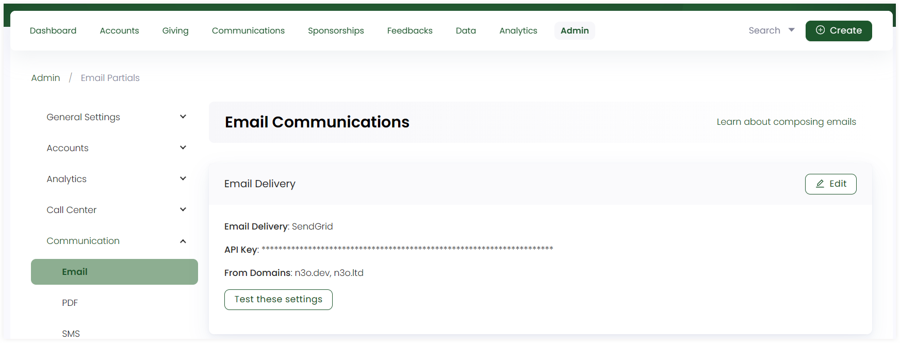

:::tip Who can use this feature?
The main **Product Owners** along with the members having **Admin Roles** access granted.  
:::

Email is a type of communication channel that handles customer inquiries and interactions. In Engage, before sending emails to donors, admin users need to set up the whole email layout and configure the email settings. 

## Configure Email Settings

You, as an admin user, need to set up and configure email settings in the **Email Delivery** section. You can add or edit any previous email setting via the **Edit** button. 

- Provide the **Email Delivery** name.
- Input the **API Key**.
- Enter different domains from where the emails would be sent in the **From Domain** section. 

You can also test these settings to verify whether the email domains and other information are correct or not. Click **Test these settings**, input the **From Address** and **To Address** emails and select **Send**. 

## Compose Email Layouts

:::tip
To learn about how emails are composed in Engage, use the **Learn about composing emails** option on the top right.
:::

In Engage, composing emails via the admin section requires you to create 3 different parts with each part explained in their respective sections.

1. **Partials**
2. **Layouts**
3. **Email Templates**

