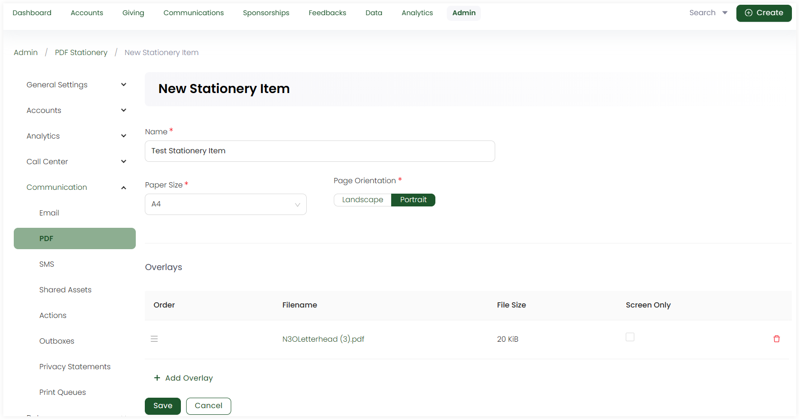

Stationery defines the paper size and orientation of the PDF. It also shows the custom layers that provide the letterhead, background and watermark, etc. 

To create a stationery item, click the **+ Create New Stationery** option. On the **New Stationery Item** screen:

1. Input the **Name** of the stationery.
2. Choose the **Paper Size** as A1, A4 or letter.  
3. Choose the **Page Orientation** as Landscape or Portrait.
4. Add any overlays, sample stationery PDFs, depending on their file size via the **+ Add Overlay** option.

## List of Stationery Items

All stationery items added appear in the form of a list under the **Stationery** tab with the following parameters. 

| Parameters | Description |
| ---------- | ----------- |
| **Reference** | Unique reference of the stationery. |
| **Name** | Name of the stationery. |
| **Created By** | Name of the admin user who created the stationery. |
| **Updated At** | Date and time the stationery was updated at. |
| **Notes** | Any notes added within the stationery. |