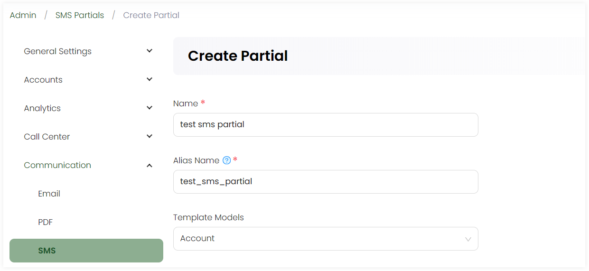
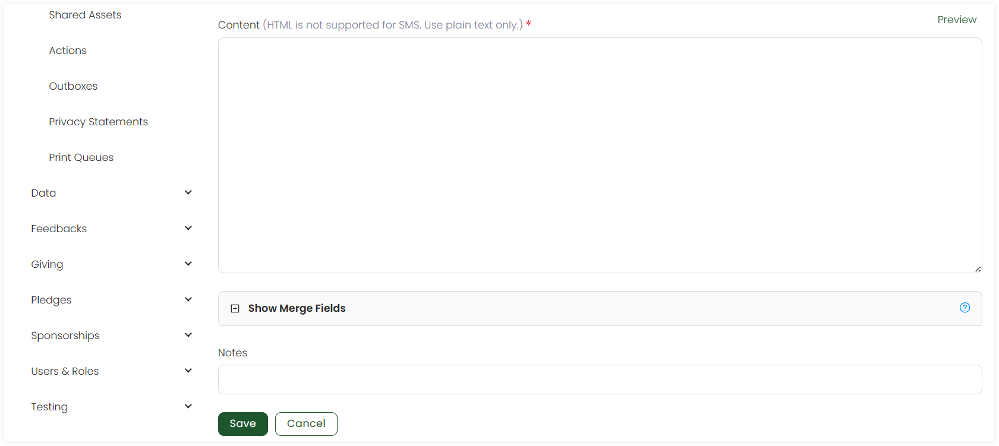

Partials refer to the reusable and modular components included within the SMS for e.g. greetings, signatures, etc.

To create a new partial, click the **+ Create New Partial** option. On the **Create Partial** screen, in the upper section:

1. Input the **Name** of the partial.
2. Write the **Alias Name** that can be further used in layouts and templates. 
3. Choose the **Template Models**, model type for which the email would be sent e.g. accounts or sponsorships.

In the lower section:

1. Write down the content of the partial as *plain text* only. You can also preview the content via the **Preview** option.
2. Click the **+** icon and search for the available merge fields for the selected template model. By default, merge fields related to the template model selected appear automatically and are populated once the email is generated.
3. Add any extra notes and click **Save**.

## List of Partials

All partials added appear in the form of a list under the **Partials** tab with the following parameters. 

| Parameters | Description |
| ---------- | ----------- |
| **Reference** | Unique reference of the partial. |
| **Name** | Name of the partial. |
| **Alias** | Alias name of the partial. |
| **Created By** | Name of the admin user who created the partial. |
| **Updated At** | Date and time the partial was updated at. |
| **Notes** | Any notes added within the partial. |