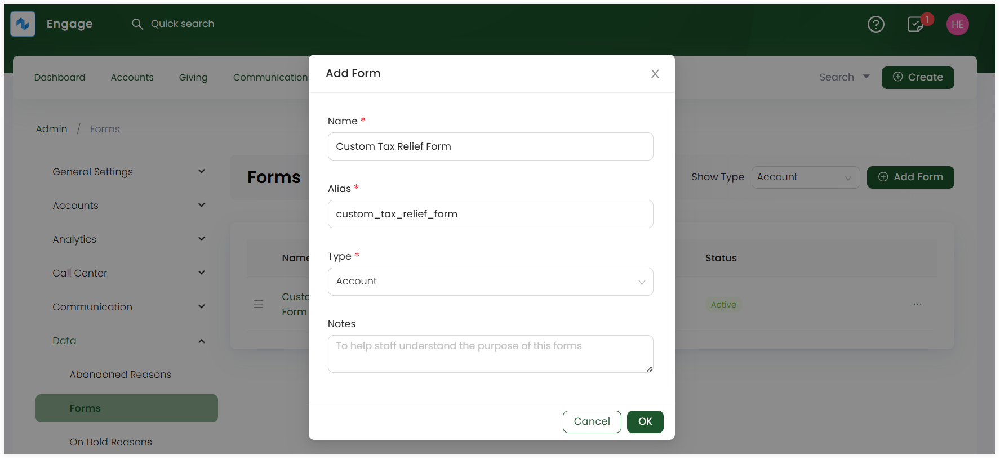
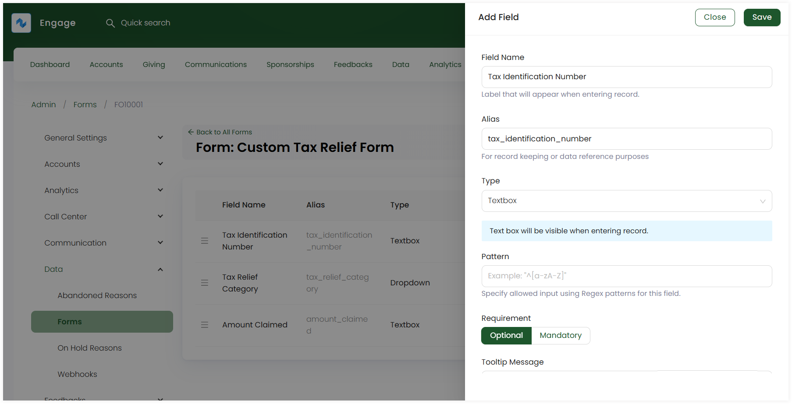

:::tip Who can use this feature?
The main **Product Owners** along with the members having **Admin Roles** access granted.  
:::

To add a custom form in Engage, follow the explained steps.

**1.** Navigate to the **Admin** section and select **Forms** under **Data**. 

**2.** Select the **type** of form you want to create for via the drop-down and click **+ Add Form**.

**3.** On the **Add Form** pop-up screen, input the **name** of the form, select the **type** and add any notes if required. The **alias** part appears automatically as soon as you input the name, hence you do not need to do it yourself. Click **OK**.

**4.** All created forms appear in the form of a table with its **name**, **alias**, **notes** and **status** as active. Click the **three dots** and you can:

- **Edit** the created form to update any information.
- **Deactivate** it, if not using it.
- **Delete** it if not needed for further use.

:::tip
You can also change the order of forms by moving them up or down via the **three lines**.
:::

**5.** As soon as a form is created, it's time to add the fields. Select the created form and click **+ Add Field**. 

**6.** On the **Add Field** popup screen:

- Input the **field name**.
- **Alias** appears automatically as soon as you input the name, hence you do not need to do it yourself.
- Select the **field type**.
- Define the **pattern** for the field.
- Select the **field requirement** as **optional** or **mandatory**.  
- Add a **tooltip** message or any extra notes.

Click **Save**.

**7.** Each field added appears in the form of a table with its **field name**, **alias**, etc. You can also edit a field via the **pen icon** and delete it, if required.

:::tip
Some common field types added for custom forms in Engage are:

- **Text field:** For inputs such as name, description, email address, phone number, etc.
- **Dropdown list:** To choose a value from a predefined list of options like country, or state. 
- **Lookup field:** To search and select from a list of existing records within the CRM.
:::

**8.** When a form with all its required fields is complete, it will automatically appear under the type selected at the beginning. For e.g. if form type **Account** is chosen, then it will show while creating a new account and on all the account profiles main page.

