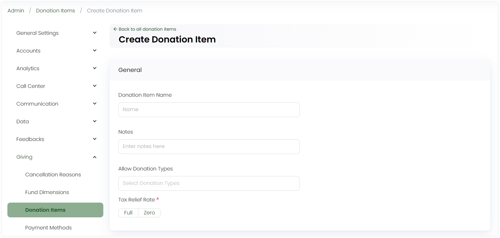
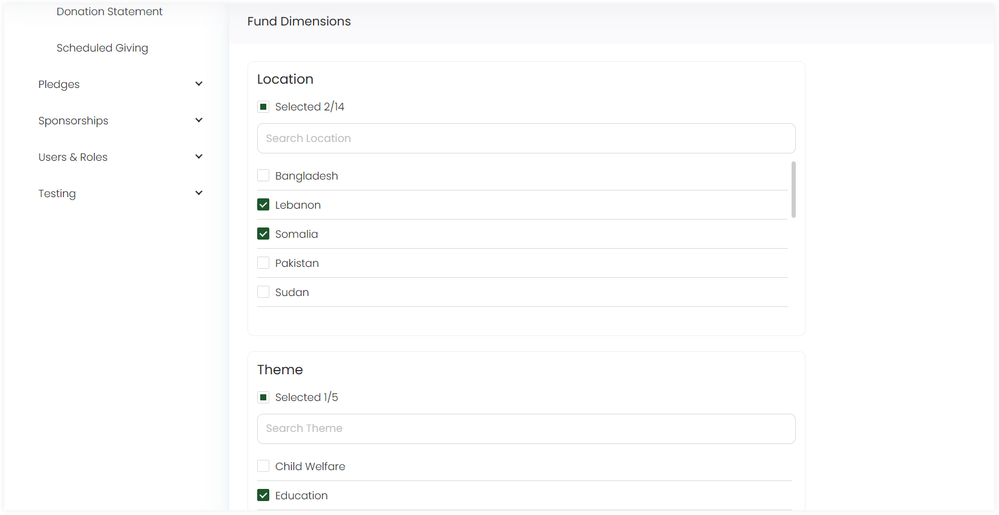
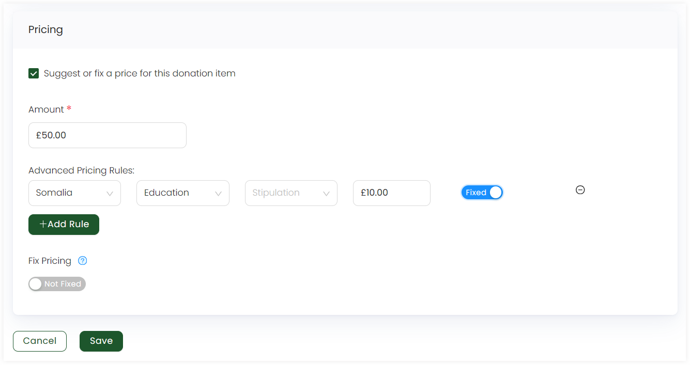
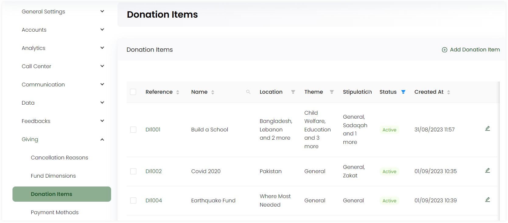

:::tip Who can use this feature?
The main **Product Owners** along with the members having **Admin Roles** access granted.  
:::

In Engage, donation items are specific projects which are spread across various fund dimensions. Admin users must first add multiple donation items for different fund dimensions in order to later add them while making donations, pledges etc., making sure that fund dimensions are added beforehand.

Click on **Admin** in the header menu, **Giving** and then **Donation Items** from the side menu. On the **Donation Items** screen, to add a donation item, click **+ Add Donation Item**. 

In the **General** section:

1. Write a donation item name.
2. Add any notes, if required.
3. Select the type of donation for which the donation will be used.
4. Choose the tax relief rate as **full** or **zero**. 

:::tip
- **Full tax relief** means that the entire qualifying amount is deducted from taxable income or offset against tax liabilities. In effect, the taxpayer gains the full financial benefit of the relief.
- **Zero tax relief** means that no deduction, reduction, or offset is provided for the expense or activity in question. The taxpayer receives no tax benefit.
:::

In the **Fund Dimensions** section, select the dimensions created beforehand, either **a few** or **all**.

In the **Pricing** section:

1. You can leave the pricing as it is without suggesting any, allowing donors to donate any amount to the donation item, or tickmark the **Suggest or fix a price for this scheme** to input the amount. 

2. You can add **advanced pricing rules** by selecting fund dimensions and fixing a price for the donation item. Multiple rules can be added for multiple fund dimensions.

3. You can use the toggle to add **fixed pricing** as well. When fixed, users entering a donation are unable to enter an amount that is different from the price specified for the donation item. 

4. Click **Save**.

You can view all donation items added in the form of a list with different parameters. Each of them can be edited as per necessary.

:::tip
Each fund dimension can be filtered to view the exact donation item for it.
:::

1. Reference
2. Name 
3. Fund Dimensions
4. Created At

