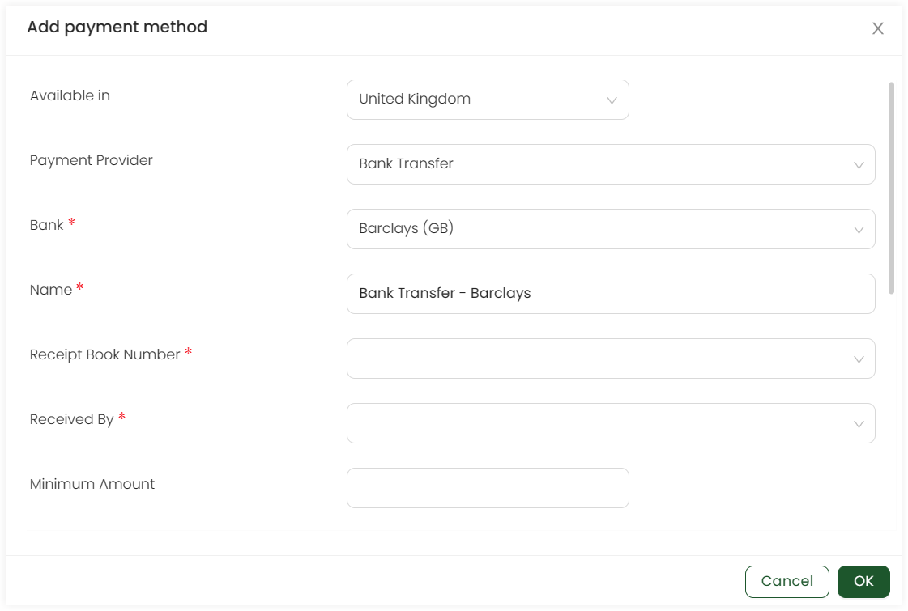

Bank transfer is the transfer of money from one bank to another. Click on **Admin** in the header menu, **Giving** and then **Payment Methods** from the side menu. To add bank transfer as a payment method, click **Add payment method** and select **Bank Transfer**. Choose the **country**, that is set to *United Kingdom* as default, the **payment provider** from the dropdown, and click **OK**.

Now, input information for all the required fields of the payment provider.

| Field | Description |
| ----- | ----------- |
| **Bank** | Name of the bank to be used e.g. *NatWest*. | 
| **Name** | Name of the payment provider. | 
| **Receipt book number** | This is *hidden*, *optional* or *required* for the payment provider. |
| **Received by** | This is *hidden*, *optional* or *required* for the payment provider. |
| **Minimum amount** | Minimum amount to be paid via the payment provider i.e. *pound 1*. |
| **Accessible to/restrict roles** | Users that can access the payment provider i.e. *Admin or Finance manager*. |
| **Allowed currencies** | The currency used in the payment gateway e.g. *GBP*. |
| **Custom Fields** | Any additional field for the payment provider as *hidden*, *optional* or *required*.  |

