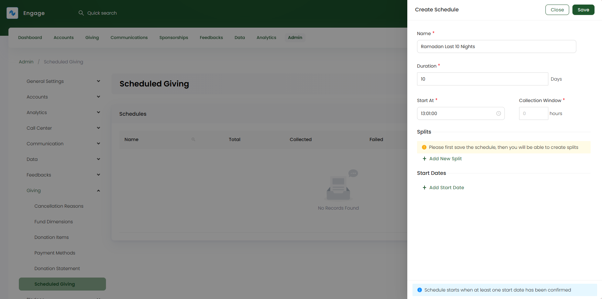
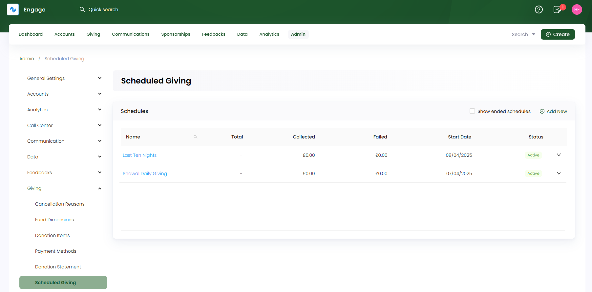

:::tip Who can use this feature?
The main **Product Owners** along with the members having **Admin Roles** access granted.  
:::

Scheduled Giving refers to a donation method where charities set up automatic, recurring contributions to a campaign at predetermined intervals or splits. Before creating a scheduled giving, a campaign must be set up by an admin user.

To add a campaign, click on **Admin** in the header menu, **Giving** and then **Scheduled Giving** from the side menu. On the **Scheduled Giving Campaign** screen, click **+ Add New** and input the following information.

- **Name** of the campaign related to the scheduled giving.
- **Duration** of the entire campaign in number of days.
- **Start At** time as the starting payment collection time.
- **Collection Window** as the number of hours (time period) between which the scheduled giving donatios would be collected.
- **Splits** as a schedule or frequency along which the donations would be collected. Some default splits can be **even**, **uneven**, **double on odd days** or **double on odd days and triple at even days**, etc. Splits are done for the duration selected before. To add a split, first save the campaign, then click **+ Add New Split**, input the split name as **description** and according to your description select the splits for each day. Multiple splits can be added for a single campaign.
- **Start Dates** as the time zone and its start date on which the donations would start to collect. Some defaults are **Local Time zone** and **Saudi Time zone**. The time zone must be **tickmark Confirmed** in order for it to trigger the campaign as active for scheduled donations.

All campaigns are added in the form of a table with its **name**, **total, collected & failed payments**, **campaign date** and **status**. A campaign can also be **edited** for any update, **deactivated** if no longer in use or **deleted** permanently via the **down arrow**.

