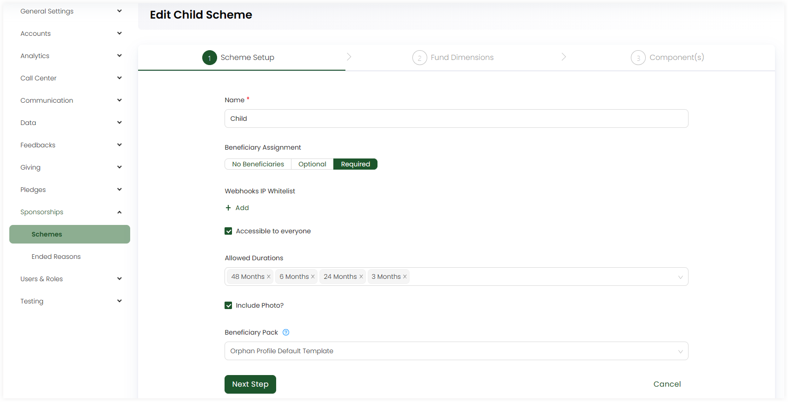
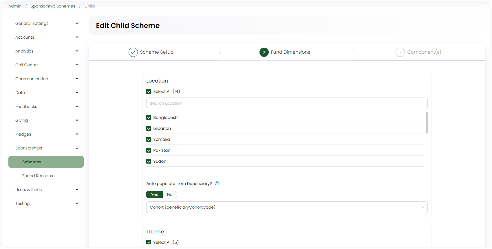
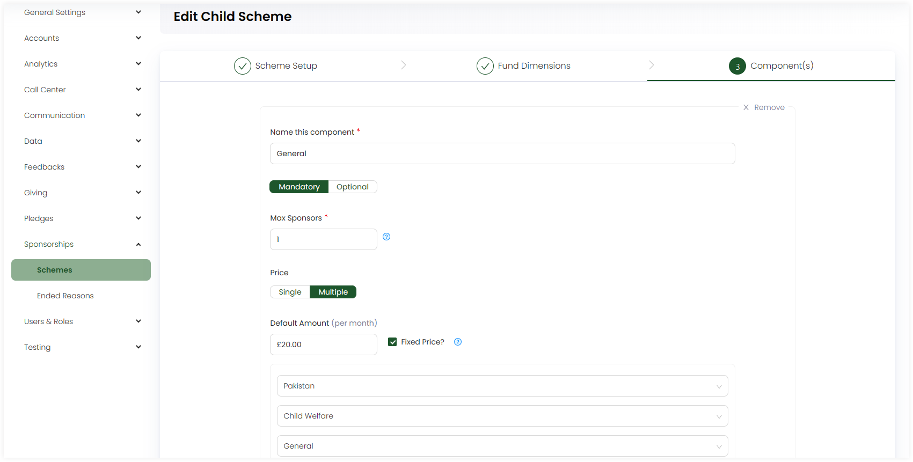

:::tip Who can use this feature?
The main **Product Owners** along with the members having **Admin Roles** access granted.  
:::

Sponsorships refer to the process of managing and nurturing relationships with sponsors or benefactors. Sponsors are individuals or organizations that provide financial support to a cause. Before creating a sponsorship, admin users must first create sponsorship schemes and activate them.

Click on **Admin** in the header menu, **Sponsorships** and then **Schemes** from the side menu. To add a scheme, click **Add New Scheme** and select **Child** or **Other**, that includes all those schemes which do not fall under the child category. Under **step 1: Scheme Setup**, input the following information.

1. **Name:** The name of the sponsorship scheme.
2. **Beneficiary Assignment:** The assignment of beneficiaries in Umbraco as *No Beneficiaries*,  *Optional* or *Required*.
3. **Webhooks IP Whitelist:** IP address of the webhook's related to the scheme. You can also add more, if required. 
4. **Restrict to Roles:** The users who will be able to able to access the scheme, either all or some part of it. If you want the scheme to be accessible by all, tickmark **Accessible to everyone**.
5. **Allowed Durations:** Choose the sponsorship duration as 1, 120 or 24 months, etc.
6. **Include Photo?:** Tickmark if you want to include a photo for the beneficiary in the schemes.
7. **Beneficiary Pack:** Select a PDF composition that is configured to be used as the beneficiary pack.

Next, select the number of fund dimensions for each under **step 2: Fund Dimensions**.

:::tip
- These fund dimensions are the ones that the admin has already added under the *Giving - Fund dimensions* section.
- You can select **all** or **some** of the fund dimensions from the list. 
- You can also autofill the fund dimensions as via **Auto populate from beneficiary?** option.
:::

1. Location
2. Theme
3. Stipulation

Lastly, add the components and their pricing under **step 3: Component(s)**.  You can add multiple components, as per necessary.

1. **Name** the component.
2. Choose the component as **Mandatory** or **Optional**.
3. Input the maximum allowed number of sponsors for a beneficiary type.
4. Choose the pricing as **single** or **multiple** for a component. Each pricing would be for different fund dimensions.
5. Input the **Default Amount** as a monthly price for the component. Leave it blank to remove the predefined price for the allocation.
6. Tickmark **Fixed price** if you want, which means the amount is mandatory and cannot be changed when entering sponsorships allocation of the scheme.
7. Select the fund dimensions and their pricing as *fixed* or *not*.
8. Tickmark **Activate Scheme** and save. 

