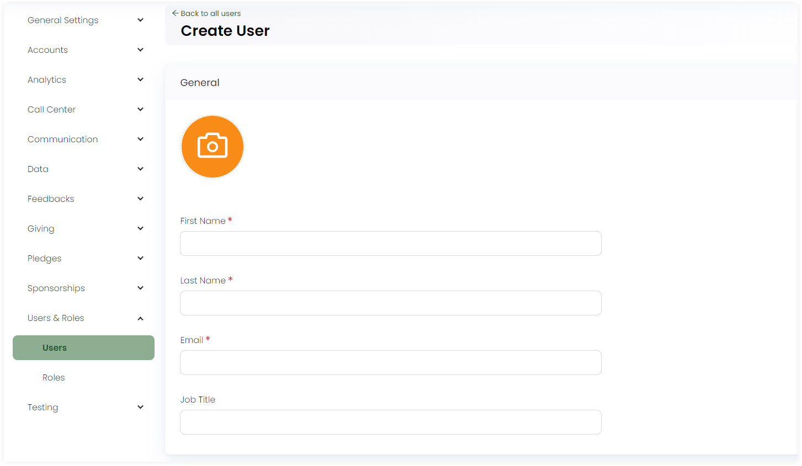
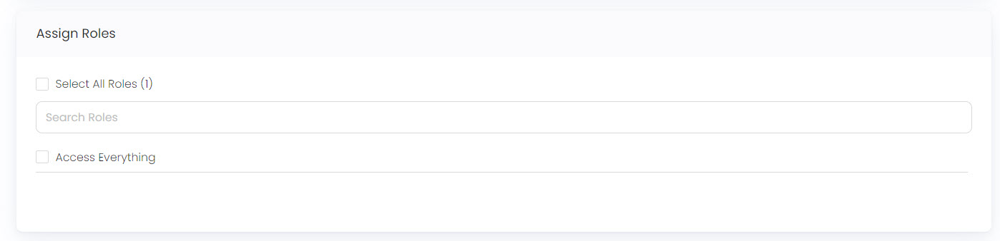
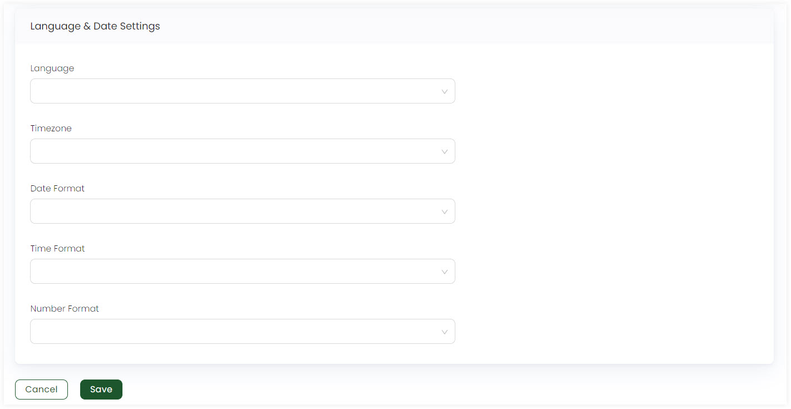

:::tip Who can use this feature?
The main **Product Owners** along with the members having **Admin Roles** access granted.  
:::

In Engage, users are the people that can access or manage different functions within. Admin users can create, add and edit multiple users via the **pen icon**. 

Click on **Admin** in the header menu, **Users & Roles** and then **Users** from the side menu. To create a user, click **+ Create User**. In the **General** section:

1. Input **First Name** and **Last Name** of the user.
2. Write the users **email** and the **job title**.

In the **Assign Roles** section, search for the user roles or tick mark **Access Everything**. 

Under the **Language & Date Settings** section:

1. Select the **language**, e.g. Spanish, English or French.
2. Select the **timezone** according to usage.
3. Choose **date**, **time** and **number format** according to the user preference.
4. Click **Save**.

All users appear in the form of a list with the fields: **Name**, **Email**, **Roles**, **Last Time** and **Status**.

