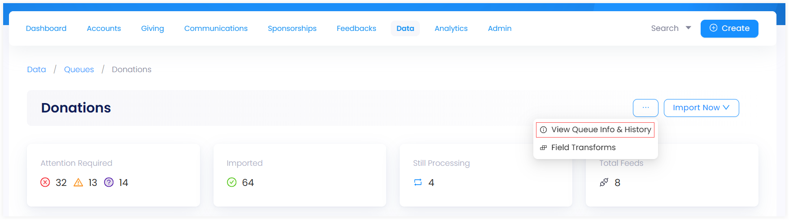
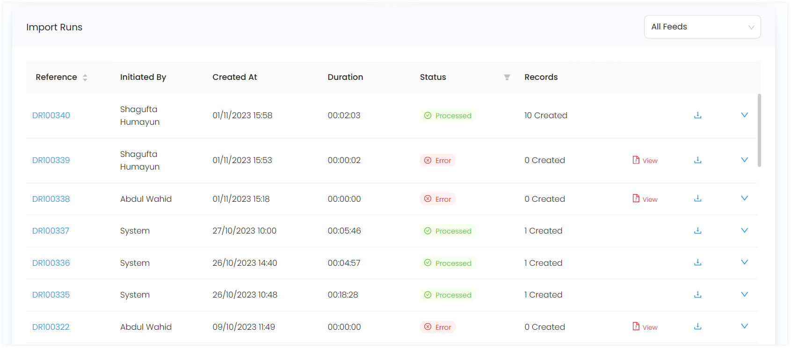
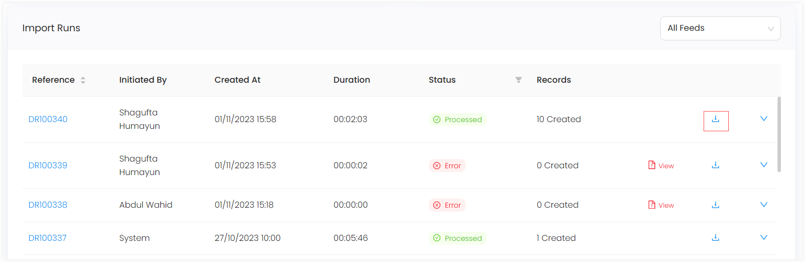

---
title: Testing Webhook Data 
sidebar_position: 3
--- 

In order to test your webhook data, you will require access to the Engage QA environment. 

1. Start with setting up and <K2Link route="" text="posting data to your website webhooks" isInternal />.

2. N3O will set up a username and password for your developer and provide you 2 webhook URL's to test your donations. 

    - Single donations
    - Regular donations

3. Access the <K2Link route="https://beta.n3o.cloud/eu1/engage" text="Engage QA environment" isEngage /> to start testing.

## How to Test Imported Data in a Queue?

To test the imported data coming from your website, follow the steps below.

1. In Engage, click on *Data*, then *Imports* and choose the **Donations Queue**.

2. Click the **three dots(...)** on the top right-hand side and go to **Queue info and history** to access the import runs.

3. Under the **Import runs** section you can view a record of all the latest import attempts in the form of a list, including any *webhooks* which you have sent.

:::note
*Import runs list* includes the *name of user* who initiated the record, *date and time* the record was created at, *number of records* in one import run and *duration and status* of record e.g. *processed, error or cancelled*
:::

4. Click any *import run reference* to see if the record is imported or gave an error.

    - If it is *imported*, then this means the webhook information is correct and no further work is required.
    - If it gave an *error*, then click on the record, and you will be directed to a screen covering information of the error. In most cases, this is due to missing information or a mis-configuration.

5. You can check the exact webhook data you have sent by going back to the import run page and clicking on the *download symbol*. This will allow you to download the data.

:::note
Use a *JSON viewer*, e.g. <K2Link route="https://codebeautify.org/jsonviewer" text="Code Beautify"/>, to view the *JSON webhook* and look for any discrepancies in the data you have sent. Engage also advises to review the provided webhook guidance to ensure your data is sent correctly. 
:::

6. If your data is correct, and you are still unaware of the resolution, then please email *support@n3o.ltd* or the designated contact given, and they will be able to provide guidance. 

7. If everything is going in the right direction, then amend your webhook data accordingly, resend it to the URL and start testing from *step 4*.