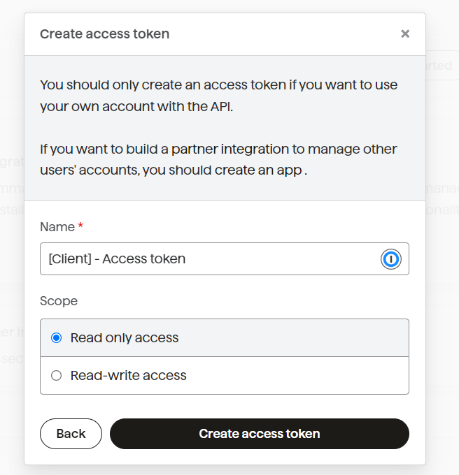
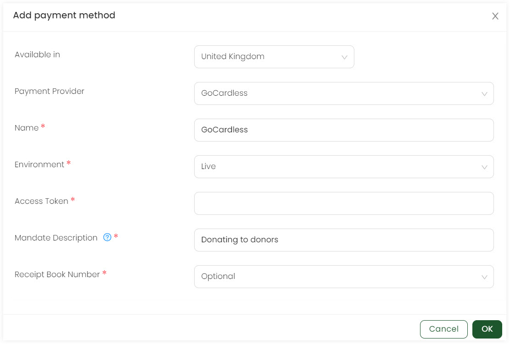
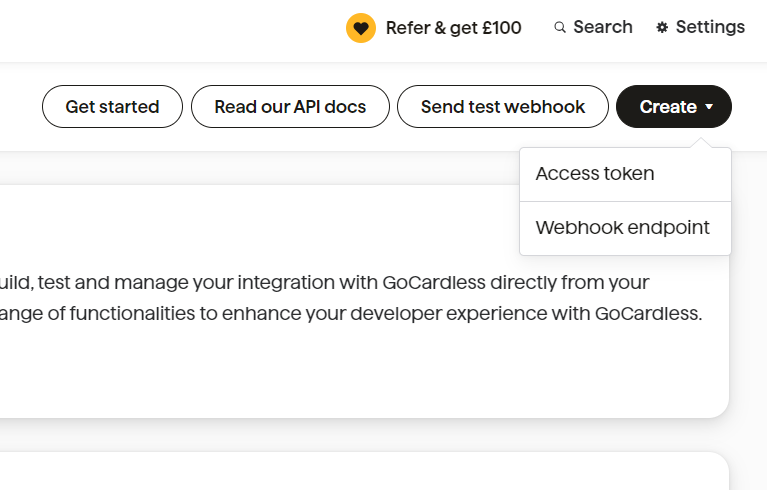
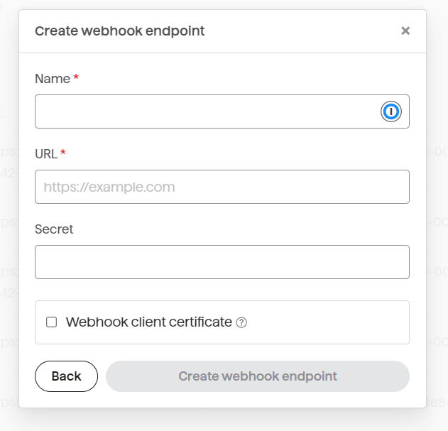

GoCardless is a payment service provider that specializes in bank-to-bank payments, particularly through *Direct Debit*. It can be integrated with Engage as a payment method via the admin section.

:::tip
To learn more about adding other payment methods, go to the Adding Payments Administrator Documentation.
:::

**1.** Login into GoCardless. Under the main menu, click **Developers** and then **developers**.

**2.** To integrate with Engage, you need to create an access token first. Click **Create** located on top and select **Access Token**.

**3.** On the **Create access token** screen, **name** the token, define its **scope** as **Read-write** access, and click **Create access token**.

**4.** Click **Copy** to copy the access token provided to you.

**5.** Now, navigate to Engage and login.

**6.** Under the admin section, select **Giving** and then **Payment Methods** from the side menu. 

**7.** To add direct debit as a payment method, click **Add payment method** and select **Direct Debit**. Choose the **country**, that is set to *United Kingdom* as default and select the **payment provider** from the dropdown as *GoCardless*.

**8.** Next, add information for the following fields and click **OK**. As soon as the payment method is saved, a **Webhook URL** and **Webhook Secret** automatically appears. Copy the URL and secret.

| Field | Description |
| ----- | ----------- |
| **Name** | Name of the payment gateway i.e. *GoCardless*. | 
| **Environment** | Type of environment used, i.e. *Live*. |
| **Access Token** | Token created in the GoCardless developer section. Paste it here. |
| **Mandate Description** | A short description that may appear on the bank statement of your donors. |
| **Receipt book number** | Book number as *hidden*, *optional* or *required*. |
| **Received by** | Name of receiver as *hidden*, *optional* or *required*. |
| **Minimum amount** | Minimum amount to be paid via the payment provider i.e. *pound 1*. |
| **Monthly Collections Restriction** | Any dedicated payment days to receive the payment monthly or not. |
| **Weekly Collections Restriction** | Any dedicated payment days to receive the payment weekly or not. |
| **Accessible to/restrict roles** | Users that can access the payment provider i.e. *Admin* or *Finance manager*. |
| **Allowed currencies** | The currency used in the payment provider e.g. *GBP* or *USD*.  |
| **Custom Fields** | Any additional field for the payment provider as *hidden*, *optional* or *required*.  | 

**9.** Now, navigate back to GoCardless and click **Create**, then **Webhook endpoint** to create a webhook.

**10.**  On the **Create webhook endpoint** screen, **name** the webhook, paste the *URL* and *Secret* and click **Create webhook endpoint**.

